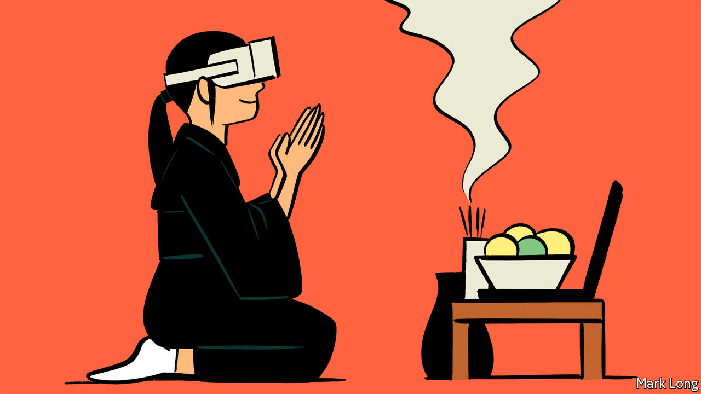

###### Virtual respect for the dead

# Covid-19 has made it hard for the Japanese to visit family graves 

##### But they have found high-tech ways round the problem 

 

> Aug 22nd 2020 

EVERY AUGUST the spirits of fallen ancestors rise all across Japan. During obon, the living commemorate them with offerings of food at altars, gather for festivals, and perform collective dances known as bon odori. Many stream back to their home towns to be with family and visit cemeteries to pay respects to their dead. “Graves are a place to talk,” says Yamazaki Masako of Zenyuseki, a tombstone carvers’ trade association.

This year covid-19 has upset the routine. Japan’s viral caseload is relatively small, with just 1,148 total deaths, roughly America’s daily average. But a recent rise in infections, especially in big cities such as Tokyo and Osaka, has spread the jitters. Citizens have been discouraged from travelling home and festivals have been cancelled. Family reunions have been held online to protect vulnerable elderly relatives.


Failure to visit grave-sites creates “a different type of stress—different from not being able to travel”, laments Ms Yamazaki. To help relieve the pain of missing those obligations to the past, her association turned to futuristic technology. For ¥25,000 ($236) it will produce a virtual-reality experience to let you visit a grave from the comfort of your home. “You can see it from all directions, 360 degrees,” boasts Ms Yamazaki. “It’s like you’re actually there.”

Others have hired proxies to visit the dead on their behalf. With Japan’s population ageing and urbanising, online graveyard visits and tombstone-cleaning services were already doing brisk business. Goendo, one such firm, says inquiries and website traffic have doubled this year. Its agents can be hired to weed, pick up rubbish, wash tombstones, arrange flowers and light incense sticks—then live-stream it all for families by video-chat. Kurashi no Market, an online services marketplace, reported that demand for grave visits in this year’s obon had nearly tripled. Reviewers have raved. “I was so relieved to see the image of a beautifully cleaned grave with flowers,” wrote a client who had fretted about not being able to visit in the flesh.

Obon came to Japan via China along with Buddhism. The word is thought to derive from the Sanskrit ullambana (deliverance from suffering). First practised in Japan in the seventh century, the custom fused with local folk traditions. “At another tap of the drum, there begins a performance impossible to picture in words, something unimaginable, phantasmal—a dance, an astonishment,” wrote Lafcadio Hearn, a 19th-century chronicler of Japan, who was in awe of a bon odori. “All together glide the right foot forward one pace, without lifting the sandal from the ground, and extend both hands to the right, with a strange floating motion and a smiling, mysterious obeisance.” Today’s live-streamed moves might seem equally phantasmal.

Editor’s note: Some of our covid-19 coverage is free for readers of The Economist Today, our daily . For more stories and our pandemic tracker, see our 

