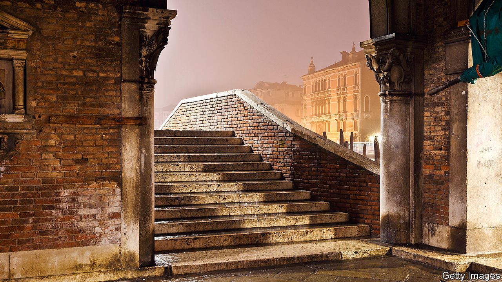

###### Home Entertainment

# For your summer getaway, try an imaginary city 

##### Italo Calvino’s “Invisible Cities” are all versions of Venice 

 

> Aug 22nd 2020 

LOOKING FOR a summer getaway? Try the city of Isidora, “where the buildings have spiral staircases encrusted with spiral seashells”. Or perhaps Anastasia, famed for its golden pheasant cooked “over fires of seasoned cherry wood and sprinkled with much sweet marjoram”, a place where “your desires waken all at once and surround you”. Seeking somewhere even more adventurous? Consider Octavia, which is built on ropes, chains and catwalks across a void between two mountain peaks.

This fantastical itinerary awaits readers of “Invisible Cities”, Italo Calvino’s masterpiece of 1972. Nominally a series of tales that Marco Polo tells Kublai Khan, it is actually a collection of layered, labyrinthine meditations on cities, memory, desire and language. Conversations between the traveller and the emperor frame 55 short prose-poems, each describing one city and following a strict mathematical structure that bears the hallmark of the avant-garde Oulipo movement to which Calvino belonged. All these cities are simultaneously visions from Calvino’s imagination and versions of Polo’s home town, the most splendid city of all, Venice. “Memory’s images, once they are fixed in words, are erased,” Polo says (in William Weaver’s translation from the Italian). “Perhaps I am afraid of losing Venice all at once, if I speak of it. Or perhaps, speaking of other cities, I have already lost it, little by little.”


“Invisible Cities” is a short book but should be savoured slowly, like an Aperol spritz on Campo Santa Margherita at dusk. Sip, sit, and let your perspective bend under its spell. You need not go to a city in person to visit it, the book shows. The richest travels are those along the thoroughfares of the mind—a welcome insight in this era of trips not taken, sights not seen, back streets not explored. Or as the Khan comes to understand: “The empire is nothing but a zodiac of the mind’s phantasms.”

For Calvino’s cities are manifestations of ideas, thought experiments in urban form. In frenetic Thekla, construction never stops so that destruction can never begin. Unhappy Raissa “contains a happy city unaware of its own existence”. Over the course of the book, the mood darkens, the cities taking on the tones of a waning empire. In Theodora, the penultimate stop, humans have extinguished every other species, down to the spiders and the rats.

Echoing Dante, the Khan sees his empire devolving into an “infernal city”. But the inferno of the living, Polo tells him, is already here. He offers the Khan a bit of timeless advice on how to escape its suffering: “The first [way] is easy for many: accept the inferno and become such a part of it that you can no longer see it,” he says. “The second is risky and demands constant vigilance and apprehension: seek and learn to recognise who and what, in the midst of the inferno, are not inferno, then make them endure, give them space.” ■

