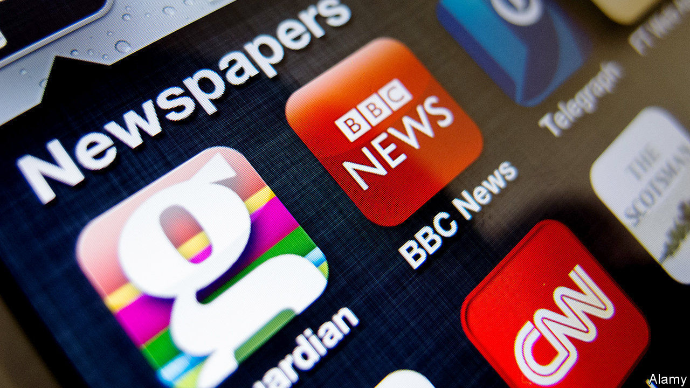
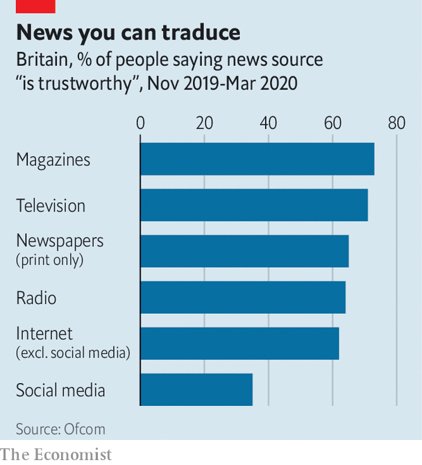

###### Media and society

# Britons are increasingly avoiding the news 

##### Brexit and the pandemic have taken a toll on the British public 

 

> Aug 22nd 2020 

EVERY YEAR Ofcom, the media regulator, conducts research into where Britons get their news. And every year, the answer is roughly the same: mostly from television, decreasingly so from newspapers and more and more from social media. But this year’s “news consumption report” contained a surprise: after years of growth, the number of British adults getting their news from social media declined from 49% to 45%. People’s opinion of social media deteriorated too. Brits consider it the least accurate, trustworthy, impartial or high quality of all sources.

One reason for the decline is the way social-media sites work. Facebook, the most popular, has been demoting news in users’ feeds. Publishers reacted to that by deprioritising Facebook as an outlet to promote their work, notes Alice Pickthall of Enders Analysis, a research firm. Moreover many websites have erected paywalls, reducing the supply of high-quality free content on social networks.

 


But a more important cause may be that Britons are tiring of the news and actively choosing to avoid it. Research by the Reuters Institute for the Study of Journalism (RISJ) in Oxford found that last year some 35% of Britons said they often or sometimes avoided the news, up from 24% in 2017. The big jump is probably because of polarisation around Brexit, reckons Rasmus Nielsen, RISJ’s director. Benjamin Toff of the University of Minnesota has found that “people who relied on social media as their main source of news were significantly more likely to say they were actively avoiding news”. In Britain women and those on the left are also likelier to avoid news. In research on Britain and Spain, Mr Toff found that one of the main reasons for news avoidance was that “the content was too focused on politics”.


The pandemic has changed the reason, but not the trend. Ofcom’s surveys were conducted mostly before Britain entered lockdown. Subsequent research by the regulator found that the use of social media as a source of news about coronavirus fell from 49% in week one to 29% in week 20. The number of people saying they were trying to avoid news about coronavirus rose from 22% in the first week of lockdown to 35% in the tenth week, at the end of May, before declining to 29% in early August, probably because the virus had stopped dominating the headlines. Research by the RISJ found a similar pattern. The main reason for avoiding news? “It has a bad effect on my mood”.

