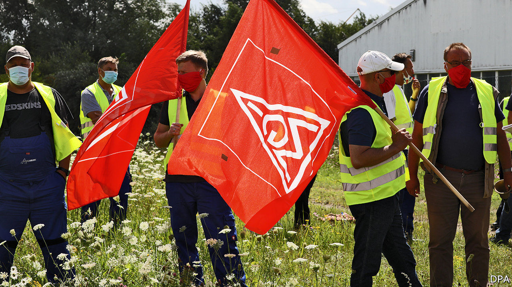

###### Weekend plans

# IG Metall is pushing for a four-day week 

##### Germany’s most powerful union thinks metal-bashers deserve a three-day weekly rest 

 

> Aug 20th 2020 

A RECESSION IS not a good time to ask your boss for a pay rise. So IG Metall, Germany’s biggest trade union, is mulling other perks its metal-bashing members might extract from employers. On August 15th its boss, Jörg Hofmann, told the Süddeutsche Zeitung newspaper he would push for firms to adopt a four-day working week.

German workers should not make Friday leisure plans just yet. Employers have not responded—it is mid-August, after all—but they are likely to put up a fight. Nonetheless, Mr Hofmann’s salvo ahead of collective-bargaining talks later this year points to a new stage in European labour relations—and a culmination of decades of pushing for working hours to be cut.


If you think no worker would object to a three-day weekend, think again. Even fans fret about trade-offs. Workers could face longer hours from Monday to Thursday, or a cut in pay. Some employers, notably technology startups, already dangle longer weekends to recruit sought-after brainboxes, or offer flexible hours. But a five-day slog will probably remain the norm in lower-paid jobs, where productivity gains from more rest are less obvious.

IG Metall’s timing is not coincidental. Its members agreed to forgo a pay rise in the covid-19 crisis. Around 6m Germans currently participate in the Kurzarbeit furlough scheme, estimates IFO, a think-tank. The 12-month scheme now looks likely to be extended to 24 months. Hubertus Heil, Germany’s labour minister, said truncated working hours—and a trimmed payslip—could be “an appropriate measure”. State top-ups of the wages of employees who go down to four days a week might be painted as part of the extension.

German workers face problems beyond covid-19. The car industry that underpins blue-collar jobs has been slow to shift to electric vehicles, let alone driverless ones. IG Metall thinks cutting hours will allow firms to retain expertise needed for the transition, without the expense and bad publicity of sacking workers, only to have to rehire some later if prospects improve. 

Where IG Metall goes others often follow, in Germany and beyond. Its members were striking for a 35-hour week long before it became law in France. A four-day week equates to around 30 hours. If union bosses pull that off without causing big cuts to workers’ pay, they truly will deserve an extra day of rest.■

