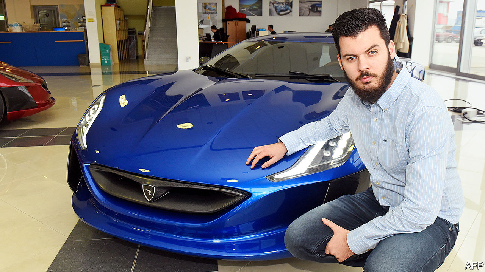

###### Believe the hypercar

# Rimac is making a big name for itself in battery-powered transport 

##### The small Croatian firm’s low volumes belie its ambitions 

 

> Aug 19th 2020 

THE BUSHY beard sported by Mate Rimac, the 32-year-old founder of a Croatian electric-car-technology firm named after him, long predates lockdown affectation. He is said to have grown it to conceal youthful features that might put off potential customers and partners among the world’s big carmakers, who could be wary of a company from a country with no track record to speak of in technology or making cars. (The infamous Soviet-era Yugo was built in what is now Serbia.)

Whether or not the facial hair helped, the limited run of 150 C Two electric hypercars, Rimac’s second model, sold out almost as soon as it was unveiled in 2018, despite an eye-watering price-tag of over €2m ($2.4m). Pandemic-related delays have forced buyers to wait until 2021 for their neck-snappingly brisk machines. Once they do hit the road, they will showcase technology that has attracted the attention of—and investments from—not just luxury marques like Porsche (which owns 15.5% of Rimac), but also mass-market ones such as Kia and Hyundai.


Rimac’s roster of clients is said to include almost all of Europe’s big carmakers, though most are quieter about their involvement than the soft whirr of an electric motor. Those that have made public pronouncements include Aston Martin, a posh (if struggling) British brand, and Koenigsegg, a more niche Swedish one, both of which Rimac is supplying with lightweight battery systems for hybrid hypercars, and Pininfarina, a new maker of fancy electric cars from Italy. Rimac is also collaborating with bigger carmakers such as Renault of France and SEAT (part of Germany’s Volkswagen Group).

Indeed, for all the hypercar hype, Rimac’s main business in years to come will be supplying electric-vehicle technology. Constructing battery packs, cooling systems and management software to give the right combination of power for speed and energy for range is as applicable to runarounds as it is to absurdly fast cars.

The firm has plenty of advantages. It is small—with only 700 employees—and nimble, unlike bigger suppliers that require, in Mr Rimac’s words, “five non-disclosure agreements and six meetings…and months to get anything started”. Big car firms, which have jealously kept the know-how to build internal-combustion engines close to their chests, can now eke out only tiny, incremental improvements in efficiency. Since electric-vehicle tech is in its infancy, opportunities abound for efficiency leaps by clever interlopers like Rimac.

Mr Rimac seems well on the way to realising his dual aim of becoming the best maker of electric hypercars and helping the rest of the industry go electric. But he also has an eye on longer-term trends that will see mobility services become more important as private car-ownership declines. His firm will be “part of the transition”, he says. How? He won’t say for now; another use for a beard is to stroke it enigmatically.■

