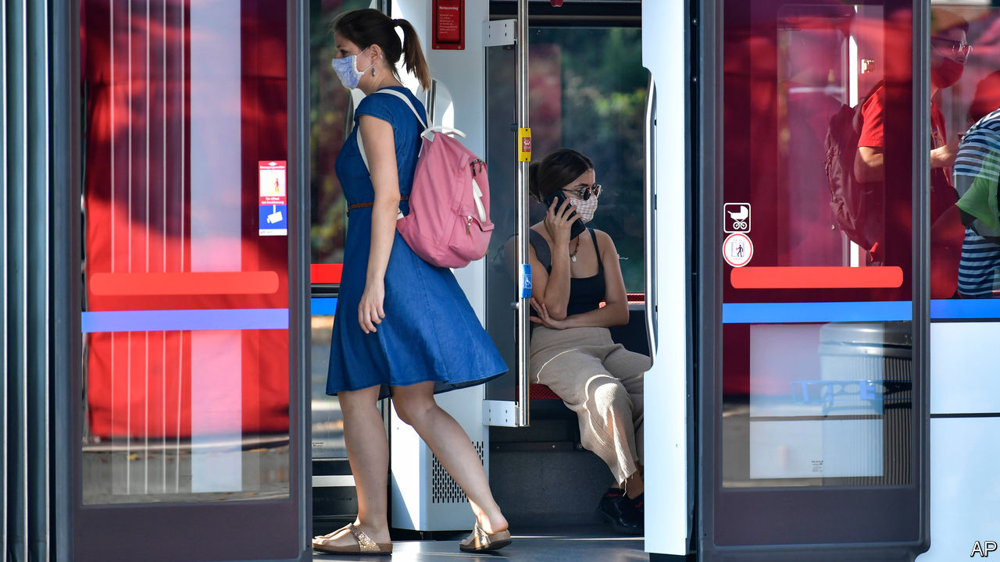

###### Cloth of gold

# Why the economic value of a face mask is $56.14 

##### A new frontier in facial finance 

 

> Aug 22nd 2020 

Editor’s note: Some of our covid-19 coverage is free for readers of The Economist Today, our daily . For more stories and our pandemic tracker, see our 

AFTER A BRUTAL first six months of the year, governments across the world are hoping for an economic bounce-back. Rich-world GDP fell by about 10% in the first half of 2020. Yet much has changed since—including that more people are now wearing masks. Economists, obsessed with translating everything into GDP, wonder if more widespread face-covering could help the recovery.

The thinking goes that masks can, in part, substitute for lockdowns. People wearing them need not be discouraged as much from using public transport. More shops and offices might be able to reopen, albeit while practising social distancing.


Calculations from Goldman Sachs, a bank, suggest that a 15 percentage-point rise in the share of the population that wears masks would reduce the daily growth of cases by about one percentage point. That obviates the need for lockdown measures that would otherwise subtract nearly 5% from GDP. The Economist took those calculations a step further. According to our reckoning, an American wearing a mask for a day is helping prevent a fall in GDP of $56.14. Not bad for something that you can buy for about 50 cents apiece.

These economic benefits suggest that governments should do even more to nudge the minority of people who still forgo masks. English shoppers without a face-covering risk a fine of £100-3,200 ($130-4,200). Authorities in Turkey and Tuscany have handed out free ones to citizens. Perhaps governments should do more—such as pay people to wear them. After all, the large economic benefits of doing so have finally been unmasked.

