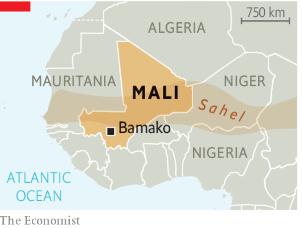

###### Suffering in the Sahel

# A coup in Mali is unlikely to make matters better 

##### Western countries cannot solve African crises with military support alone 

 

> Aug 22nd 2020 

A COUP D’ETAT is almost never good news. In Mali the descent into violence accelerated dramatically in March 2012, when soldiers mutinied and launched attacks on the presidential palace, the state broadcaster and a military barracks in Bamako, the capital. The then president, Amadou Toumani Touré, was forced into exile. Within months, jihadists had taken over much of northern Mali. By the start of 2013 France felt obliged to intervene, sending soldiers and its air force to push the militants out of their strongholds in the cities of Timbuktu and Gao.

That seemed to have saved Mali from a terrible fate: the state’s complete collapse into the hands of fanatics. But the experience of 2012 could repeat itself. On August 18th soldiers in Bamako again left their barracks to overthrow the government. The president, Ibrahim Boubacar Keita, who came to power in elections in 2013, was arrested with his prime minister, and forced to resign (see ). As in 2012 the coup plotters have promised new elections. But, as then, the result may be more violence.


Western governments are dismayed by the mutiny, and the UN rightly called for the restoration of constitutional order. In Africa especially, coups beget coups. Mali is a hub for smuggling drugs, arms and people across Africa and to Europe; that problem may now worsen. But the West must shoulder some of the blame. In the years since France intervened, the limits of trying to solve political problems with military force (partly focused on counter-terrorism) have become ever plainer. The number of foreign troops in the southern fringe of the Sahel has grown. As well as hefty French and UN contingents, soldiers from Britain, America, Germany and countries next to Mali have weighed in. But they have done little to tackle the cause of the conflict: a weak, corrupt state with scant regard for its people.

At least 4,000 people were killed in the Sahel last year, around 40% of them in Mali. Since 2012 violence has spread from the north to the centre of the country—and across the region. The state has not only failed to stop the killing, it may have been complicit in it. Last year about 160 people, mostly ethnic Fulanis, were massacred by a Dogon militia in Ogossagou, a village in central Mali. Mr Keita promised such atrocities would be stopped. Yet in February this year tribesmen attacked Ogossagou again, killing 35 more. Human Rights Watch, an international monitor, has documented how Mali’s army let it happen, leaving the village just hours before the attack.

 


A state that does not protect its people from massacres is scarcely likely to succeed on other fronts. This coup was preceded by months of civil protests prompted by a decision of the constitutional court to overturn the results in 31 seats of parliamentary elections held in March. The court handed many back to Mr Keita’s party. But the protests were also fuelled by anger towards a government seen as crooked and feeble. It is unclear whether the coup-makers acted in league with the organisers of the protests, but they are likely to be embraced by them. The dismay of foreign governments will not bring back Mr Keita.

Mali’s security problems are far from unique in Africa. For over a decade Nigeria has struggled with Boko Haram’s insurgency. Kenya is still afflicted by terrorists in its Somali north-east. An Islamic State affiliate is on the rise in Mozambique. The fighters in such cases are invariably drawn from people with no stake in the state. The West has proffered soldiers, equipment and intelligence, but has done much less to encourage governments to settle grievances. In January President Emmanuel Macron threatened to withdraw French soldiers from the Sahel unless the region’s leaders clearly said they wanted them to stay. When they did, he increased the French contingent. A genuine threat to withdraw would be risky. Yet Western governments should consider whether their military aid can defeat extremists if they do not also tackle hopeless governance.■

