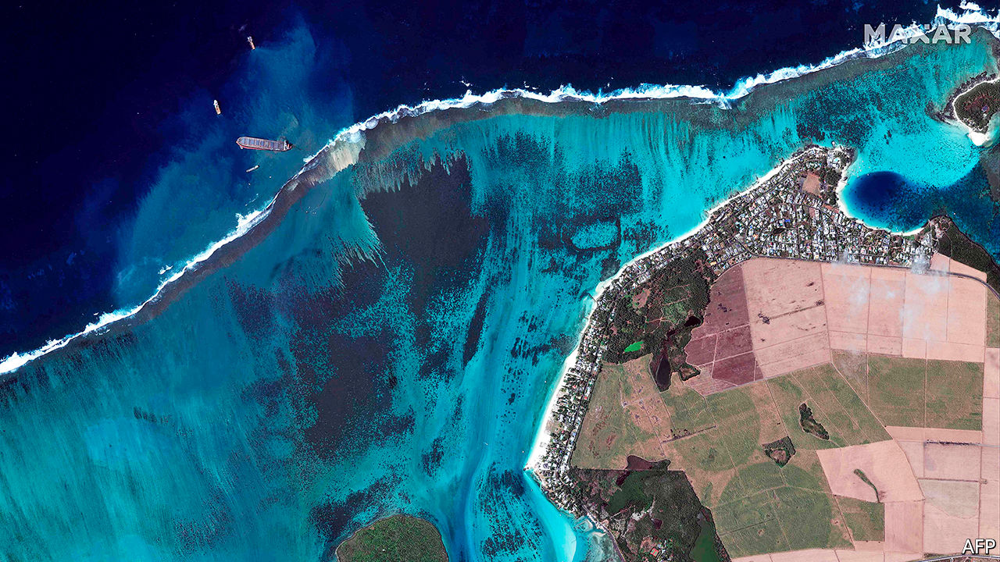

###### Oil on protected waters

# An oil spill off Mauritius threatens protected ecosystems 

##### The country is scrambling to assess the damage 

 

> Aug 20th 2020 

IT SEEMED as if the worst of 2020 was over for Mauritius. The island state has done a better job than most other African countries in quelling covid-19. It was planning to restart the tourism industry that accounts for 9% of GDP and employs nearly a fifth of the workforce. Then on July 25th MV Wakashio, a Japanese-owned merchant ship, ran aground on a coral reef off the south-east coast. It leaked more than 1,000 tonnes of fuel oil before breaking apart on August 16th. This is far from the largest oil spill in southern African history; in 1991 a tanker released 260,000 tonnes off Angola. But rarely has a spill occurred so close to protected marine ecosystems. Mauritius, with the help of France and Japan, is scrambling to assess the damage.

For more coverage of climate change, register for The Climate Issue, our fortnightly , or visit our 

