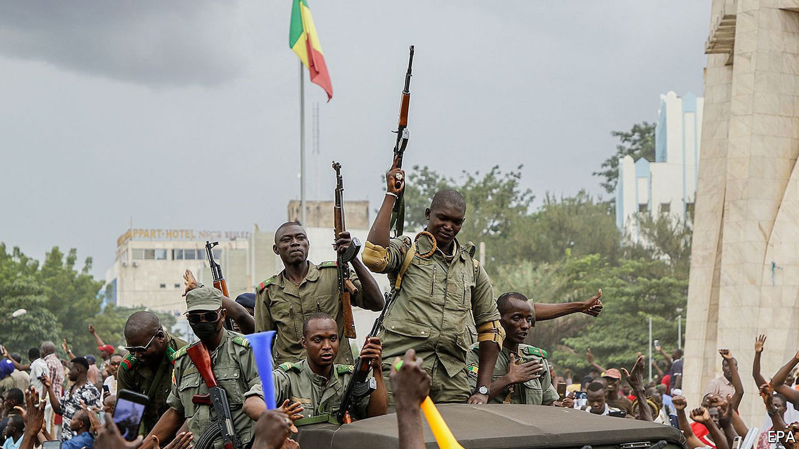
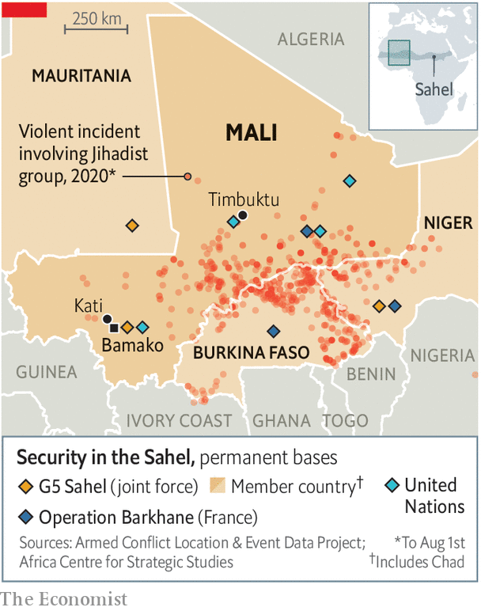

###### A coup that was coming

# What next for Mali? 

##### Mutinous soldiers have toppled the president. They may have more trouble dealing with protesters and jihadists 

 

> Aug 19th 2020 

MALIANS ARE no strangers to coups d’état. In 1991 the armed forces stepped in after sustained protests against Moussa Traoré, the dictator who had ruled the west African country since 1968. (Traoré himself had led a coup against his predecessor.) In March 2012 mutinous soldiers angry at the government’s handling of a rebellion in the north ousted the president, Amadou Toumani Touré.

The latest coup, on August 18th, has familiar echoes. It comes after months of protests. Like the events of 2012, it began with a mutiny at a base in Kati, a garrison town 15km (9 miles) outside the capital, Bamako. Soldiers arrested the president, Ibrahim Boubacar Keita, who in a video later that day announced his resignation from behind a face mask. “Do I really have a choice?” he asked. “Because I do not wish blood to be shed.” A day later five members of the new junta announced on television that they want “a civil political transition”.


For all the similarities, the context is different from eight or 29 or 52 years ago. In the aftermath of the coup in 2012 Islamists took advantage of the political vacuum to launch attacks throughout the northern two-thirds of the country, prompting France to send in troops. Following its intervention, France, the African Union (AU) and ECOWAS, the regional bloc, backed a UN mission, called MINUSMA, to keep the peace while elections were held and a new political settlement reached.

Mr Keita won presidential elections in 2013 and 2018. An agreement between the government and northern rebel groups was ostensibly reached in Algiers in 2015, the latest of several such deals since the early 1990s. But, like the others, it has failed to quell the discontent.

 


An inept, out-of-touch government led by a southern elite has done little to stop escalating jihadist violence—and even less to deal with its root causes. In the first half of 2020 more than 1,800 people were killed in fights involving jihadists and ethnic militias, almost as many as were killed in 2019 (see map). The presence of Western forces, 15,000 UN peacekeepers and an EU-led training mission has not stopped the bloodshed. Malian efforts to arm local militias have made matters worse.

Anger at the government’s handling of the conflict has risen steadily. Soldiers, as well as their wives and widows, have lambasted the officials in charge of operations. Allegations that those in or close to power are taking advantage of a corrupt war economy have increased. Outsiders have tended to push military solutions to political problems. The folly of that approach has been clear in recent months. After dodgy legislative elections held in March and April, during which time an opposition politician was kidnapped, protesters took to the streets. In July the security forces killed at least 11 people.

It is unclear whether there was any co-ordination between the officers behind the coup and the groups leading the protests. A leader of the opposition M5-RFP movement told the BBC that the coup was a “relief”. The junta says it wants fresh elections. Mahmoud Dicko, an influential imam, could act as a kingmaker.

Outside Mali condemnation of the coup has been swift. Moussa Faki Mahamat, chair of the AU’s secretariat, said he “rejects any attempt at the unconstitutional change of government in Mali”. ECOWAS, which had been trying to cajole Mr Keita into a deal with the protest movement, criticised the “putschists”, closed neighbouring borders with Mali and promised sanctions against the leaders of the coup.

ECOWAS states do not want Malians giving their own people any ideas, especially with presidential elections due later this year in Burkina Faso and Ivory Coast, which have both seen recent protests. (Ghana is also scheduled to go to the polls.) The more coups go unpunished, the more likely they are in future.

Neighbouring countries also share Western concerns about what the coup means for jihadist violence in the Sahel. As the events of 2012 suggest, Islamists are opportunistic and will take advantage of political paralysis. On August 19th France and Niger called an emergency meeting of the UN Security Council.

Condemnation of the coup may not, however, lead to the reinstallation of Mr Keita. If he were to be propped up, he could collapse again. Whatever the approach, it will need to amount to more than deals among incompetent elites. That may be what the jihadists want. But it is not what Malians deserve. ■

