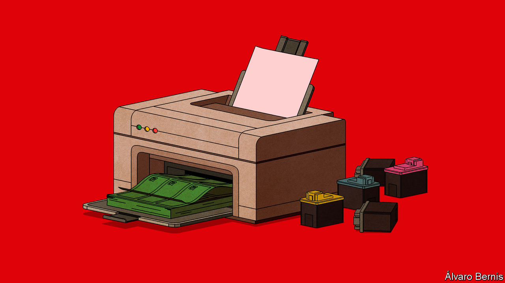
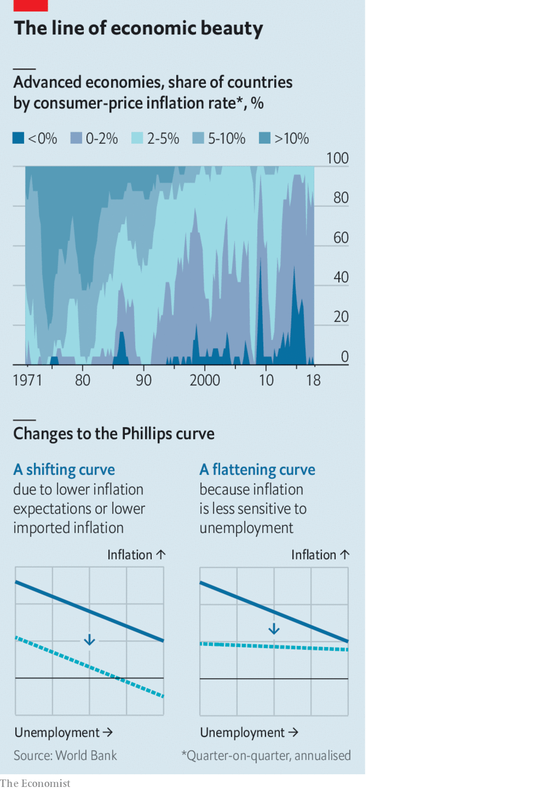

###### Hidden figures

# Why does low unemployment no longer lift inflation? 

##### The Phillips curve, the logic of which guides central banks today, has become oddly flat 

 

> Aug 22nd 2020 

EVERY NIGHT at about 10pm the lights of the prisoner-of-war camp in Indonesia would mysteriously dim, to the puzzlement of the Japanese guards. They failed to spot the makeshift immersion heaters, used to brew cups of tea for the inmates, that had been cobbled together by a prisoner from New Zealand, William Phillips. These secret contraptions were just one example of his resourcefulness.

After the second world war he built a “hydraulic” model of the circular flow of income in an economy—a labyrinth of water tanks, valves and pipes that helped earn him an appointment at the London School of Economics. But neither of these exploits is the reason why Phillips is known to every economist today. His fame rests instead on his “quick and dirty” study, published in 1958, documenting a striking, decades-long relationship between British wage inflation and unemployment: the one tended to be high when the other was low. A downward-sloping curve, which he drew largely freehand, illustrated the point. The Phillips curve, as it became known, has been described as “probably the single most important macroeconomic relationship”. It has also been called the “least solid piece of work” he ever did.


The Phillips curve’s solidity and shape has been called into question more than once in the past 60 years, including in the period since the global financial crisis of 2007-09. But the logic of the curve still guides central banks today.

When business is brisk and unemployment low, central bankers worry that workers will demand pay raises over and above inflation and any improvement in their productivity. If firms pass these higher wages on to customers by increasing prices, inflation will rise. If central bankers wish to prevent this, they will raise the interest rate they charge for the money they lend, slowing the economy and curbing the wage pressure.

The opposite happens at the other end of the curve. High unemployment flattens wages and spending, putting downward pressure on inflation. To counteract this, policymakers typically cut interest rates.

Central bankers hope to find themselves somewhere in the middle: with inflation where they want it to be and unemployment neither high nor low enough to dislodge it. In these happy circumstances, they aim to set a “neutral” interest rate that will leave inflation where it is.

Most central banks in the rich world target an inflation rate of about 2%. At such modest levels, inflation does not greatly complicate financial planning or erode confidence in the currency. But it allows wages to fall modestly, relative to prices, without anyone suffering a thinner pay packet. That cheapening of labour may, in turn, help preserve jobs in a downturn.

 


In recent years, however, inflation has fallen persistently short of the central bank’s target in many countries (see chart). In the immediate aftermath of the global financial crisis, such low inflation was no puzzle. Unemployment rose sharply, reaching 10% in America in October 2009. In those circumstances, the only surprise was that inflation did not fall further. But after the recovery inflation continued to remain muted even as unemployment in America, the euro area and Japan fell unusually far. That has forced economists to rethink the relationship.

In the 1960s some sceptics, perhaps most notably Milton Friedman, pointed out that the relationship between unemployment and inflation is only as solid as the expectations that underlie it. If inflation is expected to be 2%, then workers emboldened by low unemployment might demand a wage increase of 3 or 4%. But if inflation is expected to be 10%, then similarly emboldened workers might demand a wage increase of 11% or more. In the 1970s, high inflation persisted despite high unemployment precisely because workers’ expectations of inflation had risen so much. Economists decided to “augment” the Phillips curve by adding expectations alongside unemployment as a separate determinant of inflation.

Another complication comes from imports. Unemployment at home has little bearing on wages abroad. The price of anything consumers buy from the rest of the world will be determined by other forces. For this reason, some economists add a measure of import prices to the curve.

Neither of these additions, however, can explain the missing inflation of recent years. Imports from countries like China may have depressed the price of some products, such as electrical appliances. But that is no reason why prices in general should be subdued. If China is holding down the price of one corner of the shopping basket, the central bank should be able to encourage other prices to rise to offset it. Inflation of 2% is perfectly compatible with some prices dropping steeply, as long as enough others rise sufficiently fast.

Inflation expectations can also explain only part of the puzzle. They have been low for decades: in America, they have not exceeded 3% for 20 years, according to the Federal Reserve Bank of Cleveland. These subdued expectations have shifted the Phillips curve downwards, so that a given rate of unemployment is associated with a lower rate of inflation.

Middle of the riddle

But what has happened to the curve in recent years is different: more akin to a rotation, rather than a shift up or down. Inflation has become seemingly insensitive to joblessness, yielding a curve that has become strangely flat. This may be because the unemployment rate misstates the amount of spare capacity or “slack” in the economy. By 2019 unemployment in America, Europe and Japan had fallen to surprisingly low levels, which tempted some people on the periphery of the labour force back into work. Japan’s firms found room to grow by hiring many women and old folk who had not been counted as unemployed.

Inflation may also be slow to rise in a jobs boom for the same reason it is slow to fall in a bust. In downturns, firms are reluctant to lower wages, because of the harm to staff morale. But because they refrain from cutting wages in bad times, they may delay raising them in good. According to this view, wages will eventually pick up. It just takes time. And many other things, like a pandemic, can intervene before they do.

The impact of low unemployment would be easier to spot in the data if it were not so rare, according to Peter Hooper of Deutsche Bank, Frederic Mishkin of Columbia University and Amir Sufi of the University of Chicago in a paper published in 2019. To increase the number of observations, they unparcelled America into its separate states and cities. At this subnational level, they found numerous examples of red-hot jobs markets over the past few decades, and a clearer link to wage and price inflation. The local Phillips curve is “alive and well”, they note, and perhaps the national version is just “hibernating”.

It may also take time for higher wages to translate into dearer prices. In bustling fruit-and-vegetable markets stalls display their prices in chalk, making them easy to scrub out and revise. But for many other firms, changing prices is costly. When inflation is low, they may change prices only infrequently: it does not seem worth printing a new menu just to change prices by 2%. This inertia, however, also means firms rarely have the opportunity to reprice their goods to reflect swings in their business. The economy has to move a lot before prices will move at all.

Although the flat Phillips curve puzzles central banks as much as anyone, they may be partly responsible for it. The curve is supposed to slope downwards (when inflation or unemployment is high, the other is low). But central banks’ policies tilt the other way. When inflation looks set to rise, they typically tighten their stance, generating a little more unemployment. When inflation is poised to fall, they do the opposite. The result is that unemployment edges up before inflation can, and goes down before inflation falls. Unemployment moves so that inflation will not.

The relationship between labour-market buoyancy and inflation still exists, according to this view. And central banks can still make some use of it. But precisely because they do, it does not appear in the data. “Who killed the Phillips curve?” asked Jim Bullard, an American central banker, at a conference of his peers in 2018. “The suspects are in this room.”

But what happens when the killers run out of ammunition? To keep the Phillips curve flat, central banks have to be able to cut interest rates whenever inflation threatens to fall. Yet they can run out of room to do so. They cannot lower interest rates much below zero, because people will take their money out of banks and hold onto cash instead.

When Mr Bullard spoke, the Federal Reserve expected the economy to continue strengthening, allowing it to keep raising interest rates. But that proved impossible. The Fed was able to raise interest rates no higher than 2.5% before it had to pause (in January 2019) then reverse course. The neutral interest rate proved to be lower than it thought. That left it little room to cut interest rates further when covid-19 struck.

The neutral interest rate has fallen, according to some observers, because of global capital flows. Heavy saving by the world’s ageing populations has resulted in too much money chasing too few investments. By lowering the neutral rate, this “global savings glut” has left central banks closer to the floor on interest rates than they would like. That has made it harder for them to offset any additional downward pressures on prices.

Friedman thought central banks could prevent inflation if sufficiently determined to do so. “There is no technical problem about how to end inflation,” he wrote in 1974. “The real obstacles are political.” Is reviving inflation any different? Central banks face two technical limits. First, they cannot lower interest rates much below zero. And they can only purchase financial assets, not consumer goods. Central banks can create unlimited amounts of money. But they cannot force anyone to spend it.

One solution is to work in tandem with the government, which can spend any money the central bank creates. Before covid-19, such dalliances were rare. But an increasing number of central banks, in both the rich and emerging world, are changing course. These partnerships will try to stop pandemic-related unemployment turning low inflation into outright deflation. If they fail it will be an economic disaster: mass joblessness coupled with negative inflation. And it will be no consolation to students of economics that this combination will remove the flatness from one of their discipline’s most famous curves. ■

