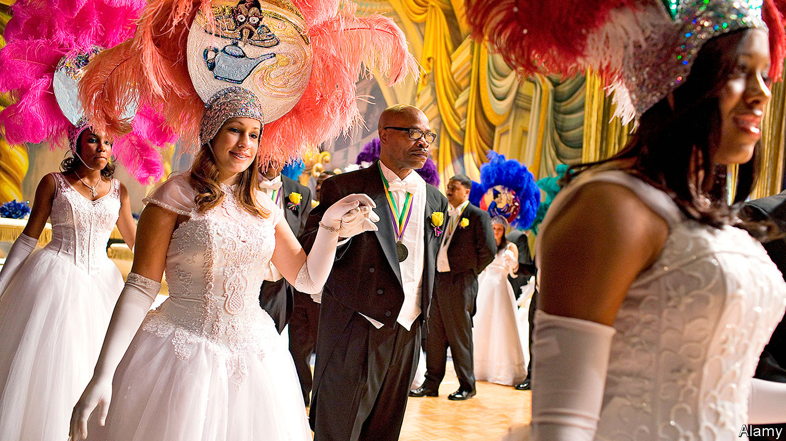

###### Our kind of people

# America’s black upper class and Black Lives Matter 

##### The United States is also home to the biggest group of highly successful black folk in the world 

 

> Aug 22nd 2020 

LAWRENCE OTIS GRAHAM recalls where he first met Kamala Harris, last summer, in Martha’s Vineyard. It was at the holiday home of Spike Lee, a film director, who held a $1,500-a-head fundraiser for the woman who is now number two on the Democratic ticket. “She is the new Barack Obama for us,” says the thrilled Mr Graham, an author and property lawyer from New York. By “us” Mr Graham means African-Americans, and in particular the glitziest end of African-American high society.

He knows of whom he speaks. He made a name in 1999 by publishing “Our Kind of People”, a sympathetic insider account of the habits, clubs and lifestyles of America’s wealthiest black families. Early on the book, now in its 37th printing, proved controversial. Some whites were ignorant of how black millionaires had thrived, a few of them since the 1870s. “People often don’t think of blacks having different socioeconomic classes,” he says. Some fumed at being publicly named as part of a black aristocracy; others were furious for being left out. Some poorer black readers, in turn, raged at the wealthy.


On average black Americans remain significantly less well-off than whites, including among the richest. Among the top 10% of black earners, for example, the median family has accumulated assets worth $343,160, said a Brookings Institution report in February. For the equivalent top 10% of white families it was more than five times higher, at $1,789,300. By one Federal Reserve measure, around 2% of black families have assets worth more than $1m; over 15% of white ones do.

Yet even if the African-American elite is not huge, it is influential, as a planned televised serialisation of Mr Graham’s book will show. The most prominent black families long formed invitation-only clubs where they socialised, created professional networks and presented their children at debutante balls. A prime example is Jack and Jill of America, founded in 1938, a society which claims 40,000 members in 247 chapters, and which is devoted to shaping children into future leaders in business, society and politics.

It continues to go strong. This week it held its 44th national convention—a four-day, virtual shindig. It is unabashedly for the most successful. Danielle Brown, its president, dislikes the word “elite”, but says 98% of members’ children attend university. (That matters: rising higher-education rates best explain why the earnings of top-paid African-Americans have kept climbing in the past half century, even as those of most black workers steadily fell.) Almost everyone goes on to thrive professionally. “They are pretty much at the top of wherever they go,” she says.

Her outfit, as any rich club must, does plenty of charity work. This year its members helped to pay for 247 needy students to finish college, she says. It also promotes civic duties, the virtue of voting and the benefits of a sound financial education. That is all worthy—but in contrast to the occasionally riotous efforts of Black Lives Matter (BLM) activists, it can look terrifically staid. At its “cotillion” dances demure teenagers, in white Cinderella ball gowns, vie to deliver the deepest curtsy as pearl-wearing older ladies look on.

Not all alumni are relaxed talking of their past. Few politicians brag of belonging to an elite group. Cory Booker, a senator from New Jersey, rarely brings up his youthful time in Jack and Jill. Don’t expect Ms Harris, member of a similarly august group of women volunteers, The Links Inc, to mention it on the stump. Yet many of the most radical leaders or their children—including those of Malcolm X and of Mr Lee—had links to Jack and Jill or similar outfits.

How do high-society African-Americans respond to upheavals from the covid-19 pandemic, killings by police, and BLM protests of recent months? For Mrs Brown, BLM is “representative of the civil-rights movement, with a new name”. She praises protesters for their “vigilance” and for stirring public—including white—concern over matters that were previously ignored. But BLM, in her view, is just one of a “wonderful plethora” of groups, clubs, sororities, voter-registration outfits and charities: “We need different people doing different things.”

Lerry Knox, a wealthy Chicagoan who runs an international infrastructure-investment fund, and Farissa Knox, who runs an ad agency, also in Chicago, see it in a similar light. The ongoing BLM debate “over white supremacy” is welcome. “I support what BLM is doing. It’s a narrative that needs to be spoken,” says Mrs Knox. But the couple prefer to invest their personal funds and time in local groups that educate black residents on the benefits of completing census forms, sitting for jury duty and, especially, registering to vote. Structural changes, they say, will come from institutions, including the companies they lead, or from judicial reform and getting new people elected to office. Rage voiced on the streets can dissipate fast.

Yet even the wealthiest align with street protesters in their fury over threats and harassment from police. Mr Knox is blunt about the risks any African-American man faces in public. Mr Graham recounts being stopped and hounded by a plainclothes policeman near his home, while collecting his daughter from school—even though he was the chairman of his county police board. He describes how rich black families, on moving into mostly white neighbourhoods, learn to visit local police stations to hand out photos of their families, in an effort to stave off trouble. “We have to be proactive,” he says. “It is absolutely demeaning to act in this way, but we have too many stories of what happens when you don’t. Don’t assume we’ve bought our way out of this treatment.”■

