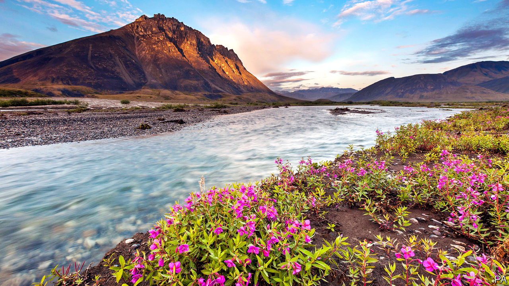

###### The hydroxychloroquine of energy policy

# Drilling in Alaska’s national wildlife refuge makes no sense 

##### Environmentally or economically 

 

> Aug 19th 2020 

FOR AMERICANS still cooped up by the covid-19 epidemic, the Arctic National Wildlife Refuge in northern Alaska is the stuff of dreams. On a recent rafting trip down the Hulahula river in the refuge Robert Thompson, an Inupiaq guide, saw 1,000 caribou and a dozen bears and wolves on tundra that stretched up into high mountain peaks under a big sky. On August 17th the US Department of the Interior released a plan to make 1.6m acres of the refuge’s coastal plain available for oil and gas exploration and development.

Mr Thompson, who lives in Kaktovik, a tiny village within the refuge, sees the impact every day of climate change, which is warming the Arctic twice as fast as the rest of the planet. The ground near his house has collapsed as the permafrost thaws. More polar bears are prowling around because their sea-ice habitat is disappearing. Mr Thompson has had to shoot two that chased him to his front door. And increased coastal erosion has swallowed 400 feet of his family’s property.


The federal study that paved the way for the drilling announcement assumes that oil production in the refuge will last for 70 years. But a government assessment in 2018 has already determined that, without rapid reductions in carbon emissions, warming temperatures will kill thousands of Americans annually. “I wonder what the heck [our descendants] are going to think of us when we’re saying ‘Drill, baby, drill’,” says 73-year-old Mr Thompson.

Production on Alaska’s North Slope currently satisfies about 2% of the country’s daily appetite for oil from existing fields, which lie about 100 miles west of the refuge. The Trump administration is blazing ahead with new development despite the climate implications and polling that shows two-thirds of American voters oppose drilling in the Arctic preserve.

Investment in the region also looks increasingly dicey. North Slope crude prices dipped into negative territory in the spring because of the pandemic shutdown, and they remain weak. BP, one of the pioneers on Alaska’s North Slope, is leaving the region. A number of big banks have bowed to public pressure and stepped back from investing in Arctic oil development, including Goldman Sachs, JPMorgan Chase, Wells Fargo, UBS and Deutsche Bank.

Warming temperatures are also increasing the already high cost of doing business in this remote place. Existing oil and gas infrastructure is designed for freezing temperatures—a climate that is becoming a relic of decades past. Winter—the season of ice and snow-roads, which ease transport and construction in this vast northern terrain that is nearly equal parts land and water—is a month shorter than it used to be. Melting permafrost has already triggered leaks and may put hundreds of wellheads at risk of failure.

The Arctic refuge provides crucial habitat for the Porcupine caribou herd, a critical resource for the Gwich’in people, as well as a useful one for coastal Inupiaq like Mr Thompson. “Nobody has ever told me where I’ll be able to do subsistence hunting if they sell off the land to the oil companies,” he says.

In short, the project makes neither economic nor environmental sense. As pure politics it does have something in its favour, at least for the president. The push to park drill rigs in the refuge would fulfil his campaign promise to boost domestic energy production, whereas Joe Biden, the Democratic nominee, promises net zero greenhouse-gas emissions by 2050, in part by reducing reliance on fossil fuels. The president’s appetite for destruction in the Arctic, in other words, probably has more to do with winning Pennsylvania and other swing states that pit frackers against environmentalists than anything else.■

For more coverage of climate change, register for The Climate Issue, our fortnightly , or visit our 

