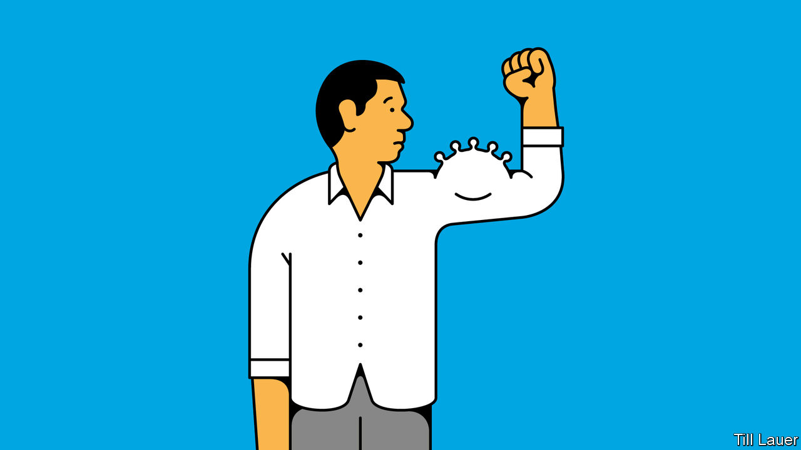

###### Banyan

# Politics is spreading covid-19 in Indonesia and the Philippines 

##### Presidents Jokowi and Rodrigo Duterte act tough, but can’t get things done 

 

> Aug 29th 2020 

IN THE FACE of covid-19, world leaders have fallen into four camps. The first group denies there is a problem: think of Gurbanguly Berdymukhamedov of Turkmenistan, who fined his subjects for wearing face masks before ordering everyone to don them as a protection against “dust”. The second group recognises the threat and counters it with maximum coercion, regardless of civil liberties: think of Xi Jinping in China. The third group, which includes most democracies, handles the tricky trade-off between crushing the virus and crushing everything that is enjoyable in life reasonably well. The fourth group tries to act tough, but does so incompetently. Here, President Rodrigo Duterte of the Philippines and President Joko Widodo, or Jokowi, of Indonesia stand out. Their two archipelagic countries have fared far worse than the rest of South-East Asia, with around 200,000 and 160,000 known coronavirus cases respectively and still rising fast.

Mr Duterte is coarse, Jokowi soft-spoken: the two seem cut from different cloth. Yet both were mayors who won national power because voters saw in them something new. They were not from the usual dynasties that dominate their countries’ politics, nor did they spout the geekspeak of global elitists. As mayors they got stuff done: in Mr Duterte’s case, “fighting crime” in Davao by encouraging vigilantes to murder drug suspects; in Jokowi’s, by building things like expressways in Solo and Jakarta, the capital. Men of action, they promised to roll up their sleeves and apply their business model to the country.


Yet the simple-sounding approach crumpled at the first encounter with the virus. As cases rose, Jokowi dithered and flip-flopped over lockdown and distancing measures. Partly that was pandering to conservative Muslim leaders who have long accused him of insufficient piety. In April he faced pressure to allow the mudik, Muslim migrants’ annual return home to mark the end of Ramadan. Its eventual ban came too late to staunch covid-19’s spread. But, mainly, Jokowi feared popular unrest if he shut down the economy. Having asked to be judged on the economy, he was reluctant to see his beloved infrastructure projects halted. Either way, Jokowi was hardly the strong, resolute ruler.

Mr Duterte acted far more quickly, ordering a lockdown of greater Manila, the capital. He called on the army and police to shoot violators of lockdown rules—classic strongman stuff. But in practice, enforcing the rules has fallen more to local governments than to the security forces under the president’s control.

As it happens, local police and village watchmen armed with staves have often been as heavy-handed as the president could have wished. But that is pure coincidence. In practice, the local power-brokers in the periphery of the Philippines—mayors, plantation owners, armed insurgents or drug gangs with friends in the police—do what they like for their own benefit, regardless of what anybody in Manila, including Mr Duterte, instructs. The political apparatus simply is not suited to effective authoritarianism.

In both the Philippines and Indonesia, confinement in crowded slums has helped spread the virus. So, too, has the two countries’ reliance on inter-island transport. It has put a premium on efficient testing and contact tracing, yet efforts have been scrappy—highlighting how ineffectual the state is. That is despite Jokowi borrowing increasingly from the authoritarian playbook. In April his police chief instructed “cyber patrols” to apprehend people who criticise his handling of the pandemic. In early August he ordered by decree the nationwide enforcement of social-distancing and other public-health measures. Yet he fails to get things done. Bureaucrats are nervous about disbursing money to the neediest for fear of being accused of misspending state funds. Ministries competing for favour stand in for clear policy. Jokowi’s “new normal”—a supposed balance between public health and economic activity—risks serving neither.

Like Mr Duterte, Jokowi inherited a political system in which the presidential writ does not run far, and only then through personalised rule. Yet neither Mr Duterte nor Jokowi campaigned on overhauling the system to introduce more effective and accountable government. Nor did voters insist on it. Perhaps, dismayed by the immense cost of the pandemic, they will next time. But do not count on it. Many in the Philippines and Indonesia, for better or for worse, love a strongman.

