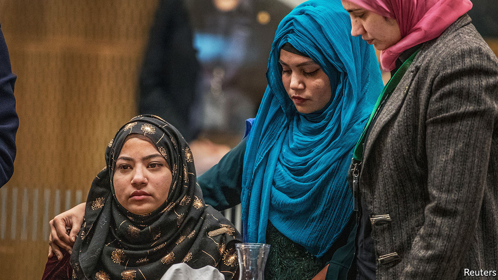

###### Dignity in the face of depravity

# The murderer of 51 Muslims in New Zealand last year is sentenced 

##### He is the first person in New Zealand to be jailed for life without a chance of parole 

 

> Aug 29th 2020 

THE WHITE supremacist who murdered 51 Muslims in Christchurch in March last year expressed only one regret: that he had not been able to kill more. The mass shooting, which he live-streamed on Facebook, was the worst in New Zealand’s history. Its courts had never sentenced anyone to life in prison without parole. But on August 27th a judge ruled that Brenton Tarrant should spend the rest of his life in jail.

“Anything less would have been a disappointment” to most New Zealanders, says Paul Spoonley of Massey University. The attack forced the country to re-examine its reputation as an open and harmonious place. “Ever since,” he says, “we’ve been looking for a degree of resolution.”


Survivors were spared a drawn-out trial because Mr Tarrant, an Australian, pleaded guilty to all 51 counts of murder, 40 of attempted murder and one of terrorism. Still, Kiwis worried that he might make a spectacle of the four-day hearing on his sentence. The killer had sacked his lawyers and was representing himself. He had already inspired copycats in other countries. How could he be prevented from using his trial as a grandstand?

The High Court’s answer was to bar live reporting from the hearing. As it happened, Mr Tarrant was silent. The stand was given mostly to survivors of the attacks and relatives of the victims. Some 90 of them read statements about how his crimes had affected them. Several showed extraordinary grace. Janna Ezat described receiving her son’s body, with the skull smashed open and brain still bleeding, before explaining that her Muslim faith gave her “only one choice: to forgive you”.

Jacinda Ardern, the prime minister, asserts that New Zealand has “fundamentally changed” since the massacre. She banned semi-automatic weapons in the days that followed the attack. By Christmas, the government had bought back more than 56,000 firearms and 200,000 illegal gun parts in an amnesty. It is not clear how many Kiwis have kept guns, though, because the law has only just been amended to create a register.

Families are still waiting for other promised changes. Plans to broaden hate-speech laws to include religion have been resisted on free-speech grounds by New Zealand First, the coalition partner of Ms Ardern’s Labour Party. A royal commission is investigating whether the authorities could have prevented the attacks. In a submission to the inquiry, the Islamic Women’s Council of New Zealand noted that the security services had been warned about the growing threat of Islamophobia. If those complaints had been taken seriously, it asserted, Mr Tarrant might not “have got to the door of the mosques”.

Still, Muslims seem inclined to agree with the prime minister. “New Zealand before 15th March is not New Zealand after 15th March,” says Gamal Fouda, an imam of one of the mosques that was attacked. The mindset of both its police and people “are completely different”, he believes. Aliya Danzeisen of the Islamic Women’s Council notices “a change in how people interact with you”. New Zealanders, she says, are even more warm, friendly, tolerant and inclusive than before. ■

