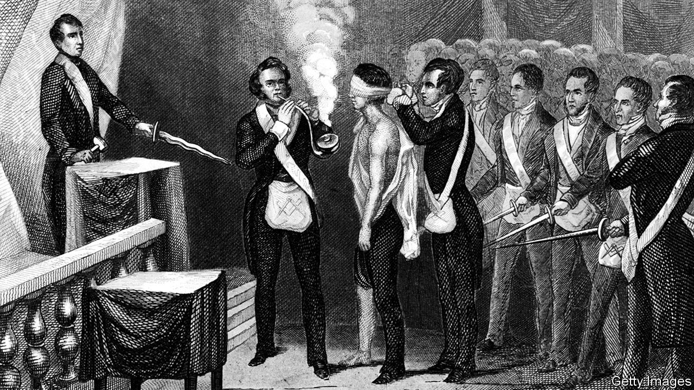

###### Inside the Grand Lodge

# A global history of the Freemasons 

##### It is a more diverse outfit than many of its detractors assume, John Dickie argues 

 

> Aug 29th 2020 

The Craft: How the Freemasons Made the Modern World. By John Dickie.PublicAffairs; 496 pages; $32. Hodder &amp; Stoughton; £25.

SINCE THEY first came to prominence in the alehouses of 18th-century London, the Freemasons have proved adept at self-promotion. From their blindfolded initiation ceremony, obscure rituals and symbols and infamous handshake, the organisation has grasped the powerful attraction of mystery as a recruiting tool. Today the secret society has around 6m members, most of them in America.


Conspiracists have long speculated that these individuals are part of a secret “world order”, with ties to the Illuminati and satanic cults. Debunking these theories is relatively easy, but in his new book John Dickie goes much further. Based on years of research into the archives of the Grand Lodges, he has produced a global history of the organisation, explaining how the brand spread far beyond Europe. “The Craft” is a fascinating tale of imperial trade, warfare and scientific progress which presents the Masons as a response to the broader development of the modern world.

In their simplest form the Freemasons are groups of (almost exclusively) men, who undertake to pursue a “beautiful system of morality” and self-improvement according to a symbolic code. Their society is united by pledges to defend rational, enlightenment values, and over the centuries has attracted many high-profile members, including Wolfgang Amadeus Mozart, Winston Churchill and Walt Disney. In this account, however, Mr Dickie veers away from celebrity biography to focus on the broader membership. His characters are idealists and misfits—political exiles and refugees, traumatised soldiers, addicts who have overcome their vices. Their organisation, says Mr Dickie, is essentially a network of patronage. But he emphasises how many Masons treat its values of friendship, respect, integrity and charity as genuine anchors in their lives, not simply as window dressing for a practical agenda.

It is tempting to see the Masons as an elite clique of white, male, middle-class gatekeepers. And that has often been true. But the outfit described in “The Craft” is more diverse. In early modern Europe, Mr Dickie writes, the Lodges were among the few places where men from different classes could socialise. The Masons wore (and still wear) gloves during their meetings “so that no Brother can tell the difference between the hands of a Duke and the hands of a dustman”. Slaves were forbidden to join, but several American branches, such as that led by Prince Hall, a black leatherworker from Boston, played a role in the abolitionist struggle. In theory the Masons do not accept females, yet Mr Dickie meets Olivia Chaumont, who in 2007 became the order’s first transgender member.

Most books about the Masons speculate on the extent to which they have shaped history. Mr Dickie is more interested in the opposite question. He shows how reactionaries have consistently projected their darkest fears onto the society. In 18th-century Lisbon, as the Inquisition entered its decline, the Catholic authorities presented the Masons as an illicit gay cult. After the French revolution the English feared them as Jacobin agitators; Hitler and Mussolini ranked them among fascism’s most dangerous foes.

For all that, in moments of violence and political chaos the Masons have tended to come out on top. Mr Dickie is also a historian of the Mafia, and he suggests a connection between Italian Lodges and organised-crime syndicates. Some leading Masons, such as Licio Gelli, the head of Italy’s P2 Lodge in the 1970s, have collaborated profitably with terrorists and money-launderers. According to a former Grand Master in Calabria, 28 out of 32 Lodges in the region were known to be controlled by the ’Ndrangheta as recently as the 1990s.

“The Craft” is a well-researched account that dismantles any lingering suspicion that the Freemasons are preparing for world domination. Almost all such calumnies assume they have some form of central government—Mr Dickie makes clear that there is no such thing. While the Lodges share some core principles, they are remarkably various. Masons have been revolutionaries and reactionaries, progressives and conservatives. By chronicling these shifts, Mr Dickie has turned legend into history. ■

