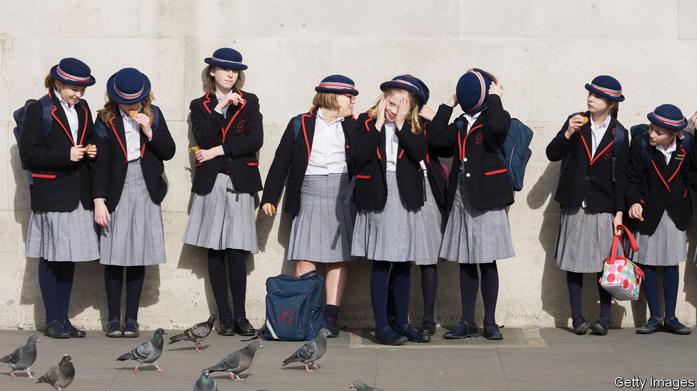

###### Schoolwear and politics

# Bringing down the cost of school uniforms 

##### Schools love a posh uniform; parents and politicians less so 

 

> Aug 29th 2020 

FOR THE many British families who have been struggling to look after children while clinging on to their professional lives, the prospect of schools reopening next week is a heartening one. But there is one aspect of the rentrée to which no parents look forward: the school-uniform bill. The Children’s Society, a charity, reckons that the cost of a state-educated pupil’s secondary-school uniform is now £337 ($445), up from £316 in 2015.

Michael Gove, a former education secretary, is partly responsible. He wanted state schools to adopt blazers and ties, along with the house systems beloved of private schools, which demand further accessories in ugly colours and stripes. These Hogwartian habits were initially adopted in the 19th century to foster team spirit among future empire-builders; modern proponents argue that making poor and rich children wear the same clothes oils the wheels of social mobility.


The transformation of state schools into independent academies has encouraged schools to develop their own identities. Despite government guidance advising them to opt for clothing available in supermarkets, schools have been branding everything from shirts to scarfs. Such items have to be bought in specific shops, and the absence of competition allows retailers to bump up prices.

The Children’s Society says two-thirds of secondary-school parents now have to buy two or more items from a specific supplier. “Most schools only have one shop you can buy the school uniform from,” says Andrea Grant. “You’ve got no choice.” She has set up Old School Uniform, a website where parents sell or give away uniforms. Other parents have gathered in Facebook groups that offer second-hand kit.

Protests against the rising cost of uniforms have driven Mike Amesbury, a Labour MP, to introduce a bill to stop schools relying on a single uniform supplier and cut down on the amount of items the school brands with its logo. Retailers and supermarkets could sell standard blazers, onto which school logos could be sewn. The bill has government support, and it is on its way to becoming law.

The government does not normally support Labour MPs’ bills, but the Conservative Party is worried that schools are putting extra pressure on the “just about managing”, a polite name for the working class coined during the premiership of Theresa May, Boris Johnson’s predecessor. Keeping that vote is central to its plans for retaining power in 2024. Monopolies are “simply not compatible with an agenda that focuses on supporting children from less well-off backgrounds in the seats won by the Conservatives in 2019,” says Tom Richmond, a former adviser to Mr Gove who runs EDSK, a think-tank that focuses on education.

Uniform suppliers are not happy. Matthew Easter, co-chair of the Schoolwear Association, a trade body, believes that the widely cited Children’s Society figures are misleading. The association’s survey of retailers estimates a uniform’s annual cost to be just £101. He argues that if a single retailer has to supply a school’s uniforms, then it will make sure that all items are available all year round. If no retailer has that responsibility, supplies may become uncertain and children may end up wearing mismatched items.

Whether that would matter much is open to question. The Education Endowment Foundation looked at the costs and benefits of 35 measures which might, or might not, enhance children’s performance. Uniforms were among the least effective. But parents like them. Mrs Grant dressed her daughter in uniform even though the school does not have one. “When they’re wearing the school uniform, parents don’t have to think about ‘oh, I haven’t got any branded items or fashionable accessories’, they’re just wearing their school uniform,” she says.

For some schools, no opportunity to extend the range of uniform items goes unmissed. Holmes Chapel Comprehensive School in Cheshire has made covid-19 face-masks compulsory. Their navy blue masks must be bought from their uniform supplier, Sam Dale &amp; Son, at £3 a pop. ■

