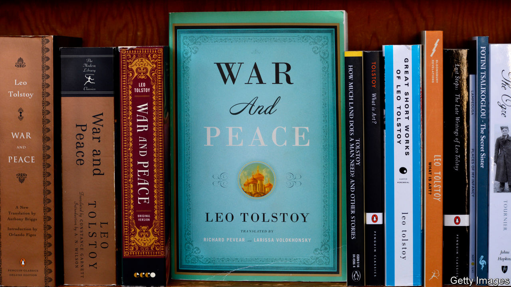

###### Books

# Reading, especially of the classics, is booming 

##### The old stories are the best 

 

> Aug 29th 2020 

A  NORTH LONDON book club, which includes a top civil servant, a senior Bank of England official and one of the country’s best-known publishers, normally picks the latest novels to dissect. But when lockdown began in late March its six members decided to take on “Madame Bovary”, Gustave Flaubert’s masterwork about the danger of getting carried away by social and romantic ambition. The shift in the book club’s tastes was a reaction to the anxious zeitgeist, says one of its members. “We wanted a book that had stood the test of time. Something rock solid.”

This book club was not alone in turning to the classics in times of crisis. The British almost doubled the time they spent reading books, from around three-and-a-half hours a week, according to Nielsen, a research firm, to six during lockdown, and with bookshops closed and publishing schedules interrupted, many people found themselves browsing their shelves and opening volumes they already owned but had never got round to reading. There was much talk of poetry, and of immersion in the Russian greats.


These new habits seem to have stuck. A fortnight after lockdown ended, over a third of people said they were reading more than before lockdown, while a tenth said they were reading less. Almost 2.2m books—a year-on-year increase of 9%—were sold in Britain in the eight weeks to August 15th.

Sales of the classics soared. Everyman, which specialises in reprints of classic titles, says that its sales in July were up by 31% year-on-year. “In uncertain times, people want…wisdom, the ancients, the great sages,” according to David Campbell, the firm’s publisher. “And the classics are the greatest books ever written.” Economic turmoil may also have contributed to healthy sales. “Recessions are very good for publishing. People don’t go out and buy a new car or go on a fancy holiday. So they do something else with their leisure time. Books are very cheap, and they’re a huge source of solace and pleasure.”

Weighty tomes are doing particularly well. After Marcus Aurelius’s “Meditations”, Everyman’s bestselling titles are a two-volume edition of Tolstoy’s stories, then 1,400 pages of Montaigne. Faber &amp; Faber reports that its most popular title in lockdown, after Sally Rooney’s “Normal People”, was “A Fine Balance”, Rohinton Mistry’s 600-page Indian epic set in a city by the sea, published in 1995.

Taking advantage of the popularity of the classics, HarperCollins is planning to relaunch “Master and Commander”, Patrick O’Brian’s series of 20 novels set against the backdrop of the Napoleonic war, the first of which was published 50 years ago. The new campaign, shaped by the fiction market’s increasing tilt towards women, will present them not as naval adventures for boys but as social commentary about friendship, loyalty, love and confinement: less the offspring of Horatio Hornblower, more Jane Austen at sea.

But a crisis that has proved a boon for older titles may be a curse for new ones. Many publishers delayed publication of books they had originally planned for the summer—especially debut novels, which need the complex ecology of bookshops, reviews and festival events to get noticed. The result is a crowded autumn. Almost 600 books are due to come out on September 3rd, the unofficial start of the British publishing season. Competition among first-time novelists will be particularly fierce. The longlist for the Booker Prize for Fiction includes eight debut novels—the largest number ever. Those that do not benefit from that sort of leg-up will struggle to get attention. ■

