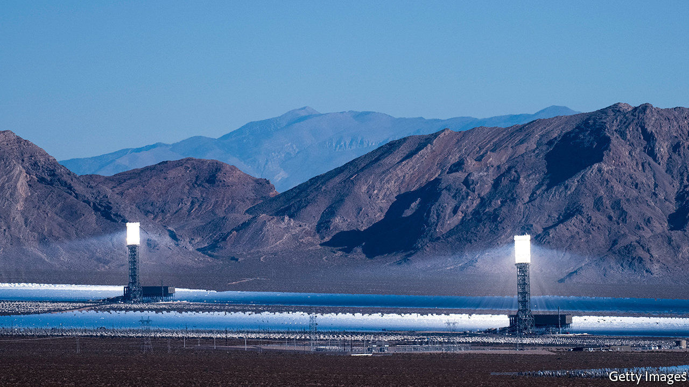

###### Lit

# Businesses compete to battle California’s blackouts 

##### Green companies vie not just to generate power but also to store and manage it 

 

> Aug 29th 2020 

DEPENDING ON WHOM you ask, California is a leader in clean energy or a cautionary tale. Power outages in August prompted stern critiques from Republicans. “In California”, Donald Trump tweeted, “Democrats have intentionally implemented rolling blackouts—forcing Americans in the dark.” In addition to provoking outrage and derision, however, the episode is also likely to inspire investment.

The Golden State has long been America’s main testing ground for green companies. Californians buy half of all electric cars sold in America. Theirs is the country’s largest solar market. As California deals with heat waves, fires and a goal of carbon-free electricity by 2045, the need for a reliable grid is becoming ever more obvious. For years firms competed to generate clean power in California. Now a growing number are vying to store and manage it, too.


August’s blackouts have many causes, including poor planning, an unexpected lack of capacity and sweltering heat in not just California but nearby states from which it sometimes imports power. Long before the outages, however, electricity operators were anxious about capacity. California’s solar panels become less useful in the evening, when demand peaks. In November state regulators mandated that utilities procure an additional 3.3 gigawatts (GW) of capacity, including giant batteries that charge when energy is abundant and can sell electricity back to the grid.

Too few such projects have come online to cope with the surge in demand for air-conditioning in the scorching summer. But more are sprouting across the state. On August 19th LS Power, an electricity firm backed by private equity, unveiled a 250-megawatt (MW) storage project in San Diego, the largest of its kind in America. In July the county of Monterey said Vistra Energy, a Texan power company, could build as much as 1.2GW of storage.

The rooftop solar industry stands to benefit from a new Californian mandate that requires new homes to install panels on their roofs from this year. Sunrun, the market leader, is increasingly pairing such residential installations with batteries. In July, for instance, the company said it had won contracts with energy suppliers in the Bay Area to install 13MW of residential solar and batteries. These could supply power to residents in a blackout or feed power into the grid to help meet peak demand. Sunrun is so confident in its future that it has bid $3.2bn for Vivint Solar, its main rival.

Another way to stave off outages is to curb demand. Enel, a European power company, has contracts with local utilities to work with large commercial and industrial clients. When demand rises, Enel pays customers to reduce energy consumption, easing demand on the grid. A company called OhmConnect offers something similar for homeowners.

Even as such offerings scale up, the need for reliability means that fossil fuels will not disappear just yet. On September 1st California’s regulators will vote on whether to delay the retirement of four natural-gas plants in light of the outages. The state remains intent on decarbonising its power system over the next 25 years. But progress may not move in a straight line. ■

