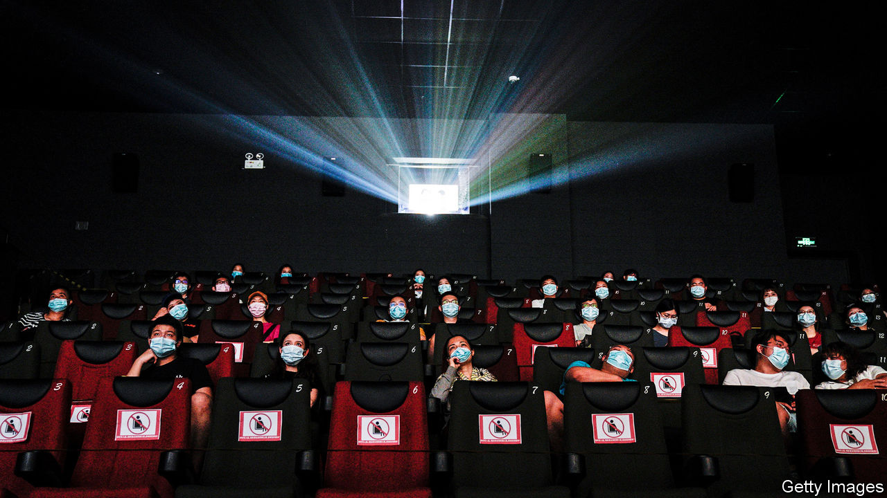
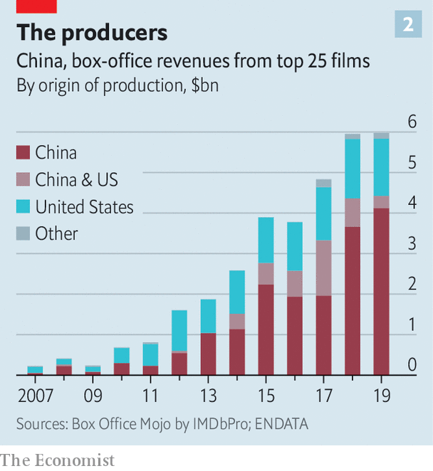
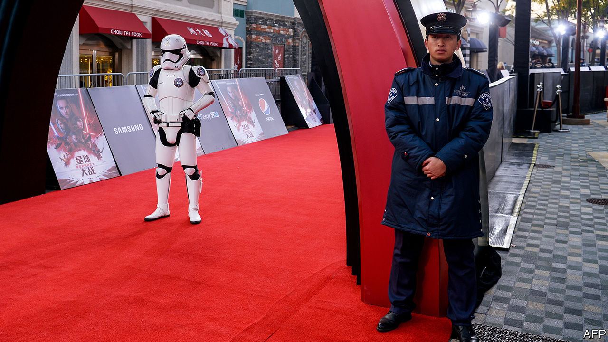

###### Red carpet

# Hollywood’s Chinese conundrums 

##### China’s box office is poised to become the world’s biggest. What does that mean for Hollywood—and America’s soft power? 

 

> Aug 29th 2020 

HORDES OF INVADERS gallop into China, armed with sinister, supernatural powers. As they thunder towards the capital, it falls to a simple country girl to foil the attack. Over mountains and across deserts, dodging arrows and unleashing batteries of fireworks, in 115 action-packed minutes plucky Hua Mulan sees off the dastardly foreigners and brings honour to China.

“Mulan”, which opens on September 4th, is a tale of invasion in more ways than one. Disney, Hollywood’s biggest film studio, has spent five years and $200m on the live-action remake of its 22-year-old animation, in the hope of conquering the Chinese box office. The film is calibrated to appeal to Asian as well as American audiences, from its plot (Mulan’s sidekick, a wisecracking dragon who irritated the Chinese, was written out of the story) to its promotional campaign (Disney touted its release in the form of a classical Chinese poem). “Shang-Chi and the Legend of the Ten Rings”, Disney’s first Chinese-themed superhero movie, is due next year. There is already talk of a “Mulan” sequel.


Hollywood has reason to look across the Pacific. In the past 15 years China’s box-office takings have risen 35-fold, to $9.7bn. That is not far off America’s $11.1bn. This year receipts have sunk as covid-19 forced cinemas to shut. But they may fall a bit less precipitously in China, which after early cover-ups has controlled the virus better than America, where most theatres remain closed (and where “Mulan” is going straight to streaming). China may emerge from the pandemic with the world’s biggest box office (see chart 1).

 


The country was becoming central to Hollywood’s business before covid-19. America’s blockbusters have increasingly relied on Chinese audiences to recoup their vast production budgets and American studios have tapped Chinese investors for finance. Between 2010 and 2019 Disney’s share of revenues from Asia nearly doubled to 11.5% and now rivals that from Europe. Hong Kong and Shanghai each has a Disneyland. Universal (owned by Comcast, a cable giant) is building a theme park in Beijing. Sony, a Japanese conglomerate with a big entertainment division that includes Columbia Pictures, last year earned 10.2% of its revenues in China, up from 6.7% five years earlier. 

However, Hollywood’s desire to capture both Eastern and Western imaginations—and wallets—increasingly faces two sets of problems in China. First, mainland studios are giving Tinseltown a run for its money on their home turf. And China’s censors are becoming more active in shaping the tales that Hollywood tells, imbuing America’s soft power with Chinese characteristics and angering American politicians. The great screen romance between Hollywood and China is turning into more of a drama.

China raised the curtain on regular Hollywood releases in 1994. The market was tiny—“The Fugitive”, the first American film to be shown in cinemas that year, made just $3m—and the bureaucracy stifling. Imports were limited to ten a year. Their makers were allocated just 13% of a film’s box-office takings. The rest reserved for cinemas and distributors.

Slowly the rules were relaxed. In 2001 the foreign-film quota doubled to 20. A decade later it rose to 34, and producers’ revenue share went up to 25%. Foreign studios also discovered co-production. Movies made in partnership with a Chinese company qualify as domestic and are thus exempt from the quota system. They also entitle the studio to as much as 43% of the box office and better release dates; usually only domestic films are awarded slots during the four main holidays—spring, summer, national day and Chinese new year—when around half the year’s tickets are sold. 

At the same time, China’s growing middle class was developing a taste for cinema. In 2005 China had 4,000 theatre screens, slightly more than Britain at the time. Last year it had nearly 70,000, according to Omdia, a market-research company, almost equal to America and Europe combined. 

Blow-Up

By 2007 American studios ruled the Chinese box office, making 16 of the 25 highest-grossing films, according to Box Office Mojo, part of IMDbPro, a data company. In 2013 “Pacific Rim”, a robots-versus-monsters romp produced by Legendary Pictures, became the first American blockbuster to take more money in China than at home. After that, recalls Peter Loehr, former head of Legendary’s China division, Hollywood studios that did not yet have offices in China quickly established them.

 As Chinese audiences flocked to watch American films, Chinese media and tech companies rushed to invest in them. In 2016 Dalian Wanda Group, a conglomerate, bought Legendary for $3.5bn. It also snapped up real estate next to the Beverly Hilton hotel in the heart of Tinseltown. In 2013, at the launch of its own huge studio in Qingdao, the Oriental Movie Metropolis, Dalian Wanda paid stars including Leonardo DiCaprio and Nicole Kidman to attend. This marked the start of a “three-year feeding frenzy, where everybody was happy to take these idiots’ money”, recalls one former Hollywood bigwig. Like the Japanese and the Arabs before them, he says, the Chinese discovered that when you hand out dosh, “people here will take it from you, in exchange for allowing you to come to a party with some semi-famous people”.

In the past few years, though, Chinese studios have grown less infatuated with Hollywood—and more sophisticated. They have splurged on sound stages and other studio infrastructure. Hengdian World Studios in Zhejiang, Shanghai Film Studio and August First Film Studio in Beijing, as well as Dalian Wanda’s Movie Metropolis, have been enlarged and upgraded. Co-productions with Americans have sharpened Chinese film-makers’ skills and given them international contacts, notes Wendy Su of the University of California, Riverside. Special effects, where the West remains in the lead, can be farmed out. “The Eight Hundred”, a recently released war drama produced by Beijing-based CMC Pictures, subcontracted its visual effects to companies including DNEG, a British firm, and Rising Sun Pictures, an Australian one.

Rao Shuguang, secretary-general of the (Communist Party-led) China Film Association, says that along with “substantial” improvement in quality, China is exploring new genres. This month film authorities issued new guidelines for science-fiction films, which they used to frown upon. Sci-fi is to “disseminate scientific thought” and “raise the spirit of scientists”. 

Chinese films, sci-fi or otherwise, are certainly getting more entertaining. “The Wandering Earth”, a sci-fi thriller made by the China Film Group Corporation (CFGC) took around $700m last year. So did Beijing Enlight Pictures’ “Ne Zha”, an animated tale of demons and spirits based on a 16thcentury novel. These slick, home-grown blockbusters pushed Disney’s “Avengers: Endgame”—the highest-grossing movie in history by worldwide receipts—into third place at China’s box office. In a reversal of fortunes from a decade ago, 17 of the 25 highest-grossing films in China were Chinese, including eight in the top ten; only eight were American (see chart 2).

 


 Audiences in big Chinese cities like Beijing and Shanghai can relate to Western fare, says Lei Ming of ABD Entertainment, an audience-analysis firm, but people in smaller, provincial cities do not. And they are the fastest-growing audience: third-tier and fourth-tier cities, roughly those with fewer than 3m residents, account for 40% and rising of China’s box office, according to Maoyang, a ticketing platform. 

Now Hollywood’s commercial challenges are increasingly compounded by political ones. Peter Shiao, who in 1998 produced the first Sino-American co-production, “Restless”, talks of a “climate of increasing suspicion on both sides”. 

Under Xi Jinping, China’s party chief since 2012, a period of relative openness to outsiders has given way to a more nationalistic sentiment. In an effort to make China a “strong cultural nation”, Mr Xi’s government has not only put the brakes on extravagant foreign investments, forcing Dalian Wanda to sell its Hollywood digs, among other things, but also made it harder for American studios to do business in China. It is strictly enforcing rules that require co-productions to have at least one-third of their investment from Chinese partners, at least one scene shot in China and a cast that is at least one-third Chinese. 

These days co-productions are “almost impossible to approve”, Mr Shiao laments. Disney, which had hoped its Shanghai theme park might buy it more access to Chinese television, has been disappointed. In 2016 Netflix tried to enter China but hit snags with technology and, above all, content control; for instance, censors considered “BoJack Horseman”, a cartoon about an alcoholic, anthropomorphic horse, an example of “funeral culture”. “The Chinese have no intention whatsoever of allowing non-Chinese media brands to operate in China,” sighs one person involved in that unhappy experiment. One American producer fears that China might target Hollywood in retaliation for President Donald Trump’s swipes at Chinese companies like Huawei, a telecoms giant, and TikTok, a hit video app. Mr Trump’s campaign to force TikTok’s sale to American investors led its American boss, Kevin Mayer (himself a former Disney executive) to quit this week after only three months in the job.

Good Will Hunting

For American critics the biggest concern is over China’s attempts to bend Hollywood’s stories to its will. Communist censors have long harried film-makers, banning not just the “three Ts” of Tiananmen, Tibet and Taiwan, but themes such as time-travel and the supernatural; China blocked “Pirates of the Caribbean: Dead Man’s Chest”, objecting not to the piracy but to the ghosts. Films that break these or other unwritten rules may be banned, sent back for edits or, for lesser offences, get a duff release date or curtailed advertising budget, the size of which is regulated in China. In an internal email from 2014 disclosed by WikiLeaks, a senior Sony executive wrote of “censorship really hassling us” about a scene in “RoboCop” where the cyborg hero’s human remains are exposed. “Don’t think we can make a stand on it either way, too much money on the line,” he summed up. 

Some censor-pleasing tweaks are harmless, like Paramount Pictures’ removal of dirty laundry from a Shanghai skyline in “Mission: Impossible III” (2006). Others can be consequential. “Abominable” (2019), an animated co-production by DreamWorks and Pearl Studio about a lost yeti, featured a map endorsing China’s bogus claim to the South China Sea but no mention of Tibet—never mind that the entire film is about a journey to Mount Everest. Then there are films that are not being made. “Not many people are going to want to go out and make any movies about the Uighurs,” admits one former Hollywood executive, referring to China’s persecuted Muslim minority.

In July William Barr, America’s attorney-general, accused Hollywood of handing China “a massive propaganda coup”, citing Paramount’s decision to remove a scene in “World War Z” in which characters speculate that a deadly virus may have originated in China. Ted Cruz, a Republican senator, has proposed that studios which kowtow to the Chinese Communist Party should be banned from filming with America’s armed forces. Stan Rosen, a China expert at the University of Southern California, wonders if studio chiefs may soon be called to give evidence before Congress.

Studio executives complain privately that every industry dealing with China faces ethical dilemmas, and that bashing liberal Hollywood is just Republican electioneering. But criticisms are not limited to conservative voices. Last month PEN America, a free-speech organisation, concluded in a report that “Hollywood’s decision-makers are increasingly envisioning the desires of the CCP [Chinese Communist Party] censor when deciding what film projects to greenlight, what content these films contain, who should work on the films, and what messages the films should implicitly or explicitly contain.” 

China may be especially keen to shape Hollywood’s storytelling because it struggles to break through with its own narratives beyond its borders. Since the early 2000s American studios have made more money at the international box office than at home. These days about two-thirds of their ticket revenues come from abroad. Chinese productions, by contrast, seldom make much money outside China. “Wolf Warrior 2” (2017), China’s highest-grossing film, produced by CFGC and others, took less than 2% of its $870m haul overseas. (Its tagline—“Anyone who offends China, no matter how remote, must be exterminated”—will not have helped.)

Global audiences will not flock to Chinese blockbusters soon. For one thing, there may be fewer of them to see in the coming years. Cecilia Yau of PwC, a consultancy, expects investments in film-making to decline as a result of covid-19. Chinese films make 80-90% of their money at the cinema, estimates Mr Lei of ADB Entertainment, so lower theatre attendance means lower returns for investors. 

 


In America, by contrast, a film’s takings at the theatre are usually eclipsed by what it earns through television rights, merchandising, video-game licensing and so on. It therefore makes sense for American studios to produce films and send them straight to streaming, as Disney is doing with “Mulan” in many markets. Disney’s films are in effect merely the intellectual-property engine that drives a much larger machine. Before social-distancing edicts obliterated businesses that rely on crowds, it made an annual operating profit of $2.7bn directly from its films and another $6.8bn from the parks, cruises and products that piggyback off them. These profits should return after the pandemic.

That ought to put American studios in a better position than Chinese rivals to keep telling stories in a world of declining cinema attendance—a trend that long predates covid-19. The average American visited the cinema 3.5 times last year, down from five times at the turn of the century. In China ticket sales have begun to slow as more people plump for local streaming services such as iQiyi and Tencent Video.

Project Power

What the shift to streaming means for American soft power is less clear. One possible effect is that East and West will consume less culture in common. At the cinema audiences often soak up stories from all over the world. As they turn to streaming they could do the same; Netflix is replete with local productions. But they more often consume content tailored to their country—and in China, almost exclusively so. The cultural and commercial tussle for global imaginations goes on for now. But one day it may see Americans and Chinese mutually retreat to their own, national, small screens instead.■

