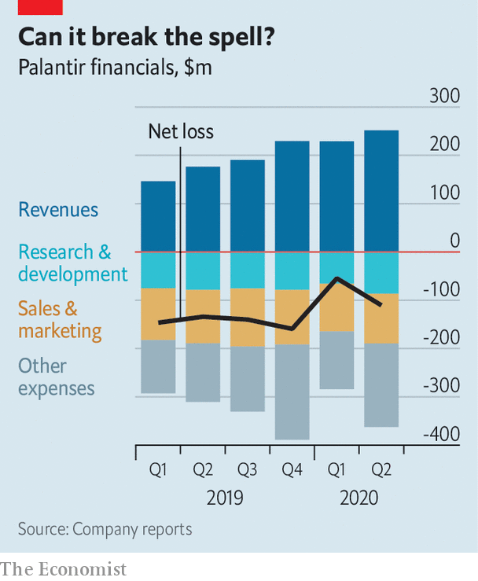

###### A prickly patriot

# Palantir’s stockmarket prospectus reveals both losses and promise 

##### A secretive software-maker says hello to the stockmarket—and goodbye to Silicon Valley 

 

> Aug 29th 2020 

“ONE NEVER really knows who one’s enemy is.” The words of Jürgen Habermas, a noted Frankfurt School philosopher, are a good point of departure for understanding Palantir Technologies. On August 25th the controversial software firm, named after a magical orb in J.R.R. Tolkien’s “Lord of the Rings” that lets users see and speak across space and time, filed the paperwork to list on the New York Stock Exchange. Its direct offer of existing shares to public investors, without raising fresh capital, could happen within a month.

The company sells programs that gather disparate data and organise them into something usable for decision-makers, from soldiers in Afghanistan to executives at energy firms. More than a technological project, it is a philosophical, even political one. In the early 2000s its co-founder and boss, Alex Karp (who used to sit on the board of The Economist’s parent company), wrote a dissertation about aggression in politics at Frankfurt’s Goethe University, though not under Mr Habermas, as is often claimed. And Palantir itself is a child of the 9/11 terrorist attacks of 2001, which America’s sundry law-enforcement outfits failed to avert because they did not share data. In a preface to the prospectus, bleak by the upbeat standards of the genre, Mr Karp writes of government agencies that “faltered” and crises that “expose the systemic weaknesses of the institutions on which we depend”. Fixing these shortcomings is the company’s raison d’être. It could prove lucrative. But it invites attacks from rivals and critics.


Like most startups that plan to go public these days, Palantir is haemorrhaging red ink. The 17-year-old firm has yet to turn a profit. Last year it lost $580m on revenue of $742m. It spends more on sales and marketing than on research and development (see chart). But its venture-capital backers, who have poured $3bn into the firm over the years, most recently valuing it at perhaps $26bn, can draw comfort from things moving in the right direction. In the first half of 2020 revenue rose by 49%, year on year, while losses got smaller. Sales may exceed $1bn for the full year, thanks to the use of Palantir’s products to analyse pandemic data. It will vie with Snowflake, another data business about to list, for the year’s biggest software flotation.

 


Palantir’s longer-term prospects are murkier. Successful corporate-software firms develop programs and services that can be offered without much customisation to many clients. This is trickier in the data business, where every company has a unique digital footprint. When Palantir got going, it was in effect a professional-services firm, chiefly creating bespoke data-analysis systems for the likes of the CIA and the Department of Defence. In recent years it has developed more generic products for corporate clients. But its scepticism of standardisation means it continues to deploy plenty of engineers to tweak them. This increases costs and is likely to limit how big and profitable it can get, says Mark Moerdler of Bernstein, a brokerage.

Palantir’s origins bring other challenges, too. Because it came of age before the rise of computing clouds, its software often still inhabits customers’ data centres, making it less nimble than younger cloud-based rivals like C3.ai and Databricks. Working for the government, particularly its spookier agencies, has also created a secretive and proprietary culture that is not an easy fit with the sort of partnerships that other tech firms often successfully use to expand their business. And it remains heavily reliant on government contracts. Between January and June 55% of revenue came from official sources, up from 45% in the same period last year. It has only 125 clients, with the biggest three (unnamed) ones accounting for nearly a third of sales.

Closeness to the state also points to Palantir’s biggest risk: politics. From its post-9/11 beginnings it has seen itself as an instrument of national security. “If we are going to ask someone to put themselves in harm’s way, we believe that we have a duty to give them what they need to do their job,” Mr Karp writes in his missive. One of his co-founders is Peter Thiel, a famed venture capitalist of strong libertarian bent with an authoritarian streak—and an occasional supporter of President Donald Trump.

This—combined with work for Immigration and Customs Enforcement, a federal agency despised by progressives for its heavy-handed treatment of migrants, or the Pentagon’s Project Maven, to analyse drone footage—has made Palantir one of the most hated firms in left-leaning Silicon Valley. “I’ve had my favourite employees yell at me,” said Mr Karp earlier this year, from a barn in New Hampshire where he was self-isolating even before the pandemic. Some engineers have left. Others are demanding high salaries to remain; in the first half of the year Palantir paid $182m in stock-based compensation, 38% of revenue. Though being in bed with America’s law enforcers and spies won’t scare off other government customers, corporate clients may take fright, particularly abroad. As the prospectus concedes, “Our reputation and business may be harmed by news or social media coverage.”

Palantir, which has recently decamped from Silicon Valley to Denver, is trying to make a virtue of the culture clash. It paints itself as a patriotic problem-solver, eschewing the techno-Utopian pretensions of the West Coast’s engineering elite. They may know more than most about software, Mr Karp writes. “But they do not know more about how society should be organised or what justice requires.” That, he implies, is the role of elected governments; the prospectus rules out dealing with Communist China. An unusual sales pitch in tech. But a plausible one. ■

