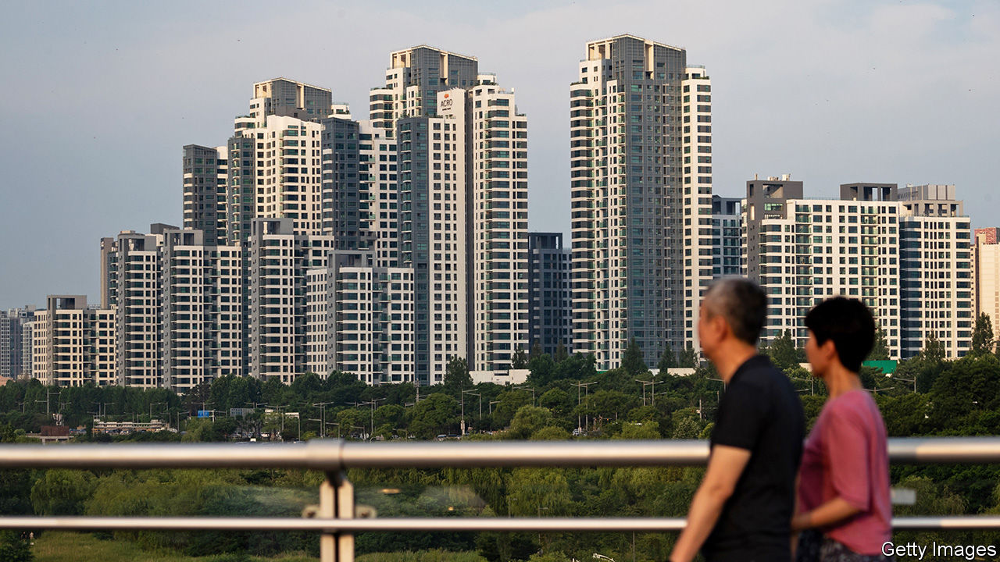
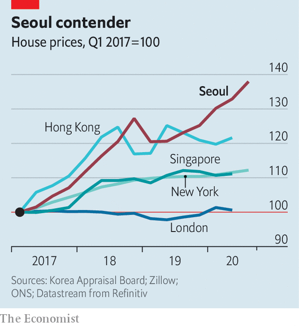

###### The high-rise life

# Efforts to rein in house prices are fuelling discontent in Seoul 

##### Measures aimed at speculators are hurting first-time buyers 

 

> Aug 27th 2020 

JUDGING FROM the chatter on the streets of Gangnam, it is a bad time to buy property in the South Korean capital. “It’s been a nightmare looking for an apartment,” says Lee, a 30-year-old who lives in a rented studio in the glitzy district in southern Seoul. “I think about what to buy and where and a month later the price has gone up by 20%.” Although he has a good job at a big company and is planning to buy with his girlfriend, he worries they’ll have to keep renting for now. “The government says they want to fight the rich, but actually they’re hitting the middle class.”

In recent months such complaints have become more common. Greater Seoul is home to half of South Korea’s population and to the vast majority of attractive jobs, schools and entertainment options. Few people with any ambition can afford not to move there. But affording the move is hard. Residential property prices in the capital have risen by around 40% over the past three years, according to official statistics; in that time, the prices of flats have gone up by 52%, suggests analysis by KB Kookmin, a bank. The rises have been fuelled in large part by demand for scarce high-quality flats in popular districts such as Gangnam.


The government, spying a speculative bubble, has introduced around two dozen measures to cool the market over the past three years. In December it banned mortgages on properties worth more than 1.5bn won (around $1.3m), roughly the price of a mid-size flat in Gangnam. It has also lowered the maximum loan-to-value ratio for flats worth more than 900m won from 40% to 20%. Last month it announced plans to increase property taxes for expensive homes and owners of multiple properties, as well as capital-gains levies on short-term sales. The overall effect, though, has been muddled and counterproductive. Young people such as Mr Lee, who are keen to get on the property ladder, are particularly disgruntled by politicians’ failure to make good on their promises to make housing affordable.

In part the problem is that the government’s efforts to cool the market have been offset by monetary easing by the central bank. In order to cushion the economic fallout from covid-19, the Bank of Korea has cut interest rates, encouraging some South Koreans to pile into property. Meanwhile, the tax proposals have angered existing investors, and are likely to restrict supply. Parallel efforts to alleviate the shortage of high-quality housing by building more of it have been slow to get off the ground. Prices, therefore, have continued to rise.

The government’s caps on mortgage availability have hit first-time buyers, particularly those looking to buy in affluent areas. The government says it wants to help “end-users” of apartments and punish “speculators”, says Song In-ho of the Korea Development Institute, a think-tank. But its attempts to deter the latter have also hurt the former.

 


The discontent is exacerbated by the peculiarities of the rental market. Two-fifths of people living in Seoul own their homes; the rest are tenants. Because South Koreans tend to invest the bulk of their savings in property, four-fifths of landlords are other private households rather than corporations or public institutions, compared with nearly two-thirds in Japan and just over half in Britain.

Roughly half of all tenancies are based on a unique system known as jeonse, or “key money”. Under a jeonse contract, the tenant pays the landlord a deposit of between 60% and 80% of the purchase price to live rent-free for two years. The deposits have helped landlords finance further property purchases. But they make it hard for anyone without the savings to find anywhere affordable to live, even if they rent. Seoul may seem cheaper than cities such as London or Hong Kong when prices are compared to incomes. But it is less affordable than it looks.

There are other strains. Household debt is high, having risen rapidly in the past. “The economy as a whole is far too exposed to the property market,” reckons Hahm Joon-ho, a former member of the Bank of Korea’s monetary-policy board now at Yonsei University in Seoul. “If prices fell suddenly, it would be very bad.”

In the short term, then, the government’s inability to bring down prices may be no bad thing. No one wants to see a sudden house-price crash at a time when the economy is already suffering a pandemic-induced slowdown. The economic fallout from the virus could curtail household incomes. That might delay the economic recovery as people cut back on their spending in order to service their loans, although interest-rate cuts should provide some relief.

In the longer term, though, the problem of affordability will have to be dealt with. Increasing supply is likely to be a much more promising way of bringing house prices down than intricate policy interventions, says Mr Hahm. There is no sign that Seoul will become less attractive as a place to live, or that prospective homeowners will become less exacting in their tastes. “More and more people want to live in high-quality apartments. Seoul does not have enough of those—and so we need to build more.” ■

