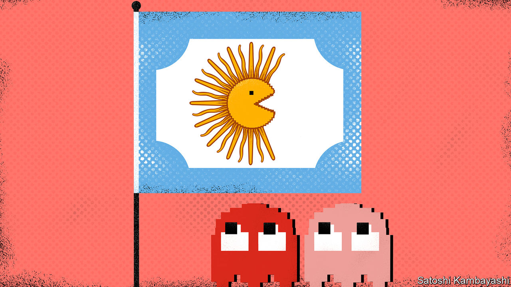

###### Buttonwood

# For fixed-income investors, hell is other bondholders 

##### As Argentina shows, investors have much to fear from their less predictable brethren 

 

> Aug 29th 2020 

ALTHOUGH OLD enough to feel nostalgic about classic video games, Buttonwood was never a fan of Pac-Man. Yes, eating pellets and eluding colourful ghosts made a change from shooting waves of space invaders. But the game never grabbed him. And its name made no sense. The original, "Puck Man", was apparently altered to stop arcade vandals changing the P to an F.

Emerging-market investors may share those cool feelings. To them, “Pac-Man” is the name for a divide-and-rule strategy pursued by governments seeking to puck their bondholders. Fear of the tactic haunted Argentina’s $65bn-debt talks, which have eventually come to a deal that most bondholders looked likely to accept by August 28th, after The Economist went to press.


A government that cannot pay its debts typically offers to swap its bonds for new ones with gentler terms. Under modern “collective-action” clauses, it can group together any bond series it wants to exchange and take a vote of all their holders. If a large majority agree to the swap, it becomes binding for all. This stops a few mercenary creditors free-riding on the generosity of others by holding out for a better deal, hoping that the government will pay them more once it has paid everyone else less.

The absence of such provisions allowed a colourful group of hold-outs to chase Argentina for almost 15 years after its default in 2001. At one point, NML Capital, a hedge fund, managed to prevent Argentina paying any creditors until it paid them all, a legal feat that upset other bondholders almost as much as it upset the government.

Creditors do not always see eye to eye. A stingy minority may antagonise everybody else. Similarly, a pliable minority who are desperate for a deal may not share the interests of the harder-headed majority. The Pac-Man strategy exploits this difference. Consider the following case, based on a blog post by Mitu Gulati of Duke University and Mark Weidemaier of the University of North Carolina at Chapel Hill. Suppose the government needs two-thirds of investors (weighted by principal) to agree to swap 200 bonds. The bonds are equally split into two varieties, pink and red. About 67% of pink bondholders support a swap. But only 33% of red ones do. If all vote together, the swap fails (only 100, or half, vote in favour).

Suppose instead the government first makes an offer to pink investors. This separate offer will succeed and become binding on all pink bondholders, including the 33% who voted against. Next, the government makes a second, slightly sweeter offer to both red and pink. All pink holders will support the second offer, because it is a little better than the earlier deal to which they are all now bound. With 100% of pink votes in its pocket, the government needs only a third of the red votes to get a two-thirds majority of the two groups combined. The swap succeeds. A government that could not gobble up two ghosts at once can devour both—after first chewing and regurgitating one.

In practice, the Pac-Man strategy is not easy. Votes are hard to predict. And Argentina had to clear a second threshold to swap its newer bonds. As well as winning a two-thirds majority overall, it had to win a 50% share of each legally distinct bond included in the swap. If the 50% bar was not met for even one bond series, the entire swap would fail.

To overcome this problem, Argentina proposed "redesignation". It would make an offer, count the votes, and then, if necessary, declare some bonds ineligible for the swap after all, allowing it to disregard their votes.

Creditors immediately cried foul, arguing that redesignation was underhand and unfair. But although Argentina’s proposal breached the spirit of its contracts, it did not violate the letter. It merely interpreted the terms to its best advantage—something its more troublesome bondholders, such as NML Capital, have previously done with brio. The government’s proposal this year was “aggressive, creative, and right there in the documentation”, says Anna Gelpern of Georgetown University. Instead of complaining, creditors should have said, “Oh crap, you read the contract better than I did.”

In the end, redesignation was not necessary. Argentina sweetened its offer enough to win over the creditors (and agreed to make redesignation harder in the future). By seeking compromise, the government proved something Pac-Man fans have always known: you can sometimes stop a ghost from chasing you for a bit by taking a step in its direction.

