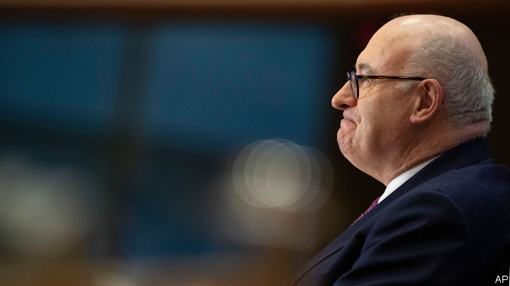

###### Exit bruiser

# Phil Hogan, Europe’s trade commissioner, resigns 

##### A controversy over a quarantine forces him out 

 

> Aug 27th 2020 

TOP TRADE negotiators are renowned for being astute and tough. When Phil Hogan took over as the European Commission’s negotiator last year, he was seen a bruiser, and a worthy match for Robert Lighthizer, his American counterpart. But on August 26th, less than a year into his tenure, Mr Hogan departed the ring.

The cause was an injudicious trip to Ireland, during which the government claims he breached covid-19 public-health guidelines. For a start, he did not go into quarantine for 14 days upon his arrival. Then he attended a golf-society dinner along with other public figures, which created a furore in Ireland and led to the resignation of a minister who also attended the event. In his resignation letter Mr Hogan said that the controversy “was becoming a distraction” from his work.


The outcome may come as a surprise. Commissioners are sacked only rarely, and mostly for blatant corruption. Ursula von der Leyen, the president of the European Commission, was clearly in a tough spot. Officials in Brussels are supposed to sit above national politics, and forcing Mr Hogan to jump risked the appearance of submitting itself to a national capital. But allowing him to stay would have ignored bubbling anger in Ireland.

Mr Hogan had grand plans when he took office, including ensuring that the transatlantic trade relationship did not deteriorate on his watch. He had begun conducting a “major” review of EU trade policy, strengthening its trade defences, and trying to cobble together a fix for the broken system of solving disputes at the World Trade Organisation (WTO).

For all these aspirations, Mr Hogan’s list of achievements looks a little thin. His relationship with Mr Lighthizer got off to a rocky start. Even after a micro-deal agreed on August 21st, Europe’s exporters face tariffs on billions of dollars’ worth of their wares, in retaliation for subsidies for Airbus, a European planemaker. A collaboration with Mr Lighthizer to work out a common response to China’s economic distortions appeared to have stalled. (And a botched bid to lead the WTO earlier this year did not exactly cover Mr Hogan in glory. It ended after he realised that he would probably not have the support of all the EU’s 27 member countries.)

Arguably, the odds in all this were stacked against him. Achieving much within the Brussels bureaucracy in less than a year—and in the middle of a pandemic—is a tall order. No European trade representative will ever have as much power to put pressure on trading partners as Mr Lighthizer has been given by President Donald Trump. And America’s engagement with its allies over China has been shallow, rather than a true collaboration.

Mr Hogan’s resignation note said that he hoped history would judge his achievements favourably. Perhaps the best that can be said is that they look more impressive when you consider his constraints. ■

