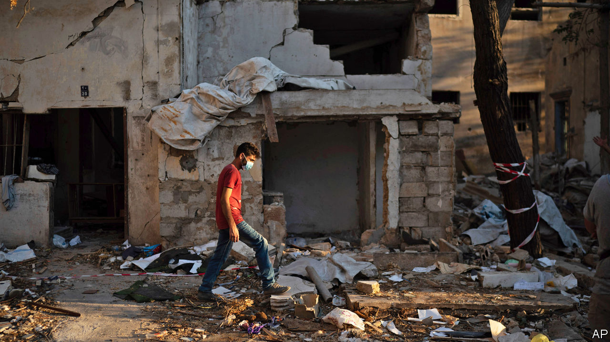

###### Broken cover

# The explosion at Beirut’s port will blow a hole in insurers’ balance-sheets 

##### The worst scenario for insurers is also the most likely: that the blast was an accident 

 

> Aug 27th 2020 

A  HOMEOWNER IN Achrafieh does not care if the investigation is a sham, only that it rules that the explosion was an accident. Otherwise his insurance policy will pay nothing. The owner of a ruined boutique down the hill in Mar Mikhael would prefer the opposite result: her policy covers terrorism, unlike most, and will compensate her for an estimated $100,000 in repairs and lost inventory. The manager of a car-rental firm wonders if his explosion cover will include one of the largest non-nuclear explosions in history, since his vehicles were flattened by falling debris, not the blast itself.

The explosion that ripped through Beirut on August 4th, caused by 2,750 tonnes of ammonium nitrate stored improperly for years at the port, devastated much of the city centre. More than 200 people are dead or missing, thousands wounded, and an estimated 300,000 are homeless. The damage to property could reach $15bn. A chunk of that will land on insurance companies in Lebanon, with consequences for banks and foreign reinsurers.


In 2018 Lebanese insurers paid out around $90m to settle property and casualty claims. Insured losses at the port alone could now run to $250m. Victims have filed 2,500 claims for $425m in damages across the city, according to Raoul Nehme, the caretaker economy minister. Insurers expect the number of claims to quadruple and the final price tag to hit $3bn. That is almost double the annual revenue of Lebanon’s 52 insurers, which wrote $1.7bn in gross premiums in 2018.

Claims are frozen until the government finishes investigating the blast. Insurers would largely be off the hook if it were a deliberate act (there is no evidence to suggest it was). An act of war would trigger force-majeure clauses, and most policies do not cover terrorism. The worst scenario for insurers is also the most likely: that the blast was an accident. That would trigger another set of claims, as insurers seek to collect from the owners of the warehouse where the ammonium nitrate was stored.

Whatever the final bill, some Lebanese insurers will struggle to pay it. Written premiums fell by 4% in 2019 as an economic crisis forced some policyholders to drop their coverage. This year has been worse. Several insurers are subsidiaries of the country’s insolvent banks. Arope, one of the ten biggest non-life insurers, is owned by Blom, Lebanon’s second-largest bank, which saw net profits fall 77% last year. Other lenders in the country, such as Byblos and Credit Libanais, also offer insurance products.

Foreign reinsurers will be stuck with part of the bill. Hannover Re expects to book a “major loss”, an event with more than €10m ($11.8m) in claims. Sven Atloff, a member of its board, says it is still impossible to tell whether the total cost will be in the low tens of millions of euros, or even exceed €100m. The firm’s net income was already down by 39% in the first half of 2020 because of covid-related losses. Munich Re also expects a sizeable hit.

For Lebanese firms there is an added wrinkle: whether they can get the cash to pay claims, many of which must be paid in dollars. (Though still officially pegged to the greenback, the Lebanese pound has lost 80% of its value on the black market in recent months.) A banking crisis that began in October has left dollars scarce; foreign-currency withdrawals are tightly restricted. The central bank may have to stop subsidising wheat and fuel imports in November because it is close to its minimum required reserves.

Several policyholders say their insurers have offered to pay them with bank cheques, which can still be freely deposited. But the cheques lose up to two-thirds of their value once withdrawn from banks in devalued local currency, typically converted at a “quasi-official” rate, and converted to dollars on the black market. After months or years of delay, the policies of many of the blast’s victims may give them a payment barely worth the paper they are written on.■

