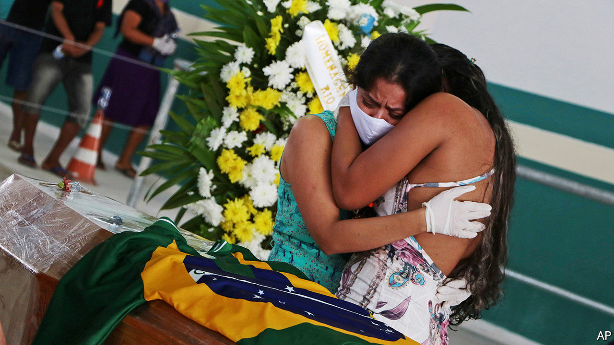

###### A pandemic of psychological pain

# How to reduce the mental trauma of covid-19 

##### A few cheap steps can make a big difference 

 

> Aug 29th 2020 

Editor’s note: Some of our covid-19 coverage is free for readers of The Economist Today, our daily . For more stories and our pandemic tracker, see our 

IN ECUADOR PEOPLE are still searching for the bodies of relatives who died of covid-19 four months ago. In Italy a boy begged a priest to forgive the “sin” of lowering his face mask outdoors. Not since the second world war have so many people in so many places been traumatised at once (see ). Even after the disease itself is brought under control, the mental scars will linger.

For many, the pandemic is merely an annoyance. But some groups face a particular risk of post-traumatic stress disorder (PTSD), the symptoms of which include nightmares, flashbacks and feelings of guilt, anxiety or isolation. The most vulnerable are those who have been very ill, or lost relatives, as well as victims of previous traumas (such as refugees), and those with front-line jobs, such as doctors and nurses. In Spain nearly a sixth of those infected are health-care workers, and most of them show signs of PTSD. In Bangladesh, where the incomes of poor people briefly fell by 80% when lockdowns were tight, 86% of people in one poll reported covid-19-related stress.


Humans are resilient. Those who experience trauma mostly cope. When their homes are destroyed by earthquakes, they rebuild them and carry on. Even the mass bombing of cities in the second world war did not break civilian morale. Nonetheless, the world should take the collective mental damage of covid-19 seriously. Steps to reduce it cost little, and can benefit not only individuals but also society more broadly.

Research into previous disasters suggests that survivors’ long-term mental health depends more on “perceived support” than “received support”. In other words, donations of money or food matter less than the feeling that you can turn to your neighbours for help. Such help is typically offered spontaneously, but governments can also chip in. France, for example, sets up “medical and psychological emergency units” after terrorist attacks and other disasters. These try to minimise the long-term mental-health consequences of such events by offering immediate walk-in psychological support near the site of the disaster. Several cities in France have reactivated this “two-tent model”, one for medical care and the other for mental care, to help people cope with the toll of the virus.

Some people draw comfort from the fact that they are not alone—millions are facing the same tribulations at the same time. But the pandemic also presents unusual challenges. No one knows when it will end. Social distancing makes it harder to reconnect with others, a step in recovering from trauma. And the economic shock of covid-19 has undermined mental-health services everywhere, but especially in poor countries.

The most important measures will be local. A priority should be bringing people together by, say, expanding internet access. Mutual-aid networks (eg, WhatsApp groups to deliver groceries to the elderly), which tend to peter out once the initial disaster subsides, should instead be formalised and focused on the most vulnerable. Mental-health professionals should connect patients to such services, and train more lay folk as counsellors. In Zimbabwe, well before the pandemic, hundreds of grandmothers were taught how to provide talk therapy on village benches to depressed neighbours who could not afford to visit a distant clinic. Such innovations can work elsewhere, too.

Religious services and sporting events can provide a physical or virtual space for mourning. The story of the pandemic can be taught in schools, helping those for whom it was a hassle empathise with those for whom it was life-changing. The mental trauma of covid-19 cannot be erased, but it can be eased.■

