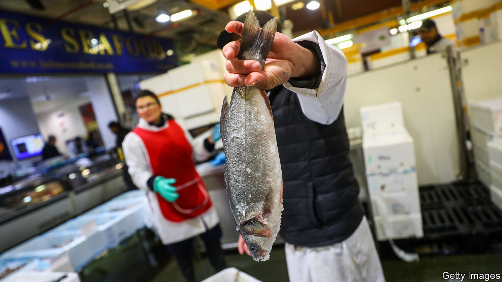

###### On Kamala Harris, vaccines, fishing rights, postmen, IPOs, Boris Johnson, TikTok

# Letters to the editor 

##### A selection of correspondence 

> Aug 29th 2020 

Letters are welcome via e-mail to 

 


The Democratic ticket

Kamala Harris, you claim, “comes from the Democratic Party’s centre”, is “not particularly ideological”, and never strays “too far from where a majority of voters are” (“”, August 15th). Her voting record in the Senate indicates otherwise. According to UCLA’s VoteView website, Ms Harris’s votes are more left-leaning than that of any other senator, except Elizabeth Warren. Her voting record is further to the left than even Bernie Sanders, the only avowed socialist in the Senate.


ROBERT HELBINGMonrovia, California

Your otherwise excellent leader repeated a general misunderstanding about life expectancy. For an American male at birth, life expectancy is 76 years. But at Joe Biden’s age, 77, a male can expect to live an extra ten years. So Mr Biden is statistically very likely to live out a four-year term, at least.

DR DEBORAH HAMMONDTacoma, Washington

It might be true that if Mr Biden loses in November, Ms Harris “would be first in line next time round” for the Democratic nomination in 2024. History suggests otherwise. Of all the vice-presidential candidates on a losing ticket in the past 50 years only two went on to be nominated by their party for president: Walter Mondale, who had actually served as veep, and Bob Dole, and he had to wait 20 years (from 1976, when he was on the losing ticket with Gerald Ford, to 1996, when he won the Republican nomination).

JAMES KENNARDMelbourne

 


Whichever way you slice it

Your leader calling for more resources to support vaccine research for the coronavirus gave the analogy that if a person needed to eat pizza to survive he would over-order pizza, so some would go to waste (“”, August 8th). The analogy is flawed.

Eating pizza, even for survival, is a classic private good. But funding for vaccine research is fundamentally different. Increased spending on vaccines means that we will finance some failures, but the knowledge that such failures gives us is incredibly valuable. Support for research is not like an insurance policy of over-ordering pizza to make sure everyone is fed. It is actually a productive investment given the public-good of scientific knowledge. The knowledge, unlike uneaten pizza, won’t go to waste.

JOHN GERSHMANClinical professor of public serviceRobert F. Wagner Graduate School of Public ServiceNew York

 


Britain doesn’t rule the waves

With reference to fishing rights in the UK-EU trade negotiations (“”, July 25th) it is worth emphasising that under international law, Britain can never revert to becoming an independent coastal state. This nationalistic trope was eagerly seized upon by Brexiteers. Unfortunately for them there is a binding international treaty obligation on post-Brexit Britain to allow any surplus fisheries within the United Kingdom’s 200 nautical mile exclusive economic (fishing) zone to be shared with fishermen from other countries, especially those who have traditionally fished in British waters.

This obligation is contained within the UN Convention on the Law of the Sea. Non-compliance may result in the British government being brought before a Conciliation Commission. While conciliation sounds friendly, a similar commission established as a result of an application by the tiny state of East Timor ultimately led to mighty Australia being compelled to negotiate a maritime boundary treaty that, inter alia, provides for the equitable sharing of any offshore hydrocarbon resources found in the seabed between these two countries.

It is hardly satisfying to think that much of the supposed Brexit dividend will now probably need to be spent on more maritime enforcement vessels.

DAVID ONGProfessor of international and environmental lawNottingham Trent University

 


Postmen’s pensions

“” (August 8th) reported on the state of the United States Postal Service and highlighted a simple truth about financial transparency: the cost of defined-benefit retirement plans for public-sector workers is unknowable. Costs generally exceed forecasts and returns generally lag behind them, so initial estimates are often too low. Since defined-benefit plans kick the can of the liability into the future, the full cost of funding those pensions becomes someone else’s problem.

Defined-contribution plans, however, make the cost transparent today. Understanding true costs will help public-sector organisations like the post office price their services better to promote a sustainable business model.

STEVEN KIRKPATRICKPortsmouth, Rhode Island

 


The greenshoe option

 perpetuated a common misunderstanding of the greenshoe option when he said that in an initial public offering “the banks retain the right to issue more stock to ‘stabilise’ the market”, and echoed complaints that this is a “rapacious practice” (August 1st). In fact, the greenshoe option was designed as a stop-loss option for underwriters, who over-allot shares of up to 15% in the new issue (go short) in order to “stabilise the market” in the immediate aftermath of an IPO.

They do this by buying any stock from the IPO that might “come back” and put pressure on the share price, thereby covering their short position. The expectation is that there will be a bid, by the underwriters, at or close to issue price for 30 days. So, if stock is offered back at prices below the issue price, the underwriters can cover their short position and sop up loose stock. However, as we all know, if the share price goes up rather than down, the underwriters lose on their short position and the potential loss is unlimited.

The greenshoe option gives the underwriters the right to buy more shares from the company’s “treasury” (not sell investors more shares than initially planned) in order to cover their short position. It was created to ensure that underwriters do not lose money in providing this valuable service. That is only fair.

What is not fair, and what annoys issuers, is when the stock softens in the after-market and the underwriters fail to provide support in the market, preferring to wait for 30 days and exercise the option. Underwriters do this because it is more profitable for them to buy from the company’s treasury than to buy from the market.

NELSON SMITHToronto

 


Get him to the church on time

 was slightly optimistic about Boris Johnson’s nuptials (August 15th). Although the prime minister has indeed had a busy year, he hasn’t remarried (yet).

LENY MORRISONLinlithgow, West Lothian

 


The kiss of death

So Donald Trump has threatened to kill TikTok if Microsoft doesn’t buy it (“”, August 8th). Isn’t it usually fatal for an up-and-coming social-media firm to be bought by Microsoft anyway?

J.J. GASPAROTTILaguna Beach, California

