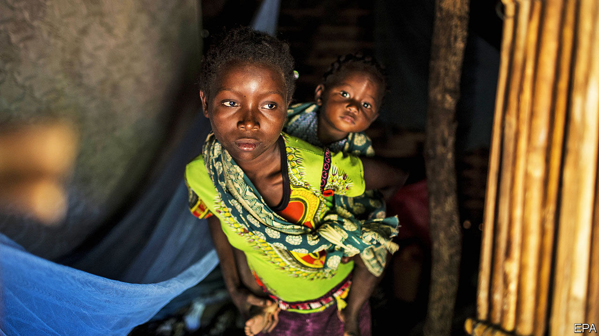
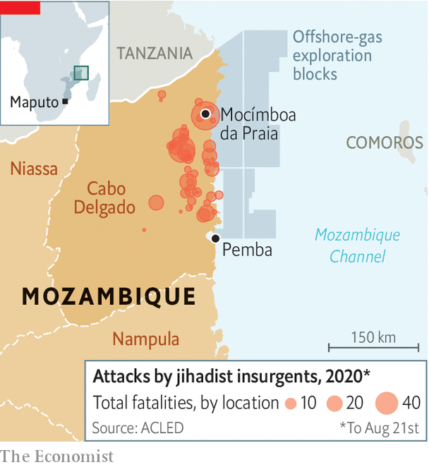

###### More misery, few answers

# The conflict in Mozambique is getting worse 

##### An overwhelmed government is worrying others in southern Africa—and beyond 

 

> Aug 26th 2020 

CABO DELGADO, the northernmost province of Mozambique, is known to some as cabo esquecido or “forgotten cape”. It has been an apt name. A Portuguese colony until 1975, Mozambique developed as two separate entities divided by the Zambezi river, explains Alex Vines of Chatham House, a think-tank in London. The north relied on agriculture and, along the coast, was influenced by Swahili culture. The south depended on South Africa and the gold trade. Many in Maputo have little grasp of what life is like in the poorer northern provinces. Mozambique’s capital is about 1,700km from Pemba, the capital of Cabo Delgado—farther than London is from Lisbon (see map).

But Cabo Delgado is no longer forgettable. A smouldering Islamist insurgency has set the province ablaze. There were almost as many attacks by the jihadists in the first half of 2020 as in all of 2019, which was bloodier than 2018, the first full year of the conflict. More than 1,500 people have been killed. At least 210,000 have had to leave their homes.


On August 5th the insurgents launched their latest assault on Mocímboa da Praia, a strategic port (and site of their first attack, in October 2017). They killed more than 50 soldiers in a single ambush and sank a small naval ship with a rocket-propelled grenade. On August 11th they took the port. The sophistication of the attack has raised concerns in Maputo and other capitals that the insurgency will spread to other parts of the country and perhaps beyond.

 


Much remains murky about the uprising. Ansar al-Sunna, the name analysts use to refer to the fighters, grew out of a sect that had grievances with local Sufi Muslims and links to extremists in east Africa. It recruits young people frustrated by the lack of opportunities in the licit or illicit economies. Few locals believe the discovery of huge amounts of natural gas off the coast of Cabo Delgado will benefit them, as opposed to the elites in and around the ruling party, FRELIMO.

In 2019 the insurgents were depicted in a video pledging allegiance to Islamic State (IS). The strength of the connection is debatable, however. The insurgents seldom refer to themselves as being members of IS. Their attacks tend to be on state institutions. They rarely issue propaganda and have no clearly stated aims. All of this suggests Ansar al-Sunna remains a mostly local affair. But it is launching more daring and complex operations.

At first the state dismissed the group as bandits. Now President Filipe Nyusi admits there is a problem, but his government is overwhelmed. Fighting within FRELIMO over the spoils of a war economy is intensifying. The country’s best soldiers are guarding facilities to liquefy and ship the gas. The rest are undertrained, underpaid and accused of human-rights abuses, which could worsen as the government begins to arm local militias. Most soldiers are not from Cabo Delgado and do not speak the local languages. Often they flee when insurgents attack.

So the government has turned to outsiders. Together they could be a cast of characters in a novel co-written by Tom Clancy and Wilbur Smith. First there was the aborted involvement of Erik Prince, who founded Blackwater, a controversial American security firm. Then, in 2019, came the Wagner Group, Russian mercenaries close to the Kremlin. It lost battles and retreated. In its wake came Dyck Advisory Group (DAG), a South Africa-based outfit led by Lionel Dyck, a former Rhodesian officer who became a commander in Robert Mugabe’s Zimbabwean army. Mr Dyck is admired in FRELIMO circles for leading an assault in Zimbabwe on the party’s arch-enemy, RENAMO, in 1985. Now DAG’s helicopters, with machineguns welded to the side, are trying to stop insurgent attacks.

Will neighbouring countries’ troops follow the mercenaries? After a (virtual) meeting of leaders of the Southern African Development Community on August 17th, the bloc released a statement saying that it would “support Mozambique in addressing the terrorism and violent attacks”. But Mozambique is reluctant to let nearby countries interfere too much. And the neighbours themselves are wary.

South Africa is said to have sent a small contingent of special forces to the province. This month it appointed Siphiwe Nyanda, a former chief of the South African Defence Force, as ambassador to Mozambique. It may adapt its navy’s operations in the Mozambique channel. Yet many within President Cyril Ramaphosa’s government are reluctant to get embroiled. Some worry about possible blowback from IS against South Africa.

Zimbabwe’s ruling party, Zanu-PF, is close to FRELIMO, but is distracted by its own imploding economy and infighting. Tanzania has belatedly increased security along its southern border. On August 12th the Mozambican government said that Tanzania had “deactivated” a group of insurgents trying to cross into Cabo Delgado. But for the most part John Magufuli, Tanzania’s president, has behaved as if Cabo Delgado is Mr Nyusi’s problem.

Non-African powers are increasingly worried, especially those with interests in gas. America has offered to help with military training but seems to have been rebuffed. France is scaling up its presence in Mozambique and rethinking how it uses its Indian Ocean islands of Mayotte and Réunion. Last year Total, a French firm, bought the stake held by Anadarko, an erstwhile American rival, in a liquefied natural gas (LNG) project in Mozambique. In July Total secured $15bn in loans for its operations there—the biggest project-finance deal in African history. On August 24th it was announced that the firm had finalised a “joint task-force” with the government to improve security for its LNG operations.

Mozambique’s strategy, if one can call it that, is to rely on piecemeal outside help to fight the insurgency while creating an armour-plated bubble around its LNG assets. That is a policy of “Iraqification”, says Jasmine Opperman of the Armed Conflict Location &amp; Event Data Project, a non-profit organisation. There is no sign that the government is willing or able to tackle the conflict’s root causes, such as poverty and corruption. So a local fight is slowly becoming international. But the victims remain the people of Cabo Delgado. ■

