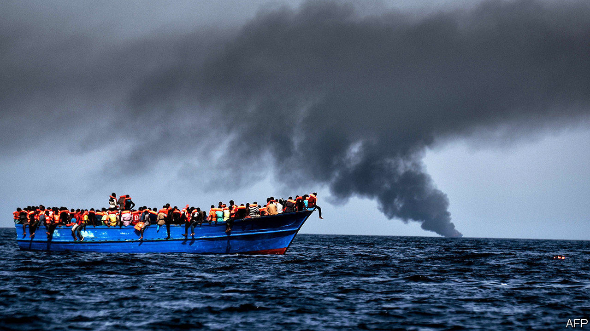
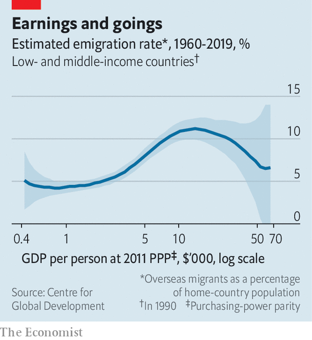

###### Cheques don’t check treks

# The idea that aid and development slow migration is wrong 

##### Up to a point, they seem to have the opposite effect 

 

> Aug 29th 2020 

WHEN THE number of irregular migrants crossing into Europe spiked in 2015, policymakers scrambled to stem the flow. One of the more humane ideas they latched onto was an old one: to slow migration by targeting its “root causes”. Growth and opportunity at home, the thinking went, would dull people’s enthusiasm to up sticks. So the European Union set up a multi-billion-euro trust fund for Africa. And indeed, irregular migration to Europe, while still a big issue, has fallen considerably from its peak five years ago.

However, the extra aid probably had little to do with that drop. A handful of new studies suggest that neither aid nor economic development in poor countries reduces migration.


Start with the work of Paul Clist of the University of East Anglia and Gabriele Restelli of the University of Manchester, who looked at the relationship between the number of migrants trying informally to cross into Italy between 2003 and 2016 and the amount of aid Italy and others gave to the migrants’ home countries. They used statistical regressions to strip out the influence of other factors, such as conflict. Aid, they found, does very little to deter irregular migration—and sometimes does the opposite. For example, controlling for aid from elsewhere, Italy could expect to receive one new asylum-seeker for every $162,000 it doled out in bilateral aid. To actually deter a single migrant from a country like Iraq would cost $1.8m in aid, the authors found. Deterring migrants who come through official channels is even costlier, between $4m and $7m per head.

The notion that as people in poor countries get richer emigration decreases does not hold up either, according to Michael Clemens of the Centre for Global Development, a think-tank, and Mariapia Mendola of the University of Milan Bicocca. They found that people preparing to emigrate to rich countries earn, on average, 73% more than those staying put. The truly poor cannot afford plane tickets or fees to traffickers. Migration, says Mr Clemens, is like going to university: it is an investment that wealthier and better-educated families are more able and likely to make.

Migration, in fact, goes hand-in-hand with a country’s development. In another study Mr Clemens found that as poor countries grow richer their emigration rate rises. This trend continues until they have an annual income per head of about $10,000 (see chart). Income per head in sub-Saharan Africa is about a third of that.

 


None of this means that aid to poor countries should be cut. Foreign assistance used sensibly improves health care and education, and reduces poverty. Those are worthwhile goals in their own right. Aid can also make countries more stable and reduce their vulnerability to conflict or disaster—perhaps lowering the chance of a future sudden surge of emigration. But spending on aid to stop migration is like buying a car for the cup-holders, says Mr Clist—it misses the point.

Rather than trying to create programmes to deter migrants, aid agencies could instead spend on schemes to channel them towards legal pathways, which tend to be safer, and which give the host country more control over who comes. The European Union says this is one of the four pillars of its approach and a focus of the trust fund. Yet a review by Oxfam, an NGO, found that just 1.5% of the fund is allocated to supporting legal-migration schemes.

The irony is that Europe needs migrants. Its working-age population is projected to decline by almost 30% by 2100. African migrants could help solve this problem. In any event, Europe will struggle to stem the flow. ■

