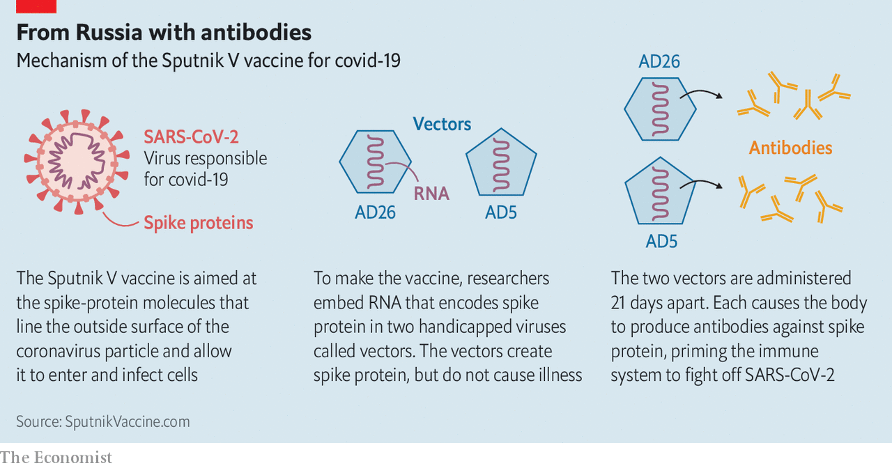

###### The coronavirus pandemic

# Anti-covid-19 medicines are being approved too easily 

##### And maybe for the wrong reasons 

 

> Aug 29th 2020 

WHAT DO A malaria drug, a Russian vaccine and the blood plasma of people who have recovered from covid-19 have in common? All have been approved for use by governments in response to the coronavirus pandemic, with little or no scientific substance to back those decisions up.

On March 28th, near the pandemic’s beginning, America’s Food and Drug Administration (FDA) issued emergency-use authorisation for hydroxychloroquine, an established but not risk-free antimalarial medicine which was controversially being proposed by some people, including Donald Trump, the country’s president, as a possible covid treatment. It did so, the authorisation stated, based on “limited in vitro and anecdotal clinical data”. On August 11th Vladimir Putin, Mr Trump’s Russian counterpart, said his government was the world’s first to approve a coronavirus vaccine, despite a lack of proper tests. And on August 23rd Mr Trump announced approval of the use of convalescent plasma therapy to treat covid-19. He described it as a “very historic breakthrough” on the basis of a study the statistics of which the head of the FDA, Stephen Hahn, got publicly and spectacularly wrong.


That regulators move fast in emergencies is to be applauded. But these three examples have raised worries that sometimes they are moving too fast, and possibly for the wrong reasons. In one instance, indeed, things have gone full circle. Hydroxychloroquine’s approval was rescinded on June 15th, after a series of well-conducted trials showed that it had no effect on covid-19. The worry is that the other two approaches may prove similarly futile—diverting attention and effort from more promising avenues or, worse, causing actual harm.

Don’t just say “yes”

The Russian announcement was of the development, by the Gamaleya Research Institute of Epidemiology and Microbiology, in Moscow, of Sputnik V. This involves two injections, three weeks apart (see chart). Each shot is of a harmless virus that has been modified to express one of the proteins made by SARS-CoV-2, the virus that causes covid-19. This is a perfectly sensible approach. Unfortunately, Sputnik V has not yet been through the trials, normally involving many thousands of people, which would be needed to show that it works and is safe. In fact, it has been given to a mere 76 people, and no results from these tests (nor from any of the animal tests that the institute says it has run) have yet been published. Mr Putin has, in other words, simply redrawn the finishing line for making a vaccine, stepped over it, and declared victory.

 


America’s behaviour is not much better. Again, the approach behind the product approved is reasonable in principle, but insufficiently tested. Convalescent plasma therapy transfuses blood plasma from those who have recovered from an infection (and which is therefore rich in antibodies against whatever had infected them) into patients with the illness to be treated. As Soumya Swaminathan, chief scientist of the World Health Organisation (WHO), observes, this tactic has been used to treat infectious diseases for over 100 years, and is effective against some, but not others. Trials of it as a treatment of covid-19 are therefore under way around the planet, but Dr Swaminathan says the results so far are “not conclusive”, and the trials themselves have been small. As a result, the WHO considers it an “experimental therapy”.

Not so, apparently, the FDA. Mr Trump made his announcement with Dr Hahn on the same platform. Two things have upset people about this. One is that the basis for the emergency approval was an observational study of ways of administering plasma (either less or more than three days after diagnosis) rather than a randomised controlled trial in which some patients were given a placebo instead of the treatment under test. The other is that, even granted this difference, the advantage seen in the study in question was too inconclusive to justify the approval given.

Dr Hahn described the benefits of treating early with convalescent plasma by saying that, “if the data continue to pan out, [of] 100 people who are sick with covid-19, 35 would have been saved because of the administration of plasma”. Jonathan Reiner, a professor of medicine at the George Washington University Medical Centre, tweeted that this was “shockingly wrong”, and that the actual figure was 3.2. Dr Hahn has since clarified that he confused the relative reduction in risk of mortality (of 35% between the two arms of the study) with an absolute risk reduction. That is a pretty fundamental mistake.

Meanwhile, in Hong Kong—a part of the world which looked as though it had SARS-CoV-2 under control—news has emerged of someone who, having had covid-19 once and recovered, has now been infected by a slightly different strain of the virus. Extrapolating from a single case is risky, but this one calls into question how long someone who recovers from infection retains immunity from re-infection. The answer is crucial to understanding how herd immunity to the virus develops in populations, and may also have implications for vaccine development. Doctors will now be looking hard for similar examples, so that such understanding can be improved.■

Editor’s note: Some of our covid-19 coverage is free for readers of The Economist Today, our daily . For more stories and our pandemic tracker, see our 

