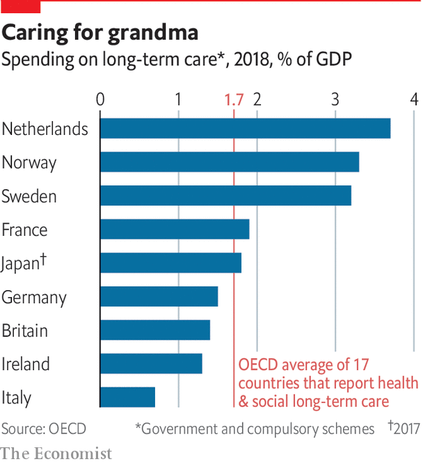

###### Financing care

# No country has found a sustainable way to finance dementia care 

##### And most have not even tried 

 

> Aug 27th 2020 

IT IS IMPOSSIBLE to quantify the most important of the costs of dementia: the losses to people living with the condition. In a forthcoming book, “The Great Demographic Reversal”, Charles Goodhart and Manoj Pradhan, two economists, suggest that surveys could be used to undertake a cost-benefit analysis of plans to spend more on dementia. A sample of adults could be asked how much annual income they would be prepared to pay to reduce the risk of developing dementia, as it mounts with age.

The results would be at best subjective and indicative, but better than nothing, which is all that is available now. Other costs—to those caring for people living with dementia and to the economy—are, in theory, more measurable. But the estimate cited earlier for the global cost of dementia, an annual $2trn by 2030 (up from $604bn in 2010 and $1trn in 2018), is little more than a guess. It relies on extrapolation from countries with good data to others with hardly any at all. And, as Marco Blom of the Alzheimer’s Society in the Netherlands points out, straight-line projections are likely to be exaggerated: 60-65% of the costs, he says, go to labour. There will be too few workers for their number to increase in tandem with rising dementia.


In ADI’s World Alzheimer Report in 2015, Martin Prince of King’s College London and others divided the costs between direct medical spending, social care and informal care. Direct medical costs were the smallest of the three, about one-fifth of the total, compared with twice as much for the other two. The distribution changes with a country’s income. More spending in the developing world falls on informal care in the family or village. In high-income countries 38% of costs are in informal care; in low-income countries, 69%. Partly for this reason, and because wages are higher, global costs are concentrated in rich countries. Although nearly 60% of people with dementia are in low or middle-income countries, 87% of the costs arise in high-income ones. In fact 62% of the costs are incurred in the G7 rich countries alone.

Every country must ask how these costs are to be met. With health budgets overwhelmed by covid-19, and public borrowing climbing to unprecedented heights to counter the virus’s economic impact, the question is harder to answer than ever. Should the government’s share, in public services or subsidies, be financed out of taxation? If so, the expected rise in spending is so large that tax rates might have to rise to politically unappealing levels. So more countries are looking at a special earmarked tax or at insurance. But that does not resolve the question of how costs should be divided between the state and individuals and their families, or how much families should pay directly towards care: everything they can afford, or only up to some limit?

As in so much else to do with old age, Japan has had little option but to confront the issue. Since 2000 it has had a universal long-term-care insurance system. This was modelled in part on a scheme introduced five years earlier in Germany, which has a private, compulsory scheme (the insurance is obligatory, but the insurers are private). But, unlike Pflegeversicherung (care insurance), Japan’s does not operate on strict insurance principles, with premium income covering costs. Rather, half of spending is covered out of general taxation. Nor does it allow people to take cash instead of services, ie, payment for care provided at home.

In the Japanese scheme (which Britain is said to be eyeing with interest), everyone aged 40-65 pays a premium, currently averaging ¥6,000, or about $57, a month. Regardless of income or wealth, those aged over 65 can claim benefits, after an assessment of needs based on a questionnaire and a doctor’s report. Beneficiaries must meet 10% of all costs themselves. In 2018, 5.5m people received benefits, about 15% of the over-65 population.

Officials at the Ministry of Health, Labour and Welfare concede that the scheme is not financially sustainable. Raising premiums will not be enough. Either other taxes will have to rise, or benefits must be cut, by increasing co-payments from beneficiaries or by means-testing. Lowering the age at which people contribute to below 40 is not being considered. It would be another tax on the young in a society already unduly skewed towards the old.

According to figures from the OECD, Japan spends a total of 1.8% of GDP on long-term care. That is above the OECD average, but far below the Netherlands, which spent 3.7% of GDP in 2018. And that was a decline from 3.9% of GDP in 2013, after a revamp of the scheme in 2015. In the Netherlands dementia accounts for a greater share of health spending (5.5% in 2011) than in most countries. The Dutch have had mandatory universal long-term-care insurance since 1968. Contributions and co-payments were linked to income. But coverage was generous compared with almost everywhere else. In 2000-13 spending on long-term care increased by an average of over 4% a year. The system came to be seen as unsustainable. Economies were made, including a tightening of admission criteria for residential care, to rule out those with relatively mild impairments. Some group homes had to close, or be converted into nursing homes.

A central element of the reform in 2015 was to separate three sorts of coverage, with different sources of financing, depending on the level of institutional and home-care need. This has stemmed spiralling costs. But it has created its own problems, since the barriers between different types of care are fuzzy, and the municipalities responsible for providing services have an incentive to shunt people into the third category, where the burden falls on the central government. The scheme is complex to navigate.

At least the Dutch have tried to tackle the issue. In America, Medicare, a public-health programme for those aged 65 and over, covers hospital care, some doctors’ fees and many medicines, but no more than 100 days of skilled nursing care. Residential care is not covered. And the cost of private long-term-care insurance is beyond the reach of many of those who will need it.

Social carelessness

In Britain the issue of social care for those who need it has become a political football. Many Britons wrongly believe that the National Health Service covers them for all eventualities. In fact, though they are entitled to free treatment for cancer or other physical diseases, they must bear the costs of their own social care, down to the last £23,250 ($30,300) they have, after selling their homes. This strikes many people as unfair, and is frequently bemoaned as a “dementia lottery”, since the costs of social care for those with dementia are likely to be far higher than for others. Making matters worse, as the years have gone by, less money has been available for this means-tested system, even as the number of old people needing it has grown.

Repeated efforts have been made to tackle what has long been portrayed (more urgently since covid-19 infiltrated so many care homes) as a social-care emergency, both for people needing care and for those struggling to provide it. One, a commission led by Sir Andrew Dilnot, an economist, produced a report in 2011 that came close to producing legislation in 2015. It suggested that the state should put a cap on people’s total lifetime liability for the cost of social care (£35,000) and be responsible for anything above that. It would be, in Sir Andrew’s words “social insurance, collective provision with a relatively large excess”. But he points out that only about one in ten people needs such a big excess.

 


The suggestion was shelved as British politics was seized by the paroxysms of a series of elections and Brexit. In the 2017 election the Conservative Party’s proposals for what became derided as a “dementia tax” (it would have raised the £23,250 savings limit to £100,000) were partly blamed for its disappointing performance. In his first speech as prime minister in July 2019, Boris Johnson promised: “We will fix the crisis in social care once and for all, with a clear plan we have prepared.” He was rumoured to be contemplating a voluntary-insurance model. Speaking on a podcast last year for the King’s Fund, a British health-care think-tank, Sir Andrew said he found that improbable, since such a model has worked nowhere else. In March, when Mr Johnson’s chancellor of the exchequer delivered his first budget, consideration of social-care finance was deferred, as he understandably concentrated on the threat from covid-19. Few could argue with his priorities. However, campaigners for people with dementia complain that there is always an issue more urgent than theirs.


If the governments of elderly, well-off Western countries are unable to make adequate financial arrangements to look after their old people, it is unsurprising that in the developing world preparations for a future in which people live longer and need more care in their later years are also limited. In China, the biggest of all, private insurance is virtually unavailable and “public financing for long-term care is minimal”, according to a note from the World Bank last year. It is confined to basic support for a minority of people who have no income and no family to support them, though some local governments also provide subsidies. Public spending on elderly-care services amounts to about 0.04% of GDP. Since 2016, 15 cities across the country have been running pilot schemes to test a long-term-care insurance facility. But it does not normally cover mental-health problems or dementia.

Financing the cost of care is just one aspect of the economic shift that ageing populations will bring. As Mr Goodhart and Mr Pradhan put it in their book, “the basic problem is that ageing is going to require increasing amounts of labour to be redirected towards elderly care at exactly the same time that the labour force starts shrinking.” They point out that, combined with other changes, such as the rising ages at which people marry and women have their first child, this has transformed life cycles. In the “old” cycle, 40 or 50 years ago, people could expect to spend the ages from 40 to 60 working with no surviving elderly relatives and no dependent children. In the new one, from 30 to 50, people will be both working and supporting children. From 50 to 67, they will still be working but will have parents dependent on them. In China, as those born under the “one child” policy from 1980 reach old age, many sets of four grandparents will have but one grandchild between them.

The diversion of much of the labour force to the care industry means that the rest of it will have to raise its productivity to compensate. In most rich countries there will be a chronic shortage of workers willing and able to take on jobs in the care sector. The authors agree with Japan’s health ministry: finance is a huge problem. But the real crisis will be a lack of carers.■

