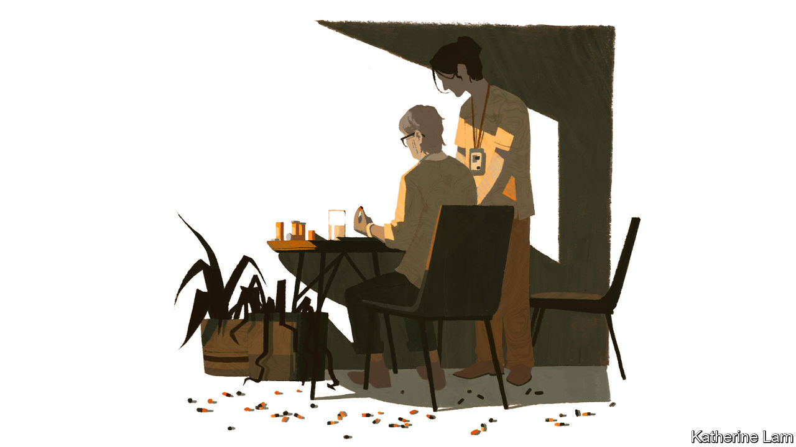
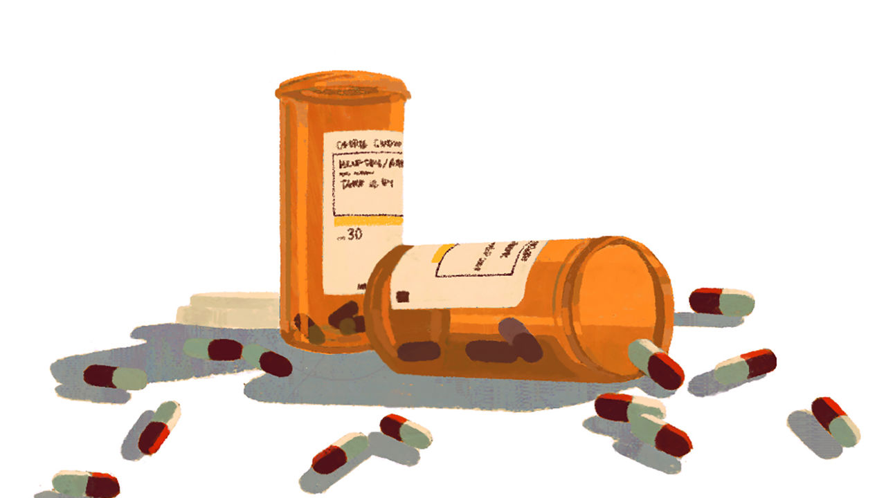

###### The science

# The search for a cure for dementia is not going well 

##### But behavioural changes can reduce the risk of developing it 

 

> Aug 27th 2020 

PERFORMING HIS autopsy on Auguste Deter in 1906, Alois Alzheimer noticed three unusual features of her brain. It was at least a third smaller than normal. Many neurons, the nerve cells, had vanished. He also saw abnormal deposits inside the remaining cells, especially in the cerebral cortex, the thin outer layer of grey matter. Between a third and a quarter had been invaded by dense knotty bundles, now known as “neurofibrillary tangles”, caused by a build-up of a protein called tau. And across the cortex were deposits of another protein, since identified as beta-amyloid, which collect between neurons and disrupt their functioning.

Despite decades of research, Alzheimer’s still has no vaccine and no cure. Some fear that the covid-19 crisis will now squeeze the financial and scientific resources available for dementia research. In the pandemic, research has anyway suffered because clinical trials became difficult. Miia Kivipelto, a Finnish neuroscientist who led a study showing how changes in ways of life could slow or arrest cognitive decline, had to suspend her follow-up research. And many people have become wary of seeking diagnosis or help, for fear of infection, or of laying claim to health-care resources needed elsewhere.


Most research into Alzheimer’s has focused on ways to attack one of the proteins, beta-amyloid. The approach is often called “the amyloid hypothesis”. But it is not known if the proteins cause the disease or are just among its symptoms. Many elderly brains have large accumulations of beta-amyloid and tau, but no memory loss or other signs of dementia. So proving the hypothesis has been tricky. Over 200 drugs have been tested, but not one disease-modifying treatment has been found. A paper in 2014 by Jeff Cummings, of the Cleveland Clinic at the Lou Ruvo Centre for Brain Health in Las Vegas, looked at clinical trials for Alzheimer’s drugs from 2002 to 2012. The failure rate, he concluded, was 99.6%.

Four drugs have been developed (three “cholinesterase inhibitors”, and an “NMDA receptor”) that have limited effects in some patients. Takeshi Iwatsubo, professor of neuropathology at the University of Tokyo, explains that the drugs attack the symptoms but not the disease, and can have unpleasant side-effects, such as nausea and diarrhoea. So debatable are the benefits that in May 2018 the French government stopped reimbursing payments for them.

Those working on dementia are used to big drug companies announcing setbacks, or even that they are giving up—as Pfizer did in 2018. One problem is that most testing has been conducted on those who already have the condition, when it may be too late to stop its advance. Mr Iwatsubo says the build-up of beta-amyloid precedes the onset of mild cognitive impairment (MCI) by 15-20 years. So it was disappointing when, in February, Eli Lilly and Roche released results from a test of anti-amyloid drugs among those genetically predisposed to early-onset Alzheimer’s. Cognitive tests showed that neither produced a significant benefit over a placebo.

In March 2019 Biogen, an American firm, and Eisai of Japan announced that they were ending two clinical trials among people with MCI or early-onset Alzheimer’s. They were testing aducanumab, another anti-amyloid drug. But then, in October, Biogen said a fresh look at the data showed that the drug had worked in some cases. “Patients…experienced significant benefits on measures of cognition and function such as memory, orientation and language.” The firm has now applied for approval of the drug by America’s Food and Drug Administration (FDA). Last November China conditionally approved Oligomannate (GV-971), a drug produced by a company from Shanghai, Green Valley. This was the first drug to have got so far in the approval process in 17 years. Derived from marine algae, it was reported to have been shown in trials to reduce amyloid accumulation and improve cognitive functioning.

Reactions to these new drugs have ranged from the celebratory (Paola Barbarino, ADI’s boss, called the change of mind about aducanumab a “ray of sunshine”) to the cynical. The value of Biogen’s shares, it was noted, fell by nearly 30% the day it declared the trials a failure and rose by 26% when it said it would seek approval after all. And the data from the Chinese study, Western scientists grumbled, were scanty and its conclusions hard to credit.

Even if a drug is approved, who will pay for it? The worst that could happen, says Edo Richard, a neurologist at the University of Amsterdam, is approval of a drug that works a bit for some people. So prevalent is Alzheimer’s that private and public insurers would face tremendous pressure to cover it. But the drug will be extremely expensive, at least in its first, patent-protected years. Others argue that, since insurers will approve a treatment only for patients for whom it is effective, the problem may not be so acute.

The best progress in treating the condition is likely to come from combinations of drugs that deal with different aspects of the brain. Dr Kivipelto, the Finnish neurologist, believes in the “cocktail” approach of combining drugs and behavioural therapies that tackle different aspects of dementia’s pathology. That includes potential genome editing, using CRISPR technology.

By the time people are diagnosed with dementia, it is usually quite advanced. So another thrust of the scientific campaign is to find ways of catching the condition earlier. Several techniques are employed, besides cognitive testing. One is to identify those with a genetic predisposition to Alzheimer’s. Three genes have been implicated in the rare, inherited, early-onset form of Alzheimer’s. For the more common sort, several genes have been found to increase the risk, particularly one form of the ApoE gene, ApoE4, which also appears to raise the risk of heart disease and covid-19. This can be detected by a blood test.

 


However, all it indicates is a somewhat higher risk, not the presence of the disease. For this two other sorts of “biomarker” are used. One is to measure levels of amyloid and tau in a person’s cerebrospinal fluid. This requires a lumbar puncture (the insertion of a needle into the lower spine). The other is a scan, usually a magnetic-resonance imaging (MRI) scan, to look at the size of the brain, along with a positron-emission tomography (PET) scan that can measure the build-up of amyloid.

Scanners are expensive and often unavailable. So the search is on for a simpler and cheaper approach. Many believe a blood test offers the best prospects. At the Alzheimer’s Association’s annual conference in July, hopes were raised by a test that could distinguish between Alzheimer’s and other neurodegenerative conditions, and spot those at risk years before symptoms appear. This measures a form of tau called p-tau217, and was found to predict Alzheimer’s with 96% accuracy. It is already possible, using the technique of mass spectrometry, to measure the level of beta-amyloid in the blood. But it is not known how this relates to levels in the brain. A trial in America last year found that the test matched the result of a PET scan 88% of the time, a hopeful result but not accurate enough for a clinical diagnostic test. The success rate rises to 94% if two other risk factors are considered: age and the presence of the ApoE4 gene.

Others look to the use of data and artificial intelligence (AI). Kurokawa Kiyoshi, a professor of medicine at the Graduate Institute for Policy Studies in Tokyo, argues that “data tech is progressing much faster than biotech”. Data research should allow more extensive mapping of correlations between physical conditions and behaviour and the later onset of dementia. Even without AI, scientists can detect evidence of dementia from how people use words. In her final novel, Iris Murdoch, who went on to develop severe Alzheimer’s, uses a more limited vocabulary and simpler language than in earlier works. Doctors analysing Ronald Reagan’s public pronouncements say signs of Alzheimer’s could be detected in his speech patterns years before his diagnosis in 1994.


Nowadays, the way people use digital technology—navigation apps, for example, since impaired spatial awareness and sense of direction are often early signs of dementia—may provide an early indication of cognitive decline. This raises the uncomfortable spectre of tech giants tracking their customers’ mental decay. Those worried will be only partly reassured by studies showing that the use of digital technology helps slow the process.

Even in the absence of data from apps, many factors have been linked to an increased or reduced risk of dementia. A study presented at the July Alzheimer’s Association conference estimated that dementia could be prevented or delayed in 40% of cases by attacking 12 risk factors. It added three (excessive drinking or incurring head injuries in middle life, and exposure to air pollution in old age) to nine already identified (including smoking, high blood pressure, obesity, hearing loss, less education and diabetes).

Hearts and minds

“What is good for the heart is good for the brain” is a bromide often trotted out. So public-health campaigns intended to reduce the chances of developing heart disease, cancer and diabetes will also reduce dementia rates. Such is the fear of the disease that this should reinforce efforts to promote healthy ways of life. What else works against dementia is not certain, but it includes retaining social contacts and keeping an active mind (though learning something new such as a language is more effective than doing a familiar puzzle like a crossword every day).

Dr Kivipelto’s study in Finland (known as the “FINGER” trial), published in 2015, showed that changing ways of life could significantly reduce the rate of mental decline. Conducted among a group of 60- to 77-year olds with higher risk factors for dementia, it monitored and changed lifestyles and put them through “cognitive training”—computer-based mental gymnastics. She speculates that for some, part of the benefit may have come from learning to use computers and the internet for the first time.

There is evidence that the age-specific incidence of dementia is going down as lifestyles change, notably in Europe—and going up in others, such as China and Japan. A study published in the journal Neurology earlier this month followed nearly 50,000 people in America and Europe (clinically representative of no more than 16% of the world’s population) from 1988 to 2015. It found that 8.6% developed dementia. But the risk of being among them had, remarkably, fallen by an average of about 13% a decade, from about a one in four chance for a 75-year-old in 1995 to less than one in five now.

Yet however wholesome a person’s way of life and however much they stretch their minds by learning Tibetan or reading The Economist, they cannot eliminate the risk of dementia. For the foreseeable future, there is no cure and the world will keep growing older. So how to look after people with dementia, and how to pay for it, will be ever more pressing questions. ■

