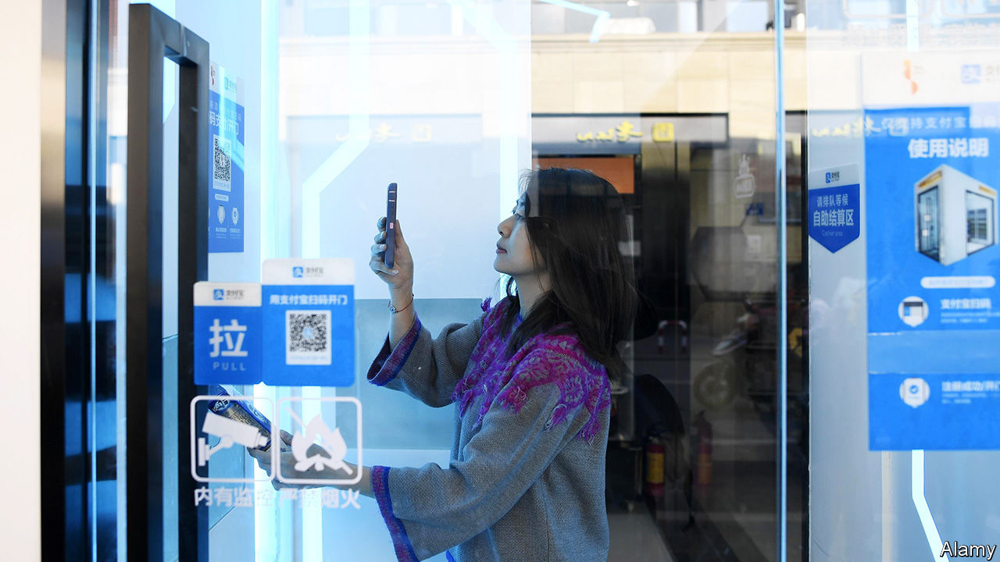

###### 

# Business this week 

#####  

 

> Aug 29th 2020 

Ant Group filed papers for what could be the biggest-ever IPO, raising up to $30bn. Most famous for its Alipay service, the group is affiliated with Alibaba, China’s biggest online retailer, and its founder, Jack Ma. Much of China’s online payments are made on its platform. It is the world’s most valuable fintech enterprise. Ant’s dual stockmarket flotation, in Hong Kong and on Shanghai’s STAR exchange, could see it valued at upwards of $200bn. See . 

The Taiwanese government said that Taobao Taiwan,an e-commerce platform which is operated by a British-registered firm, but in which Alibaba holds a substantial stake, posed a security risk because customers’ details could be held on Alibaba’s servers in China. The government gave the British firm six months to either re-register as a Chinese company or “withdraw” its investment.


Kevin Mayer is to step down as TikTok’s chief executive, after just three months in the job. The video-sharing app is the latest Chinese-owned firm to stir up national-security concerns in America. It has filed a lawsuit against Donald Trump’s order that bans it unless it sells its American operations to an American company. TikTok said it had “taken extraordinary measures to protect the privacy” of data.

A group of WeChat users also sued the administration over a similar order from Mr Trump. The group argues that a ban on the Chinese-owned messaging app curtails their right to free speech and forms part of the president’s “racial animus” against Chinese people.

The recent decision by Apple to split its stock prompted a reconfiguration of the Dow Jones Industrial Average, an index of 30 American companies weighted by share price. Out go ExxonMobil, Raytheon and Pfizer, to be replaced by Amgen, Honeywell and Salesforce. Exxon traces its roots in the index to 1928; it was then known as Standard Oil of New Jersey. Its removal leaves Chevron as the only oil company in the Dow. The changes offset the reduction in Apple’s weight in the index, but also “better reflect the American economy”, according to Dow Jones. 

Still on the road. For now

A court in California granted Lyft and Uber an emergency stay against an injunction that would have forced them to reclassify their drivers as employees in the state, wrecking their business model. The ride-hailing companies’ appeal will be heard on October 13th.

Germany’s statistics office now thinks theeconomy shrank by 9.7% in the second quarter compared with the first, a bit better than an initial estimate of -10.1%.

Public-sector net debt in Britain rose above £2trn ($2.6trn) for the first time. The government’s debt at the end of July was roughly equal to GDP.

American Airlines confirmed that it would slash 19,000 jobs in October, when the requirement to retain staff ends under the conditions of the federal bail-out of the aviation industry. The government was said to be considering a new rescue package for America’s biggest airlines.

Virgin Atlantic reached a vital agreement with creditors that will allow a £1.2bn ($1.6bn) private-refinancing plan to proceed. The cash-strapped airline was unable to secure a rescue deal earlier in the year from the British government.

Rolls-Royce reported a £5.4bn ($6.8bn) pre-tax loss for the first six months of the year. The engineering company has been hurt by the grounding of flights during the pandemic; airlines pay it based on how many hours they use its engines.

In contrast to the aviation industry’s woes, the boom in home shopping has led Tesco, Britain’s biggest supermarket chain, to create 16,000 extra permanent jobs in its online business, mostly warehouse pickers and drivers.

Purveyors of electronic goods have also done well as people spend more time at home. Best Buy reported a 242% increase from online revenue in its most recent quarter. Trade has been so brisk that the American retailer could run out of some goods, such as game consoles.

The cost of building Crossrail, which will link west and east London by train and is Europe’s biggest infrastructure project, rose again, to £18.7bn ($25bn). The opening date was again pushed back, to mid-2022. It was supposed to open in 2018.

Once a scourge of the music industry because of its pioneering platform that allowed people to share tunes, illegally, over the internet, Napster was sold for $70m by RealNetworks, its current owner, to MelodyVR, a startup based in London. Napster was forced to close in 2001 but the name lived on and it reinvented itself as a music-streaming service.

Don’t touch your face!

Kentucky Fried Chicken’s latest ad campaign dropped the “finger lickin’ good” slogan it has used for 64 years, because it doesn’t “quite fit” with clinical advice on covid-19.

