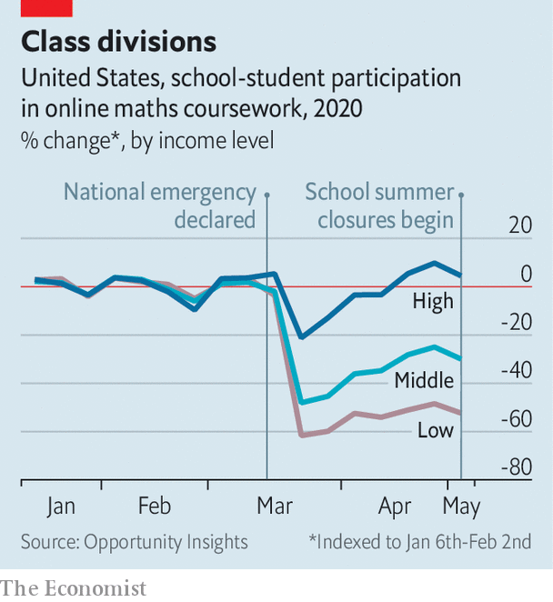

###### Back to school

# Disrupted schooling will deepen inequality for American students 

##### Learning and the pandemic 

 

> Aug 29th 2020 

THE FIRST meeting between teachers in Montpelier, Vermont, before the start of the autumn term is usually festive—hugging over breakfast and coffee. This year they had to make do with an online videoconference. After a scramble in the spring (to set up online learning, pack lunches for poor pupils who relied on them and ship computers to those without them), the district plans to let younger pupils return for in-person learning on September 8th. High school will remain partly online because the building is too small to allow social distancing. The young pupils who can return will need to wear masks, keep their distance and have temperature checks before entering school buses or buildings.

Setting up these protocols took many 60-hour weeks over the summer holidays, says Libby Bonesteel, the superintendent. Her husband, a microbrewer, recently dedicated a new beer, “Our Impossible Ask”, to teachers. “Pairs well with late staff meetings, upended expertise, existential crisis and seemingly unending complications,” suggest the tasting notes.


Of the 50 largest school districts in America, 35 plan to start the coming term entirely remotely. The opportunity to squelch the virus over the summer has been lost, upending plans for “hybrid” education (part-time in-person instruction). This means more than just child-care headaches for parents. The continued disruption to schooling will probably spell permanent learning loss, disproportionately hurting poorer pupils.

“Achievement gaps will become achievement chasms,” warns Robin Lake, director of the Centre on Reinventing Public Education, a research group. Analysts at McKinsey, a consultancy, reckon that the typical American pupil would suffer 6.8 months of learning loss if in-person instruction does not resume until January 2021 (which looks plausible). This would fall heaviest on black pupils, who would regress by over ten months’-worth of instruction, and poor ones, who would fall behind by more than a year. There could also be 648,000 more high-school dropouts.

The true scale of the educational fallout will be unknown for years, because it manifests itself in future decisions like dropping out of high school or university. It will also remain murkier because typical barometers, such as the standardised tests administered in crowded school halls, have also been impeded. What evidence exists now does not look encouraging.

A team of five education scholars recently calculated that American schoolchildren in 2020 learned 30% less reading and 50% less maths than they would in a typical year. Despite that, the top third of pupils posted gains in reading. Data from Opportunity Insights, an economic-research outfit at Harvard University, show that after lockdowns began in March pupils from low-income neighbourhoods fell permanently behind on online maths coursework, whereas those from richer areas quickly rebounded (see chart).

 


Disruptions to schooling tend to lower achievement while increasing inequality. But rarely do so many shocks pile up at once. First, schooling is now being conducted online. Previous attempts at virtual education in America have not looked promising. A study of virtual public schools in Georgia by Carycruz Bueno of Brown University found significantly reduced test scores in almost all subjects, and a ten-percentage-point drop in the chance of graduating from high school. Her results look worse for black and Hispanic children.

Then there is the problem of access to online classes. Nearly half of Native American pupils and 35% of black and Hispanic ones do not have access to either a computer or the internet at home, compared with 19% of whites. Worsening mental health among poorer families will also hurt achievement. Elizabeth Ananat of Barnard College and Anna Gassman-Pines of Duke University surveyed hourly service-sector workers in Philadelphia who had young children; half were screening positive for anxiety or depressive disorders.

When school closes poor pupils lose a social institution of last resort—one that educates, feeds, counsels and sometimes clothes them—whereas richer pupils are more insulated. A new industry of “learning pods”, where a cluster of families pool cash to pay for an in-person tutor, makes the governess model accessible to many. Scoot Education, whose normal business is providing substitute teachers for schools, quickly developed a sideline in learning pods in California. At least 100 such pods will be in place by the end of August, says James Sanders, the company’s CEO. For younger pupils the total cost of a pod, shared among all parents, is $349 a day.

To some, parents who pay for pods or other tutoring are complicit in deepening inequality. Yet pods are more a flashy symptom of educational inequality than the cause. “Rich families find a way to opportunity-hoard no matter what, even if this pandemic had not started,” says Sarah Cohodes, a professor at Teachers College at Columbia University. Some charities, like the Tennessee Tutoring Corps, have tried to spread access to tutors to less wealthy children, but efforts at scale (a federally funded national tutoring corps, say) look unlikely.

Failure to control the virus probably spells lower future incomes for millions of pupils. Without extraordinary interventions, the long-run effect of the pandemic on these students is predictable. The only question is how deep the damage will be. ■

Editor’s note: Some of our covid-19 coverage is free for readers of The Economist Today, our daily . For more stories and our pandemic tracker, see our 

