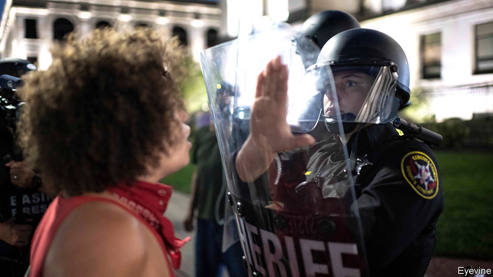

###### Violence in Kenosha

# Wisconsin’s summer of fury 

##### Another round of shooting and protests 

 

> Aug 29th 2020 

THE WAY Dee sees it, America is locked in a dangerous spiral. Standing near the courthouse in Kenosha, Wisconsin, the middle-aged man watches volunteers sweep glass from beside two blackened wrecks of lorries. “People feel a certain type of animosity in their heart now. It’s not gonna stop,” he says. He took his adult son to demonstrations in the city this week as confrontation escalated from peaceful marching to looting, arson and then to murder. “Protests are gonna continue, because two more lives were taken,” he says.

He says his fellow protesters, though they smashed property, were not set on violence. Yet they were enraged. They erupted after a white policeman trying to arrest an unarmed 29-year-old black man, Jacob Blake, shot him repeatedly on August 23rd. Bystander videos showed him shot at close range as he tried to get into a car with his three young children. “How can you justify shooting that man in the back seven times? Why you got to shoot a person with intent to kill?” asks Dee.


Mr Blake survived, but may be partially paralysed. His relatives called for calm: his mother said all sides must “take a moment and examine your hearts.” Yet clashes flared in ways similar to confrontations after police choked to death George Floyd, in Minneapolis, in May.

After many buildings were destroyed, armed men—said by some locals to be white vigilantes from beyond Wisconsin—arrived, set on resisting rioters. One 17-year-old, Kyle Rittenhouse, was filmed firing an assault rifle at a crowd. He was arrested at home in neighbouring Illinois on August 26th, and charged with murdering two protesters. Footage online suggests he shot them, and injured a third, as they chased him along busy streets.

Kenoshans deny that their city is usually troubled. Many blamed outsiders. David, a businessman who picked through wreckage at his car-sales lot, says rioters destroyed stock worth $400,000. He described feeling terror when they came, saying attackers left only when he brandished his own weapons. “Half of the people in the protest are armed, the business owners are armed. I’m surprised there wasn’t a mass shooting before,” he says. He predicts a surge in support for President Donald Trump. Voters “don’t want lawlessness, this is like a war zone”.

Will Mr Trump get a boost? For all the popular dismay over police killings, some voters—especially older and whiter ones—are anxious about recent looting, violent protests and an uptick in urban gun deaths. Polls suggest there is support for reforming the police, but not defunding them. That helps to explain why Joe Biden, on August 26th, said: “Burning down communities is not protest, it’s needless violence.” Tony Evers, Wisconsin’s Democratic governor, was also quick to take an offer from Mr Trump of federal agents to restore order.

At the Republican convention the vice-president, Mike Pence, spoke of the need for more law and order, referring to Kenosha. But a close focus on the city could be risky. It looks awkward that the man charged with murder is a police cadet and avid fan of the president, who sat in the front row of a Trump rally, in Iowa, in January. Vigilantes rarely help promote law. In Dee’s view, such people came to this city with “the intent to hurt somebody”. ■

