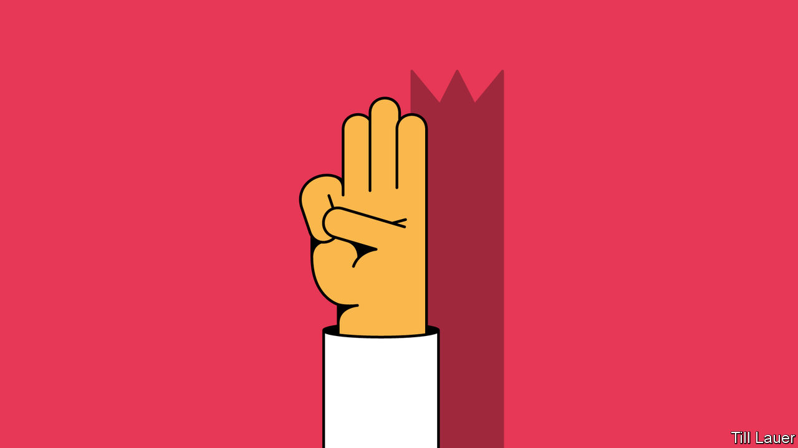

###### Banyan

# Young Thais mount a remarkable challenge to their government 

##### Some demand that the monarch be brought under the constitution 

 

> Sep 3rd 2020 

THE LAST time Thailand saw protests of the size now roiling the country was nearly seven years ago. Then, pro-establishment types declaring love for the king, the late Bhumibol Adulyadej, and for the armed forces that protected him, came out in Bangkok, the capital. They opposed the elected government of Yingluck Shinawatra, which seemed to threaten their interests. Among the children parents pulled out of classes to attend these “yellow shirt” demonstrations were friends of a prominent protest leader today, Yanisa Varaksapong, an 18-year-old undergraduate.

The turmoil the yellow shirts created enabled an army-led coup in 2014 that shoved all politics back into a box and slammed shut the lid. Today, Ms Yanisa says, those same friends are protesting alongside her—against the very establishment for which they once marched.


The dissatisfaction is understandable. The coup leaders promised a technocratic government to end corruption and spread prosperity, and a swift return to civilian rule. Instead, the constitution they wrote, the country’s 20th, entrenches the political power of the armed forces and their allies. The current prime minister is the general who led the coup, Prayuth Chan-ocha. As for the economy, there is neither cleanliness nor competence. Thailand has managed the pandemic well in terms of stemming infections, but the economy will shrink by over 8% this year, according to the central bank.

The government has immense powers to suppress dissent, including laws against sedition and lèse-majesté. So the protests by school pupils and university students took many by surprise, especially as young Thais rarely pay much attention to politics. Thitinan Pongsudhirak, a political scientist at Chulalongkorn University in Bangkok, saw a change on campus last year: “In classes, nobody was on their phone, nobody was sleeping.”

Students poured into the open after the ban in February of the Future Forward Party, which advocated real democracy and won 81 seats in last year’s general election. Flash-mob protests spread until the pandemic brought an end to them. Ms Yanisa describes the lockdown as a time of social-media ferment. In July demonstrations burst out again. Protesters waved three fingers in the air, mimicking a salute used by young rebels in “The Hunger Games”, a dystopian series of novels and films. The demands were clear: a new constitution, the dissolution of parliament and an end to the persecution of government critics.

By August the demands began to take aim at the late king’s successor, Maha Vajiralongkorn. Challenging the cult of the monarchy breaks a taboo. But the 68-year-old king is widely (if quietly) reviled as extravagant, capricious and cruel. He has seized control of vast royal assets and meddled in political and military appointments. He usually isn’t even in Thailand but in Germany, where he has a floor at an upscale hotel near Munich. He shuttles to his queen in Switzerland in one of the Boeing 737s at his disposal. Though he once threw a consort, a nurse turned military pilot, into prison, he has recently rehabilited her, Europe’s tabloid press reports, to serve in his harem of “sex soldiers”. No word of sympathy has crossed the king’s lips over his subjects’ hardship during the pandemic.

The next big student protest is planned for September 19th, the anniversary of an earlier coup, against Ms Yingluck’s brother, Thaksin Shinawatra. The establishment has tried to paint the students as puppets of the exiled Mr Thaksin and his “red shirts”. Ms Yanisa laughs dismissively: the earlier strife was “ages ago for us...Right now it’s something else.”

A large number of the protesters would like to see the king act like the constitutional monarch he is supposed to be. They benefit from growing support from ordinary Thais, from a surreal chasm between royalist propaganda and the king’s comportment, and from a certain vacillation on the part of the authorities. On the one hand they arrest protesters to intimidate the movement: this week the head of the Student Union of Thailand was charged. On the other, Mr Prayuth seems reluctant to order a bloody crackdown. His government even claims a willingness to talk.

In this atmosphere, Mr Thitinan says, the parameters for open expression have been stretched wider than in a long time. The stakes are high, because the parameters could snap cruelly tight again. For the young protesters who, like Ms Yanisa, see the chance to craft a country in which they have a place, there is no going back.

