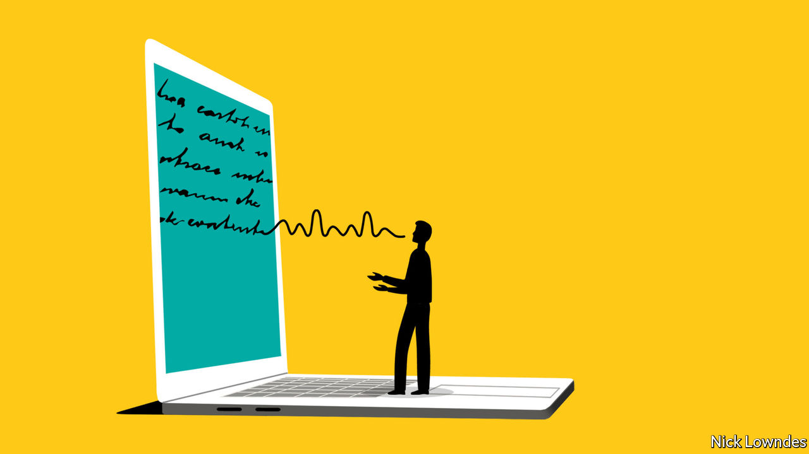

###### Johnson

# Is it possible to “write” using speech-to-text software? 

##### Turning the spoken word into clear prose requires more planning than the human brain is capable of 

 

> Sep 5th 2020 

VOICE TECHNOLOGY has come a long way. Just a few years ago, it would’ve been unusable, so much so that many people gave up on it in the early years.

But now, those who follow the technology know that it has gotten considerably better over the last five to ten years. Truly effective voice technology promises many good things. Not only does it allow you to command devices like smartphones or use wired home devices without the use of hands, but also many other applications. For example, you can identify someone by their voice if you need to know who they are over the phone. Your bank will find this very useful.


What about writing with your voice? This could be a great boon for people who lack mobility for one reason or another. But not only that. Busy people who type badly, and find it easier to talk, might find it much easier to dictate their messages than they would find to sit and type them. Everyone remembers the bosses in old movies who shout things like quotation mark Ms Johnson! Take a memo. Rotation marked.

But writing with your voice raises several interesting questions. How easy is it actually? Human speech involves a lot more starting and stopping with errors and the need for repairing mangling sentences than you may think. Writing may be an unnatural act, but once it is learned, the first draft of a piece of writing is a lot more usable than the “first draft” of a bit of speech. Anyone tempted to doubt this proposition might try listening to an interview, even one with a highly articulate speaker, and transcribing every single word that that person says. It will quickly become obvious that even gifted speakers make lots of mistakes. That’s not usually a problem when we talk to each other, but it makes for extraordinarily messy looking writing.

To make turning the spoken word into coherent writing requires lots of planning. You’ll need some kind of notes or other organiser to make it work, which only brings us back to the original problem. Those who need to write with their voice will first need to write a structure to then write from. If you are unable to write, this does not solve the problem.

Another question turning speech into writing raises is one of style. How would writing change it more people spoke their writing rather than typing? Chances are that at the very least they would come up with many more short sentences and more concrete language, which is good. But they would probably also rely on pre-assembled phrases and clichés a lot more often, which would definitely be a bad thing. Good writing requires slow thought, which is not available when you are speaking at full clip.

To test this proposition this column has been not written but dictated. It was composed from brief notes written down for structure only. It has been edited for length, with all of the original errors kept in. Though this paragraph two is being dictated, which means I have no idea how this is turning out, here are guesses about how this will read.

The first guess is that the literal accuracy of the dictation software will be extremely high. In other words there won’t be many cases where the software has heard one word incorrectly and transcribed another. But the other guess is that the readability of this column will be rather bad.

In other words, the blame is not with the technology, which turns out to be rather good. Speaking into writing relies on a much better human brain than the one we currently possess. Writing is hard. There’s a reason it can’t be done at the speed of speech, in real time.

To elucidate—and this was written after the fact, rather than dictated—paragraph breaks were added after transcription. Punctuation had to be spoken aloud, but after a full stop the first word in the new sentence was capitalised automatically. Some minor punctuation marks were added to improve clarity.

Only a handful of words out of almost 800 were transcribed incorrectly, among them “rotation marked” (“quotation mark”), “two” (“too”) and “it” (“if”). To improve accuracy, your author “trained” the software, Dragon Dictate, for a few seconds beforehand, reading a pre-written passage aloud. An external microphone of reasonable quality also helped a great deal.

Nonetheless, The Economist’s style mavens have their heads in their hands at the ugly Americanisms and egregious stylistic infractions. It will be a relief to them, and to the reader, that Johnson will not be dictating any future columns.

