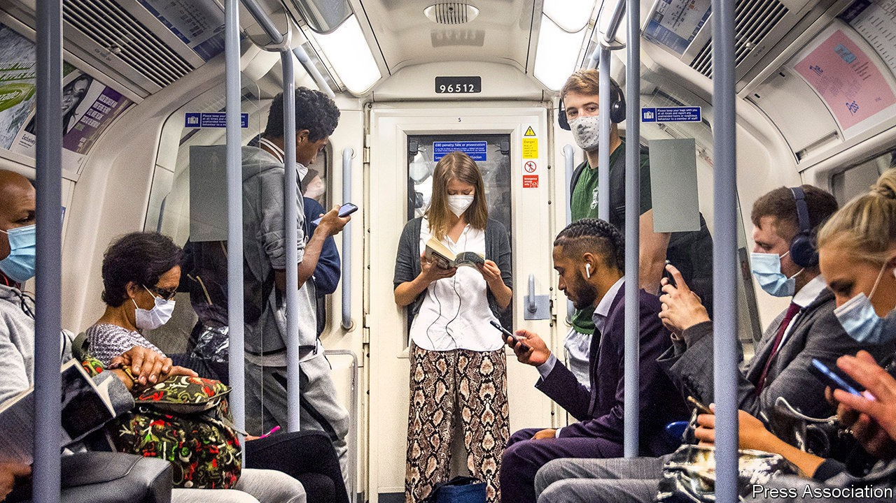
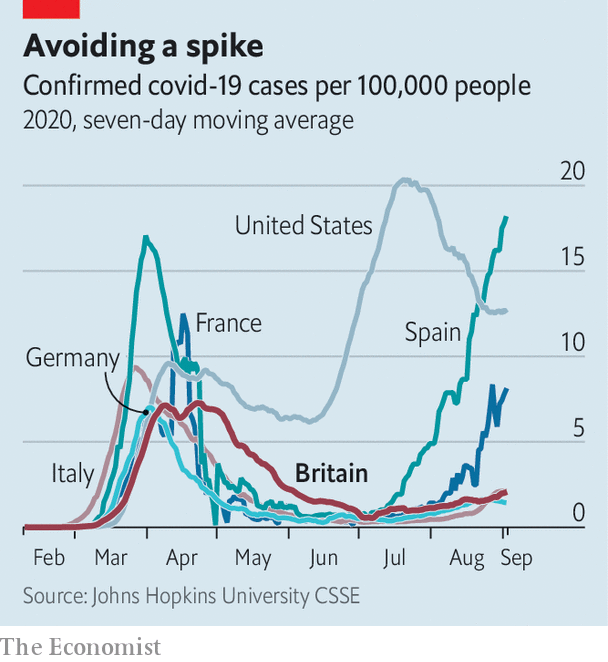
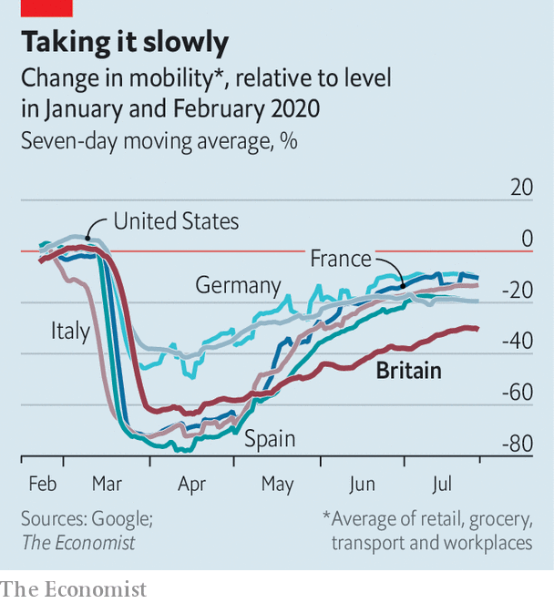

###### A summer break

# In England, reopening has not been the disaster many feared 

##### But schools and universities returning presents a new challenge 

 

> Sep 3rd 2020 

AT THE START of June, when England took a big step out of lockdown, many observers were nervous. Dissenting members of the official Scientific Advisory Group for Emergencies (SAGE) warned the government that allowing people to mingle risked another flare-up. The new test-and-trace system, intended to squash outbreaks, had only just been established. Polling found that the public believed ministers were being insufficiently cautious.

The government’s decision to ease restrictions was a gamble, but one that has paid off. Following a small rise in July, the Office for National Statistics’ infection survey, which tests a sample of people in England and Wales each week, finds that the number of cases has since remained flat. Although there has been a gradual rise in the number of positive test results, much of this is accounted for by the fact that the number of tests has increased, meaning more asymptomatic cases are found and false positives recorded. Hospital admissions remain very low.


England has so far avoided the spikes seen recently in France and Spain, meaning it is now in a similar position to Germany (see chart). A recent study found that 6% of people in England have antibodies, which may offer some protection against the virus. There is huge uncertainty about the level at which herd immunity kicks in, but even London—where the study found 13% of people had antibodies—appears short of the most optimistic estimates.

 


The state has begun to do a better job at preventing covid-19’s spread. The test-and-trace system still has flaws, not least in the time it takes to get results from tests. But there is now a functioning system, which helps suppress the growth of cases, as do local restrictions where necessary. After a weak start, Britain is now a testing heavyweight. Over the last week for which there is data, it carried out 2.5 tests per 1,000 people, compared with 1.7 in Spain and Germany, and 1.8 in France.

Public caution has played a part in keeping cases down, too. According to Google’s mobility statistics, Britons are less likely to have returned to work than those in other big European countries; something the government, concerned by the economic implications, is now trying to change. John Edmunds, an epidemiologist at the London School of Hygiene and Tropical Medicine, and one of the dissenting SAGE members when restrictions were eased, notes that cross-country data imply “the release from lockdown has resulted in larger changes to at-risk behaviour [in Europe] than here.” It is unclear why this is.

 


With children returning to school and students to university, and people moving indoors as the weather cools, keeping cases down will soon become trickier. “I think although we’ve got a lot of testing going on, we probably don’t have anywhere near as much as we will need to manage the next month or so,” says Sir John Bell of the University of Oxford. There has been a worrying jump in cases in Scotland, and it will be difficult to avoid importing cases from parts of Europe that are currently seeing spikes, given the volume of summer travel. Removing restrictions went better than expected in England. That does not mean some will not have to be reimposed over the coming months. ■

Editor’s note: Some of our covid-19 coverage is free for readers of The Economist Today, our daily . For more stories and our pandemic tracker, see our 

