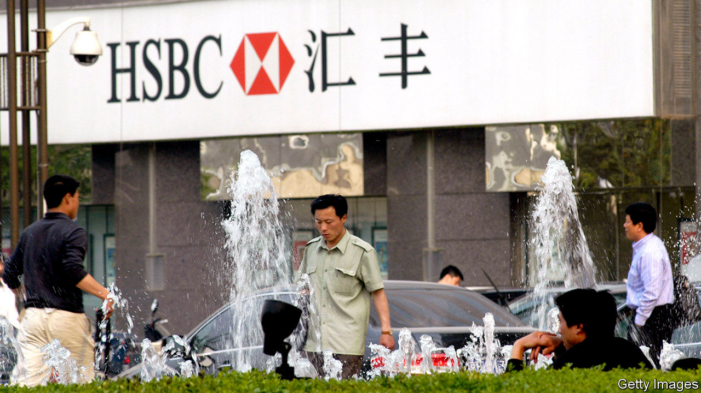

###### Rebalancing act

# Can Japan Inc navigate the rift between China and America? 

##### Japanese companies cannot afford to anger either a big market or a big ally 

 

> Sep 3rd 2020 

WHEN ABE SHINZO became Japan’s prime minister for a second time in 2012, relations with China were on the skids. Tensions over disputed islands brought the two countries to the brink of conflict. Japanese car dealerships in China were set ablaze. Protests at a Panasonic factory turned violent.

After that, tempers cooled and relations warmed. Mr Abe had planned to host Xi Jinping for a state visit in Tokyo this spring, the first by a Chinese leader since 2008. Japan Inc, too, has been dining out on the bonhomie. Annual trade between China and Japan, the world’s second- and third-biggest economies, amounts to more than $300bn. Japanese firms accumulated over $130bn in assets in China. The flow of Japanese foreign direct investment there hit an all-time high of $14.4bn last year.


According to Morgan Stanley, an investment bank, listed Japanese firms derived only 4% of revenues from China. But 26% of their profits were tied to China through suppliers or customers, more than depended on America, calculates Jesper Koll, a Tokyo-based economist. He reckons this profit share shot up to 63% in the second quarter, as the Chinese economy recovered faster than others from covid-19. 

Now the mood seems once again to be souring. Covid-19 put paid to Mr Xi’s visit. His crackdown on democracy in Hong Kong and the economic cold war between Beijing and Washington have led senior Japanese officials to speak of risks rather than opportunities in China. Earlier this year Mr Abe’s government imposed new restrictions on foreign investment to protect certain industries, battered by covid-19, from Chinese bargain-hunters. The pandemic and the spectre of further American sanctions against Chinese companies such as Huawei, a telecoms-equipment giant, are making Japanese companies think about the stability of their supply chains, not just efficiency, says Ke Long of the Tokyo Foundation for Policy Research, a think-tank. Mr Abe’s sudden resignation on August 28th over ill health has added to the uncertainty (see ).

Closer inspection reveals a more nuanced picture, however. One source close to the government says its aim is to focus on “several strategic choke-points” in China (such as medical supplies), while “keeping many areas open for commercial activity”. Not so much a great decoupling, then, as a quiet rebalancing. 

Mr Abe’s ¥244bn ($2.2bn) programme to induce Japanese firms to diversify their supply chains away from China is a case in point. In July 57 companies, including Iris Ohyama, a big plastics producer, and Sharp, a maker of electronics, received a combined ¥57bn to invest in production at home; others got help to build factories in South-East Asia. But of the 87 winning projects, 60 will be producing masks, disinfectants, drugs or other medical supplies.

Having business in China was not a precondition for the handouts; many companies, especially small and medium-sized ones that made up the bulk of applicants, had little or none. An executive at Novel Crystal Technology, a producer of materials for semiconductors, says his firm applied for the subsidy to reduce overconcentration—in the American market. The sums on offer are far too small to spur all-out decoupling, says Onishi Yasuo, a former official at the Japan External Trade Organisation, an independent government agency.

Most Japanese firms with lots of exposure to China are in “wait and see” mode, says Mr Ke. America may have a new government soon. The scope and enforcement of American sanctions is vague. Even if tensions keep rising, Japan Inc is unlikely to behave as a monolith. Makers of niche products for export may decamp from China. Firms with a large Chinese business, such as carmakers, will be loth to leave.

In the long run the risk for corporate Japan is less geopolitics than competition. China already transformed once, from a land of cheap labour into a booming consumer market; more than 70% of what Japanese companies’ affiliates produce in China is sold there. Now a second shift is under way, from consumer market to rival in sophisticated technology.

The latest annual survey of 74 technology products and services by Nikkei, a Japanese business newspaper, found that last year Chinese companies overtook Japan in market share for liquid-crystal displays installed in smartphones and insulators for lithium-ion batteries used in electric vehicles. As an adviser to a large Japanese bank observes, that is what really makes Japanese firms nervous. ■

