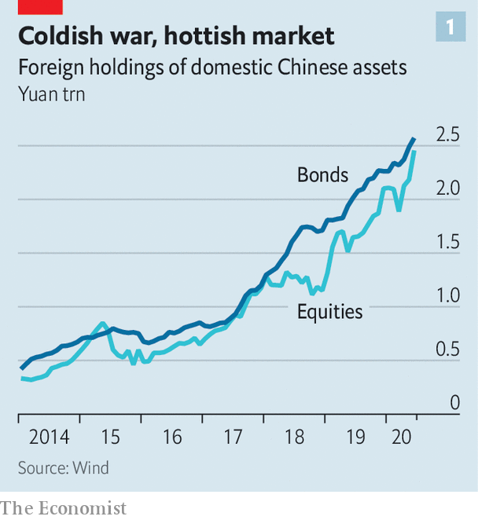
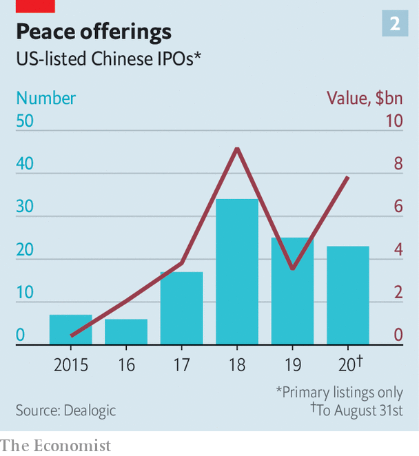

###### Present tense, future market

# Is Wall Street winning in China? 

##### As America tries to cut links, China is opening its door to foreign capital and firms 

 

> Sep 5th 2020 

IF YOU WANT a sure-fire way to get rejected, try asking Western financial firms for interviews about how geopolitical tensions have affected their strategies in China. “This topic carries some sensitivities,” one bank demurs. “We don’t want to end up in a Trump tweet,” says another. The Economist sought interviews with 15 global banks, insurers and asset managers. All declined to speak—except on background.

Such bashfulness from the swaggering titans of finance is revealing in itself. They are on unfamiliar ground. For years the American government called on China to open up to foreign capital, while China dragged its feet. Suddenly, these roles have been reversed. President Donald Trump’s administration wants global financiers to pull back from China. But China is enticing them in, creating opportunities that few had expected to come so quickly, if ever.


It has made for a disconnect between the political and the financial realms. Many observers focus on the decoupling between America and China. Yet for those managing the trillions of dollars that flow through global markets every day, the main trend looks more like coupling. Consider these moves by investment and commercial banks in the past half-year alone. Goldman Sachs and Morgan Stanley took majority control of their Chinese securities ventures. HSBC acquired full control of its Chinese life-insurance venture. Citi received a coveted custody license to serve institutional investors in China. Among asset managers, BlackRock received approval to sell its own mutual funds in China and Vanguard decided to shift its Asian headquarters to Shanghai.

 


Even more astonishing are the money flows. Roughly $200bn has entered China’s capital markets from abroad over the past year. Foreign holdings of Chinese stocks and bonds at the end of June were, respectively, 50% and 28% higher than a year earlier (see chart 1). Some of this reflects an inevitable pull as global index compilers such as MSCI add Chinese assets to their benchmarks; fund managers that passively track these benchmarks must allocate cash in line with the new weightings. But it is more than that. China has made it much easier for foreigners to enter its markets, and it offers two things that are rare in the world at the moment: GDP growth and interest rates higher than zero.

Despite talk of a new cold war, there are two reasons to think that coupling, not decoupling, will remain the better description of Sino-American financial ties. The first is China’s own actions. It is pursuing what Yu Yongding, a prominent economist, has described as a “linking strategy”, seeking to create more connections with foreign companies. Since late 2019 the government has lifted foreign ownership caps on asset managers, securities firms and life insurers. It has belatedly allowed MasterCard and PayPal to enter its payments industry. And it has let foreign ratings agencies cover more Chinese firms.

Even without the linking strategy, China has ample incentive to open its financial system more widely. Its current-account surplus has steadily narrowed as a share of GDP over the past decade (though it will soar this year because of the covid-19 impact); that puts pressure on it to attract more inflows through its capital account. At the same time reformist officials want greater foreign participation in the financial system. Zhou Xiaochuan, China’s former central-bank governor, has argued that just as competition from abroad helped make Chinese manufacturers world-class, so it can elevate the finance industry. Regulators also want companies to raise more funding by issuing bonds and stocks, to lessen reliance on bank lending.

China’s regulatory relaxation dovetails with the second factor: the interests of foreign financial firms. The Chinese market is simply too big to ignore. The investable wealth of retail clients is projected to grow from about $24trn in 2018 to $41trn by 2023, according to Oliver Wyman, a consultancy. And few sophisticated, globally minded asset managers operate in China today.

Foreign institutions know better by now than to assume that the economy’s scale will directly translate into business for them. In the early 2000s China began opening its commercial-banking industry to foreigners, but their share of the market, always tiny, has shrunk over time, dipping to just about 1% of domestic-banking assets. They are bit players.

Yet foreigners may fare better in the sectors newly open to them. No global bank can compete for deposits against the likes of Industrial and Commercial Bank of China, which boasts some 15,700 branches. Success in investment banking and asset management, however, is more related to experience than to sheer heft. Can an adviser help structure a cross-border acquisition? Can an asset manager offer the right interest-rate swaps to hedge currency exposure? “These are the areas where foreign firms feel they have an advantage,” says Mark Austen, head of the Asia Securities Industry and Financial Markets Association, a group that represents many of the world’s biggest financial institutions.

Not that China is going to make it easy. A taste of the potential complications came in the approval granted to BlackRock for a fund-management company. Unlike prior approvals for Chinese-owned entities, the regulator added a condition, demanding adherence to the Internet Security Law. BlackRock will need to store client data within China and authorities could demand access, likely forcing it to segregate its Chinese and global systems.

Foreign firms will also face a ferocious battle with domestic firms on a playing field that is tilted against them. “They’ll never just completely open and be fine with us crushing the locals,” says one banker. State-owned firms will reserve their juiciest deals for domestic banks. The government is engineering mergers to create what it calls an “aircraft-carrier” investment bank to repel foreigners. And global asset managers will have little choice but to distribute their products through domestic banks and tech platforms. Chantal Grinderslev, founder of Majtildig, a Shanghai-based advisory firm, sees a split between foreign firms that commit capital to China for the long haul and those that are less patient. “If you have to be profitable in three years or less, this is not the market to enter,” she says. JPMorgan Chase, she notes, is on track to buy out the local partner in its asset-management venture for $1bn, a 50% premium over fair value. That is expensive, but it also testifies to the weight that Jamie Dimon, the banking colossus’s chief, places on China. “He is looking to build a real business,” she says.

The political tussle with America looms over these corporate decisions. “Global headquarters asked us to develop optimistic, realistic and pessimistic scenarios,” says the CEO in China of an American bank. “I laughed because there’s no point thinking of things getting better. It’s binary. Either we can continue in China or we can’t.” So far things have clearly remained on the remain-in-China side of the equation. America’s financial measures against China have thrown some sand in the gears but have not stopped them from turning.

 


The Trump administration has blocked a federal-government pension plan from investing in Chinese stocks. It has threatened to delist Chinese firms from American stock exchanges. And it has placed sanctions on Chinese officials in Hong Kong and Xinjiang. All three moves are, in the grand scheme, mild. The government pension plan that now excludes Chinese stocks represents just 3% of American pension assets. China has until 2022 to stave off the threatened delistings, and has already proposed a compromise, giving American auditors more access to its companies’ books. In the meantime, the value of Chinese listings on Wall Street has risen this year (see chart 2). As for the sanctions, they can be painful for individuals, but would have harmed China much more if they had named entire banks.

It is only prudent for firms to prepare for America to take a tougher line against China. But the implications in the financial sector are different from, say, the industrial sector. Factories require a large fixed investment and carefully configured supply chains. Investments in bonds or equities are, by contrast, much easier to adjust—at least so long as China lets investors move cash out of its markets. Even for firms building up brokerages or asset-management operations in China, the investments are small compared with their global footprints. The Chinese securities firm controlled by UBS, for instance, held just 5bn yuan ($730m) in assets at the end of 2019—bigger than any other foreign-owned securities firm in China but barely 0.2% of UBS’s global investment-banking assets.

The one American action that could almost instantaneously derail financial coupling would be to block China from the dollar-payments system. The administration could do so by pressuring SWIFT, a Belgium-based messaging system that underpins most cross-border transfers, to boot out Chinese members. Or it could order the big banks which clear dollar payments in America to stop serving Chinese banks.

Chinese officials, alarmed by these once-unthinkable possibilities, have held meetings in recent months to discuss how they might respond. They have talked about promoting the yuan as an alternative to the dollar and home-grown payment networks as alternatives to SWIFT. In practice, neither would help much. The yuan, constrained by capital controls, remains a weakling in global finance, while China’s would-be SWIFT replacements have failed to gain traction.

The biggest constraint on America is the damage that it would suffer itself. Cutting China off from the dollar would undermine not just Chinese banks but also China-based companies that account for more than a tenth of the world’s exports. This would trigger a collapse in international trade, massively disrupt supply chains and, quite possibly, deepen the global recession. The fact that American policymakers must contemplate such consequences is an argument in favour of China’s linking strategy. “The only option is more openness,” says Larry Hu, head of China economics at Macquarie Group in Hong Kong. “You must create a situation where your counterpart has more to lose.” For foreign financiers in China, that, oddly enough, is music to their ears.■

