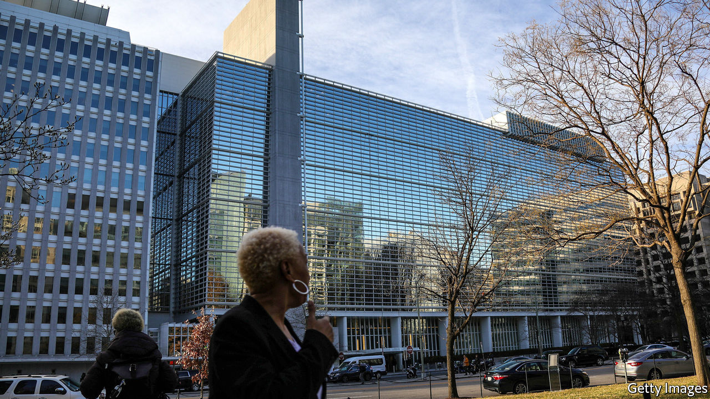

###### Global red tape

# The World Bank’s business-rankings mess 

##### The data may have been fiddled 

 

> Sep 5th 2020 

RUNNING A BUSINESS is hard in many parts of the world. So the World Bank gives governments an incentive to make it easier, and ranks them according to where the burden of regulation is lightest. This year, though, its Doing Business (DB) index has itself been ensnared in procedural problems. On August 27th the Bank said that publication of the next set of rankings would be delayed. It comes in a year when, The Economist understands, China was going to be ranked one of the biggest improvers. On that the Bank had no comment.

Some cheered the postponement because they think the index is counterproductive, specious, or both. Many critics worry that it encourages PR-attentive technocrats and politicians to slash regulations excessively and that it ignores how rules are applied in practice. A study in 2015 found “almost zero correlation” between the DB results and what businesses say when directly surveyed by the World Bank.


Still, the recent suspension happened not because of methodological concerns, but because of questions about data integrity. Nine World Bank whistle-blowers have alerted management to alleged “irregularities” in the indices published in 2017 and 2019, including for Azerbaijan, China, Saudi Arabia and the United Arab Emirates.

It is not hard to see why countries might want the figures to be fiddled. Falling down the rankings is politically embarrassing. The World Bank, meanwhile, may have an incentive to keep relations with important members sweet. In 2017 its leaders grew concerned that China’s DB ranking would fall, which led the bank to double check the results, an ex-insider says. After fixing a coding error and tweaking a judgment call, its ranking did not drop.

A further source of uneasiness comes from countries paying the World Bank for advice on how to rise up the DB rankings. China, Saudi Arabia and the United Arab Emirates all pay for such Reimbursable Advisory Services (RAS), which in the past were delivered by some DB staffers themselves. (The use of DB officials in this way was stopped in 2019.)

Some performance improvements defy logic. An email seen by The Economist suggests that Azerbaijan’s rise to attain the top score globally for legal rights when obtaining credit last year was particularly controversial. Its overall score declined.

The World Bank is doing a thorough audit of its processes, including those relating to the RAS. Whatever the investigation uncovers, the saga highlights the tension between the institution’s different roles. The Bank likes to think that its diplomatic and research functions are complementary. If only things were so simple.■

