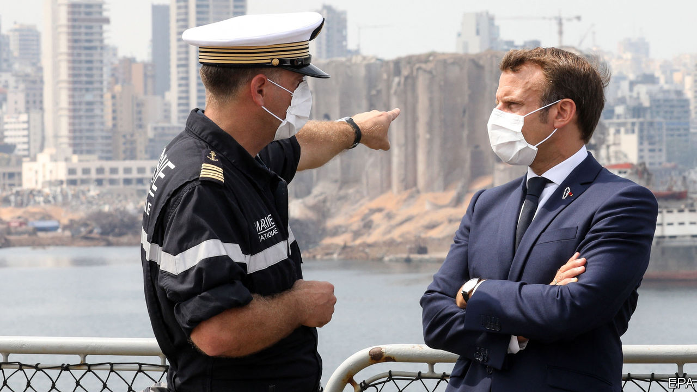

###### The sultan et le président

# Old colonial powers are bidding for influence in Lebanon 

##### Their efforts may drag the country into yet more conflict 

 

> Sep 3rd 2020 

AS CELEBRATIONS GO, it was sombre. A century earlier French officials stood in Beirut’s imposing Résidence des Pins (the French ambassador’s villa) and carved Lebanon out of their mandate in Syria. On September 1st Emmanuel Macron travelled there to mark the event—and to lecture the politicians who have helped turn Lebanon into a failed state.

Lebanon has always been a plaything for foreign powers. America, Iran, Israel, Saudi Arabia and Syria have all meddled in the tiny country’s tortured politics. As Lebanon sinks into economic and humanitarian crisis, two of its old colonial masters, France and Turkey, are making worrying bids for renewed influence.


This was Mr Macron’s second visit since a massive explosion at Beirut’s port on August 4th killed almost 200 people. The prime minister, Hassan Diab, resigned soon afterwards. For weeks the president, Michel Aoun, declined to consult parliament about a successor. But he abruptly summoned MPs to meet on August 31st. Wags likened him to a child rushing to finish his homework before daddy returned.

Mr Macron speaks for many when he calls for political change in Lebanon, ruled for decades by a coterie of ageing, corrupt men who deploy fear and exploit sectarian loyalties to stay in power. “The objective of this visit is clearly to mark the end to a political chapter,” Mr Macron said. Yet the man who will lead this new beginning is hardly a break from the past. The unexpected choice for prime minister was Mustapha Adib, Lebanon’s ambassador to Germany, who won the support of 90 MPs out of 128.

For many, that very support makes Mr Adib suspect. He is a political unknown, but hardly an outsider. He advised Najib Mikati, a billionaire businessman who served two stints as prime minister and is battling corruption charges. Mr Adib won the backing of Saad Hariri, another billionaire ex-prime minister and the country’s leading Sunni politician. The two main Shia parties, Hizbullah and Amal, and Mr Aoun’s Christian allies are also behind him. A man handpicked by the establishment is unlikely to confront it.

Even a genuine reformer would be overwhelmed by Lebanon’s problems. Its economy has collapsed. The currency has lost 80% of its value on the black market since October. Annual inflation hit 112% in July; food prices leapt fourfold. Over half of Lebanese live in poverty.

In years past Lebanon might have turned to the Gulf for a bail-out. Saudi Arabia was a longtime patron of Lebanon’s Sunni community. But, frustrated with Lebanon’s politics, in recent years the kingdom has stepped back.

That has left an opening for Recep Tayyip Erdogan, Turkey’s president, who has cultivated ties with Sunnis in neglected areas. Turkey’s foreign-aid agency has built cultural centres and funded other projects. Thousands of Lebanese have received scholarships to study in Turkey. Thousands more have gained citizenship based on Turkish ancestry. Turkey’s vice-president visited Beirut after the explosion and offered to help rebuild the port.

Unlike the Saudis, Mr Erdogan has not thrown his support behind a political party. But he and his confidants have made powerful friends. Hakan Fidan, the Turkish spy chief, has built a relationship with his influential Lebanese counterpart, Abbas Ibrahim. Mr Hariri was a guest at the wedding of Mr Erdogan’s daughter in 2016.

Turkey’s growing clout worries many. The dying days of Ottoman rule were not a pleasant chapter in Lebanon’s history: the famine that began in 1915 killed half the people in the mountainous heartland. Particularly nervous are members of the large Armenian community, many descended from refugees who fled the Ottoman-era genocide in eastern Turkey a century ago, which Lebanon is one of the few Arab states to recognise.

There was a telling incident this summer, when Nishan Der Haroutounian, a Lebanese-Armenian TV presenter, called Mr Erdogan an “obnoxious Ottoman” on air. Mr Der Haroutounian now faces prosecution. His words sparked protests outside the studio and insults on social media from Lebanese of Turkish origin. One member of that community proclaimed himself “proud of the massacre that our Ottoman ancestors carried out”.

At the moment, Lebanon is desperate for help, regardless of its source. Mr Macron, who is planning a donors’ conference, gave Mr Adib two months to enact reforms. France is being “demanding, not interfering” and trying to “unblock” Lebanon’s politics rather than impose an alternative, says Mr Macron. But things are rarely so simple in Lebanon. Its politicians are loth to reform, and their foreign patrons often treat the country as a zero-sum struggle.

France and Turkey may find themselves at odds as well. The two are already sparring in the eastern Mediterranean. A greater Turkish role in Lebanon could draw in the United Arab Emirates, a small but powerful state that views Mr Erdogan’s brand of political Islam as an existential threat. Lebanon’s next chapter may become a new struggle between its old rulers. ■

