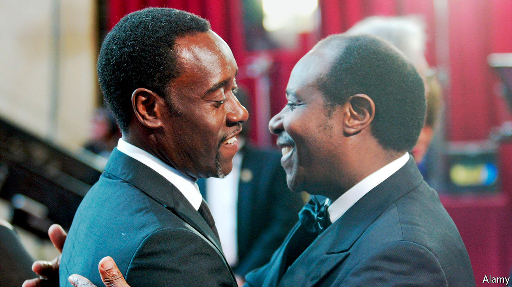

###### The hero of “Hotel Rwanda”

# Rwanda arrests the man who shielded people from genocide 

##### Paul Kagame’s authoritarian regime grows more brazen in attacking its critics 

 

> Sep 5th 2020 

THE LAST time Trésor Rusesabagina spoke to his father was on his birthday, when the latter called from his home in San Antonio, Texas, to wish his son well. “He hadn’t been anywhere for ages because of lockdown and I thought he was just hanging out, watering his plants.”

On August 31st Trésor woke up to a welter of messages on his phone, asking if he’d heard the news. Paul Rusesabagina had just appeared in handcuffs at a press conference in Kigali, Rwanda’s capital, hosted by the Rwanda Investigation Bureau. The authorities accuse him of founding and leading “armed extremist terror outfits” fighting the Rwandan state. Mr Rusesabagina had told his wife he was flying to Dubai for a meeting. How he ended up in Rwanda’s capital remains unclear.


For the former manager of the Hotel des Mille Collines, the rendition is a nightmare come true. Since moving his family to Belgium in 1996, where he applied for asylum before relocating to America, he had lived in anticipation of just such an event. “He’s always been paranoid about them arresting him, shutting him down, because he had a voice,” said his son, Trésor. “In Rwanda, to have an opinion is a crime.”

The film “Hotel Rwanda”, which starred Don Cheadle, made Mr Rusesabagina (pictured on the right) a celebrity in the West. It showed how during the genocide of 1994 that claimed some 500,000 lives he sheltered 1,268 terrified Tutsis and moderate Hutus in the Mille Collines. A Hutu on jocular terms with the army generals and militia leaders who masterminded the genocide, Mr Rusesabagina used charm, cigars and booze to buy time for the hundreds of Tutsis who had taken refuge under his roof.

Silencing the critics

Mr Rusesabagina’s pragmatic heroism won him a Hollywood film deal, international praise and an admiring audience in America, which became a donor to the new government established by Paul Kagame, a former rebel leader. But the regime chafed at Mr Rusesabagina’s outspoken criticism of the Tutsi elite now running the country. He poured scorn on Rwanda’s rigged elections and mocked what he saw as token attempts at ethnic reconciliation. “We have changed the dancers but the music remains the same,” he wrote in a memoir.

On social media Mr Kagame’s backers are circulating a clip filmed in 2018 which appears to mark the moment when Mr Rusesabagina came out in favour of armed struggle. “The time has come for us to use any means possible to bring about change in Rwanda,” he said, calling on Rwandans to support the National Liberation Front, the armed wing of a coalition of opposition groups which included his own. “All political means have been tried and failed.”

His family insist the 66-year-old grandfather never actually intended to incite violence, which he abhorred. Anyway, the much-hyped opposition coalition he was part of has largely collapsed since he made the statement, suggesting he posed no real security threat to Rwanda.

This makes Mr Rusesabagina’s rendition all the more surprising, given the international condemnation it courts. The real motive may have been jealousy, says a former confidant of Mr Kagame: “There can only be one post-genocide hero in Rwanda and that’s Kagame. He wasn’t going to share the limelight with anyone.”

The operation is the most brazen that his government has launched against perceived enemies abroad. Quick to remind the international community that it did nothing to stop the genocide, Rwanda’s leaders see Israel as a model and inspiration. This extends to the efforts of the Israeli security services to track down and abduct or kill those deemed enemies of the state abroad.

Ever since a former Rwandan interior minister, Seth Sendashonga, was shot dead in Nairobi in 1998—an assassination for which disillusioned members of Mr Kagame’s intelligence apparatus have since admitted responsibility—the government has shown the same readiness to ignore borders. In South Africa at least three attempts have been made on the life of an exiled former army chief-of-staff, Kayumba Nyamwasa, prompting the government to expel Rwandan diplomats suspected of arranging the attacks. In early 2014 Patrick Karegeya, a former external intelligence chief, was found strangled in a Johannesburg hotel. Mr Kagame, who had known both men since childhood, denies responsibility. But the magistrate at Karegeya’s inquest ruled that the attackers were “directly linked” to Rwanda’s government.

In February Kizito Mihigo, a gospel singer, died in Rwandan police custody. Friends reject official claims that the young man hanged himself. Last month a Congolese gynaecologist, Denis Mukwege, who won the Nobel peace prize for his work with rape victims, said he had had a stream of death threats after calling for those responsible for human-rights abuses in the east of the Democratic Republic of Congo to be held accountable. UN reports accuse the Rwandan army of committing mass atrocities there in the late 1990s.

A Rwandan human-rights campaigner, Rene Mugenzi, who describes Mr Rusesabagina’s arrest as a “kidnapping” since no extradition hearing was held, sees the latest operation as evidence of extreme intolerance by a regime whose impressive economic development has never been matched by a respect for human rights: “The risk Rusesabagina represented to Kagame was reputational, not military. He could reach places in the American establishment that matter to Kigali. Now they want to destroy his reputation in court.” ■

