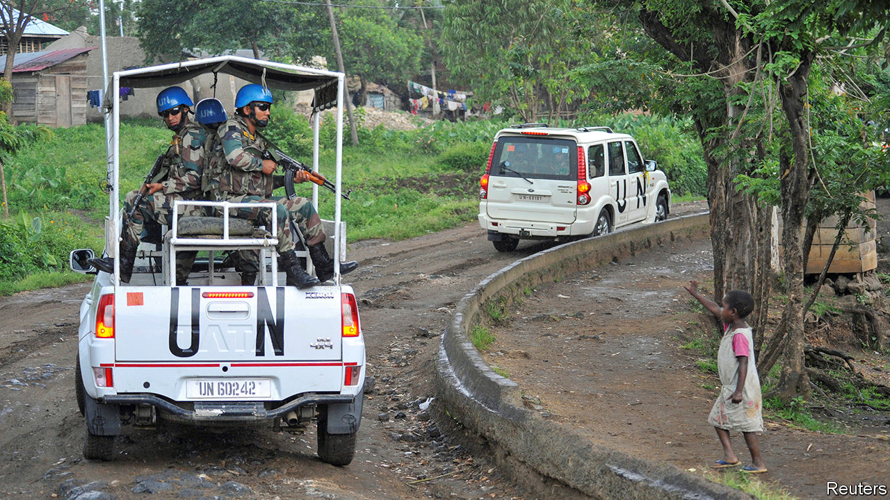
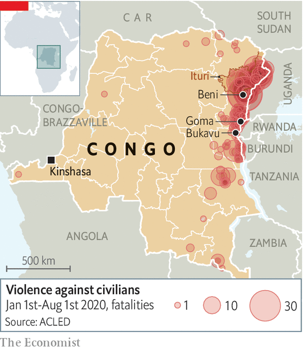

###### All helmet and no mettle

# The UN’s peacekeepers are under pressure to quit Congo 

##### The peacekeeping mission has struggled to bring peace, but leaving could make things even worse 

 

> Sep 3rd 2020 

ON THE EDGE of Beni, a city in north-eastern Congo, a field is strewn with bricks and broken glass. Three Malawian soldiers, working for the UN’s peacekeeping mission, known as MONUSCO, lounge under a tree amid the rubble. It is all that is left of MONUSCO’s offices after they were burned down in November by locals furious that the mission had failed to protect them from rebels. “We have suffered years of massacres,” says one of those who took part in the burning. “We see UN soldiers all over town, but when the rebels are killing us they never come.”

The peacekeeping mission in Congo, with over 16,000 soldiers and police, is the largest and third most expensive in the world. UN troops have been in Congo since 1999, when they arrived to oversee a ceasefire in a civil war that had left between 1m and 5m people dead, thanks to bullets, machetes and disease. For two decades the mission has tried to pacify the country’s embattled east. Yet more than 100 armed groups still hide there in the forests. They survive by smuggling minerals, looting and extorting cash from the locals.


This year alone about 1m Congolese have been displaced by violence. Some of the bloodiest fighting has taken place in Ituri province, where two rival tribes have been clashing. Rebels have hacked at least a thousand people to death with machetes, attacking 60 schools and raping children.

Even though the violence still rages (see map), MONUSCO is under pressure from the UN Security Council to pack up and go. A report commissioned by the council last year says MONUSCO should aim to be out by 2022, largely because it is too expensive and has sputtered on for so long. President Donald Trump’s decision to cut America’s contributions to UN peacekeeping has squeezed MONUSCO’s budget to $1bn a year, almost a third less than in 2016. Yet conditions for the mission’s total withdrawal will plainly not be met by 2022, when Congo’s army is supposed to be largely back in control. So MONUSCO will probably be shrunk but will not leave altogether.

 


The peacekeepers are far from fulfilling their mandate to disband militias, protect civilians and stabilise the state. Armed groups are multiplying. Few Congolese civilians think the mission really protects them. According to a poll in 2018 by peacebuildingdata.org, an American NGO, only 15% of those surveyed said they trusted MONUSCO to keep their neighbourhood or village safe. Still, with nobody else to turn to, displaced people do often huddle around MONUSCO bases.

At the best of times, bringing peace to eastern Congo is a very tall order. The eastern provinces are ten times the size of Switzerland. Much of the land is jungle. Murder and mayhem can occur quickly at night, so by the time UN soldiers arrive—if they do at all—the rebels have invariably melted back into the bush. “Whenever I see the bloodshed, I always ask, where were we?” says Leila Zerrougui, MONUSCO’s head. “We can never do enough.”

In any case, MONUSCO can stay only as long as the Congolese government wants it to. It is meant to work alongside the national army. Whereas Congo’s former president, Joseph Kabila, routinely threatened to kick it out, his successor, Félix Tshisekedi, is keener to co-operate with it. Yet working with the army is tricky. Its unruly, underpaid soldiers often collaborate with rebels, selling them guns and tipping them off. Sometimes they kill and loot together. Many former rebel warlords have been given senior posts in the army in exchange for surrendering their weapons. Their thugs tend to go on pillaging as before—but in army uniforms.

“We cannot trust our soldiers and we do not know who the enemy is,” says a villager near Beni whose eight neighbours were rounded up and shot outside their houses last year. He says the killers were uniformed Congolese soldiers speaking Lingala, the language of the capital and the army. These murders took place barely a mile from MONUSCO’s offices, sparking the protests in which they were burned down. “Nobody came to help. We were forgotten.”

To make matters worse,UN troops in Congo have themselves often been accused of violence. Dozens of women say they have been raped by blue-helmeted soldiers in eastern Congo. Posters in MONUSCO’s barracks remind UN troops not to have sex with under-age women.

Yet for all MONUSCO’s faults, Congo would probably be worse off without it. Its soldiers are more trusted than the Congolese army. “In many places, peacekeepers are the only ones who are actually trying to protect people,” says Séverine Autesserre, author of “The Trouble with Congo”. MONUSCO’s civilian staff have documented abuses by rebels and the army that would have gone unnoticed. Aid agencies rely on MONUSCO’s planes and armed escorts to help them reach remote, beleaguered places. If MONUSCO leaves in a rush it will leave a gaping hole that is bound to be filled by rebels and predatory soldiers. ■

