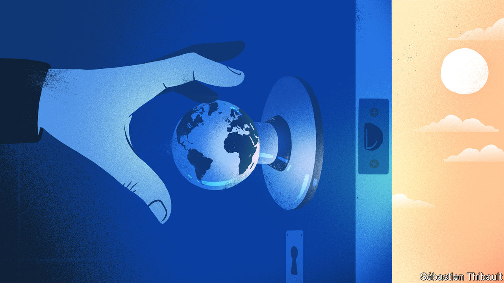

###### Lowering the drawbridge

# Two books expound the virtues of open societies 

##### Johan Norberg sees openness as an engine of progress. Matthew Yglesias wants to open up America 

 

> Sep 12th 2020 

Open: The Story of Human Progress. By Johan Norberg.Atlantic Books; 448 pages; $24.95 and £20.

One Billion Americans: The Case for Thinking Bigger. By Matthew Yglesias.Portfolio; 288 pages; $28 and £23.99.

IT WAS NOT just roads that led to Rome. The shipping lanes did, too. By the first century BC, Rome had conquered the entire Mediterranean coastline. Some 90% of its people lived within 15km of the sea, buying corn from Egypt, olive oil from Spain and toga dye from Carthage. The Roman Empire prospered because it was open to trade, people and ideas, says Johan Norberg, a Swedish thinker. Galleys brought “all the crafts that exist or have existed”, as one Greek observer put it. Foreigners could become citizens; a slave’s son could (occasionally) rise to become emperor.

Mr Norberg’s “Open” is one of two new books that offer big ideas about globalisation, past and future. He argues that progress depends on openness, but that this tends to create resistance that sets back the clock. In “One Billion Americans” Matthew Yglesias, a co-founder of Vox (a wonky leftish news outlet), ponders how the United States might evolve if it were much more open to immigrants.

“Open” is clear, colourful and convincing, marshalling evidence from a range of eras and civilisations. The Roman Empire ceased to prosper when it ceased to be open. Christianity became the established religion, and sought to crush all others. “This new intolerance…led to vicious conflicts…between Christians and pagans, who saw their old gods being banned and their temples torn down.” Persecuted pagans joined Rome’s enemies, even welcoming barbarian invaders as liberators.

Human history, in Mr Norberg’s telling, is a cacophony of drawbridges being lowered and then raised. Mathematics and medicine flourished under the cosmopolitan Abbasid caliphate, but froze when religious conservatives won control. By driving out Jews, Muslims and heretics, he argues, the Inquisition helped impoverish Spain (between 1500 and 1750 the Spanish economy actually shrank).

China’s Song dynasty, which welcomed Muslim traders, Indian monks and Persians, developed paper money, water-powered textile machines and the makings of an industrial revolution 400 years before the West. But later dynasties turned inward and stagnated. Ming officials smashed clever machines, banned overseas trade on pain of death and curbed movement within China itself. The Manchus were even worse: to prevent contact with the outside world, in 1661 they forced the whole population of the southern coast to move 30km inland. A century later the Qianlong emperor banned or burned any books that seemed sympathetic to previous dynasties, including a great encyclopedia of economic and technical matters.

The author is often amusing as well as illuminating. Genghis Khan was a vicious warlord, but his domestic policies “would today open him up to accusations of being a politically correct, latte-drinking virtue signaller”. The Mongols practised ethnic and religious tolerance, which is one reason why they were so effective. They promoted skilled fighters, engineers and administrators of all backgrounds. Of the 150,000-strong horde that invaded Europe in 1241, only around a third were ethnic Mongols. Habsburg soldiers were surprised to find that one captured officer was a middle-aged literate Englishman, who had fled persecution for heresy at home and sought refuge among the more open-minded Mongols.

All regions have had rulers who tried to preserve stability by shutting out foreign influence. The key to thwarting them has often been for the ruled to vote with their feet. Early modern Europe was no more advanced than China, but power was more dispersed, so thinkers who offended one prince could simply move. Hobbes wrote “Leviathan” while in exile in Paris; Locke and Descartes went to Amsterdam. Their books could always be printed somewhere, and so were impossible to suppress.

Backlashes against openness are inevitable because they are rooted in human nature, Mr Norberg contends. Human brains evolved over millennia in which disruptive change often meant death; mutually beneficial exchanges with strangers were rare. If the past 300,000 years of history were compressed into a single day, it would not be until the final minute that steady material progress, fuelled by disruptive innovation, took off. Small wonder people’s instincts are so conservative. When threatened, they seek shelter within their tribe, which is why demagogues try to scare them. Fear wins elections.

The more the merrier

The book ends on an optimistic note. Populist demagogues eventually lose power because they are hopeless at governing. Four in ten wind up being indicted for corruption, by one count. Citizens get used to change: today American Muslims are as tolerant of homosexuals as the country was overall in 2006. The open society “may yet be saved”, Mr Norberg concludes.

Mr Yglesias makes a bold case for openness in his own country. If America made both child-rearing and immigration easier, its population could in time swell to 1bn. It would thus remain the pre-eminent power, outstripping China and India. A bigger America would make for a more innovative and democratic world, he argues.

But wouldn’t an America of 1bn people be horribly crowded? No, it would be as sparsely populated as France is now. Even popular cities could accommodate many more residents if building codes were less restrictive. Enlightened visa rules could revive declining towns. Congestion could be eased with policies that have worked elsewhere, from road pricing to better railways.

Mr Yglesias is swimming against the tide, and knows it. He notes that a recent immigration bill backed by Donald Trump is so restrictive that it would not let Kazuo Ishiguro, a British Nobel prizewinner, apply for a work visa unless his job paid $240,000 or more. Yet as Mr Norberg shows, political tides can change. ■

