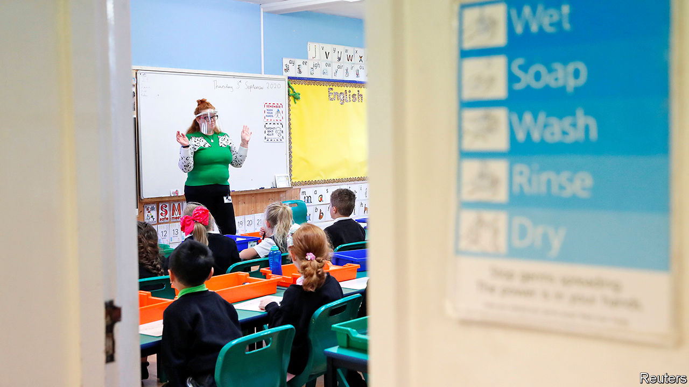
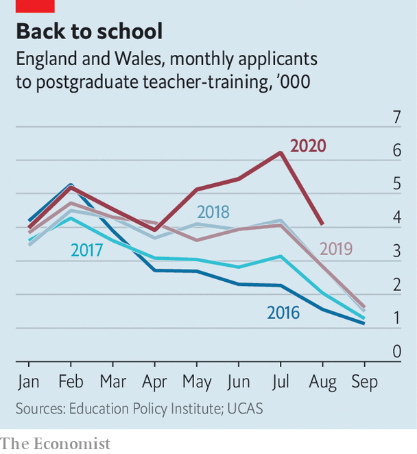

###### Famine to feast

# A rush of new teachers will help England’s short-handed schools 

##### They arrive just as pupil numbers are shooting up 

 

> Sep 10th 2020 

IF THINGS HAD gone to plan, Oli Seadon would be leading a troupe of acrobats on a tour of South America. But the pandemic forced his employer, Cirque du Soleil, to cancel its shows, and prompted the 36-year-old theatre producer to make a fresh start. In April he applied to begin teacher-training with the help of Now Teach, a charity that encourages job-changers to enter the classroom. Mr Seadon comes from a family of educators and says he had been mulling the move for a while. Without the pandemic, he says, “I’m not sure I would have given myself permission to do it.”

Mr Seadon is not alone. Interest in teacher-training courses has soared since lockdowns began. The number of people who had applied to postgraduate ones by mid-August was 16% higher than last year (see chart). Recessions always increase demand for secure jobs in the public sector. This time around, the shock of school closures and the difficulties many parents have experienced while home schooling their children may have had the added effect of raising the status of teaching as a profession, reckons Lynne McKenna, dean of the teacher-training school at the University of Sunderland.


England has long struggled to recruit enough teachers. Its secondary schools have 7% fewer than they did in 2007, according to analysis by the Education Policy Institute, a think-tank. Pupil numbers are expected to rise 7% by 2024, the result of a baby boom ten years ago. Despite this year’s surge in applications, the government will probably still fail to hit its targets for subjects where shortages are most acute, such as physics. But the application round was already half-finished by the time the pandemic struck. Jack Worth of the National Foundation for Educational Research, a charity, thinks the number of people who apply for teacher training next year will be higher than usual, too.

 


Two worries persist. Universities and the other organisations that train teachers rely on schools to provide their students with work placements. This year stressed-out heads have been less inclined to host trainees. The government has said that school leaders should consider trainees to be essential workers, not outsiders who might bring infection. But concern about the availability of placements means some teacher-training providers snapped up fewer of this year’s applicants than they might have done, says Emma Hollis of NASBTT, a trade group.

A bigger question is how many of the new trainees will stay in teaching. Research in America shows that people who enter the profession during recessions tend to make better teachers than those who do not, perhaps because high-skilled workers have fewer other options during a downturn. But they are also a bit more likely to give up. England already has a problem retaining new teachers. About a fifth leave the job within two years of qualifying. About a third go within five.

Sam Sims at the UCL Institute of Education says “muscular” policies that were put in place before the pandemic provide reason for optimism. Last year the government said that starting salaries would rise to £30,000 ($39,000) by 2022, a 23% increase. It is offering annual bonuses to teachers of subjects with the biggest shortages. And it is promising more mentoring and training for people who are new to the job. The idea is that new teachers will eventually consider themselves better-paid and better-supported than peers in many other professions. That might make Mr Seadon’s cohort a bit more likely to hang around. ■

