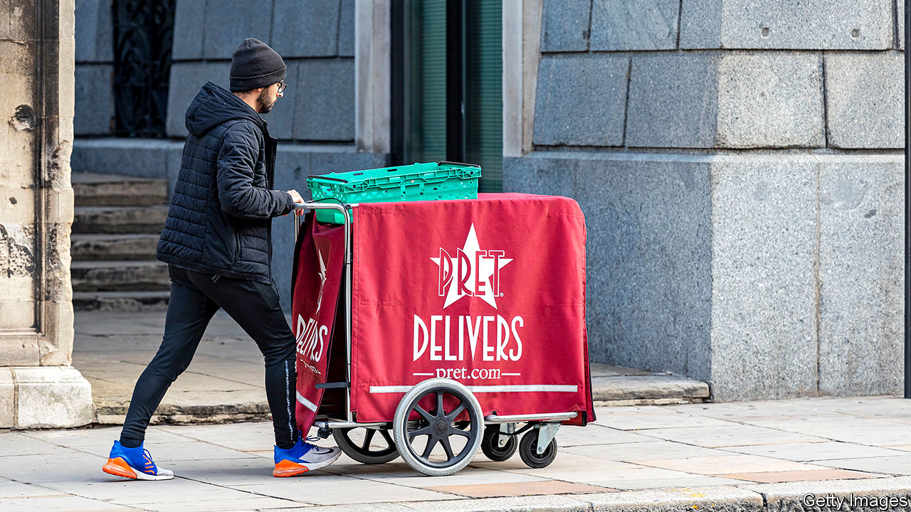

###### Sandwich strategies

# Empty city centres are a crisis for cafés—and also an opportunity 

##### How Britain’s lunch purveyors are rewriting the rules of their business 

 

> Sep 10th 2020 

BEFORE THE pandemic, reporters at The Economist’s London office had a wealth of venues from which to get lunch. Within a five-minute walk there were two burger chains (McDonald’s and Five Guys); two fast-casual outfits with the names of Frenchmen (Leon and Paul); three sushi suppliers (Wasabi, Itsu and another Itsu); and four sandwich shops (Pret, Pret, Pret and Pret).

But then hard-toiling journalists had to start working from home. So did most other city-centre workers, spelling disaster for purveyors of grab-and-go lunches. Pret a Manger, the poster-child of the lunchtime economy, cut 2,800 shop jobs, nearly a third of its total. Itsu, Wasabi and Yo!, another sushi chain, are all undergoing restructuring. Each firm is dealing with the same conundrum: how to tear up a successful business model and draw up a new one overnight.


In normal times, established companies face three big obstacles to changing how they work, says Jessica Spungin of the London Business School. One is that if things are running smoothly, managers see no need to change. Another is that even if change is desirable, fears remain that new lines of business will cannibalise old ones. And then there is the difficulty of undoing decisions that have already been made, like long-term leases on high-street shops. Pret exemplifies these problems. “We had such a successful business and such a great culture, we started to really struggle to drive change,” says Pano Christou, the company’s boss. “You had ‘We can’t do it this way, we always did it that way’. It was really difficult for us to kill our sacred cows.”

The pandemic gave managers the ability to push ahead with new ideas. Not all of them worked. When shops reopened in April, Pret introduced a range of groceries, such as milk and bread. It no longer offers those. A “heat at home” range of soups is on its way out as well. This is no bad thing. A wise incumbent tries lots of small things at the same time until something works, says Ms Spungin.

For city-centre lunch outlets that means following customers to where they now spend their time: the suburbs. Pret has opened a “dark kitchen” in Colindale, in deepest north London, which produces food only for delivery. It has started selling coffee beans on Amazon. And it introduced a subscription service that offers up to five coffees a day for £20 ($26) a month, which is designed to entice customers back into shops and to collect data on consumer behaviour. Not to be outdone, Leon quickly followed up with a £15 unlimited coffee offer.

Yet even with pandemic-enforced change, another big strategic question looms, says Jonathan Reynolds of the Said Business School. If a vaccine does arrive soon and life goes back to normal, assumptions made today could be invalid within a year. Sensible business leaders plan for that, too. Many of the moves Pret is trying now were ones it was planning already, albeit at a slower pace. That is the final lesson for business leaders: how to turn crisis into opportunity.

