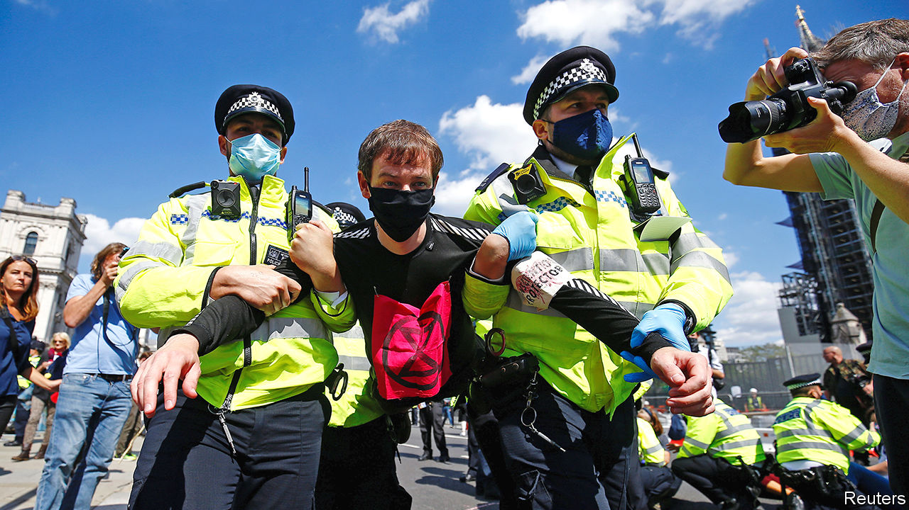

###### Lots of hot air

# Extinction Rebellion shows how not to run a protest group 

##### Internal conflicts have dampened momentum, and harmed the outfit’s cause 

 

> Sep 12th 2020 

ON SEPTEMBER 5TH Britons woke to discover that their news-stands were rather empty. Overnight, Extinction Rebellion (XR) had blocked access to three printworks owned by Rupert Murdoch’s News UK. The protest was not well received. Newspapers, and many environmentalists, called it an attack on free speech. Boris Johnson, the prime minister, thinks that XR should be classified as an organised-crime group, which would subject activists to surveillance typically reserved for gangsters.

XR’s latest demonstrations, which include marches in central London as well as blockades on printworks, follow noisier protests last year. In April 2019 they occupied major thoroughfares in London and other cities for a week of revelry and political action. Those protests were widely seen as a success. Polls found public support for their aims. Responding to the group’s demands, Parliament declared a “climate emergency”. Since then, however, XR has struggled to retain its influence.


That is partly due to forces beyond its control. A planned protest in March was cancelled because of covid-19. This time round, the group has been prevented from camping out by a curfew put in place by the police to ensure social distancing, and coppers have stopped them taking over Lambeth Bridge and other roads. Yet it also reflects internal conflicts that have harmed the group’s cause.

XR has been through a bitter civil war, emerging scarred and exhausted. In theory, the group was run along “holacratic” lines, based on a theory in which traditional hierarchies are replaced by semi-autonomous “circles”. In XR’s case, this meant that small local groups were able to carry out protests independently. Initially, the approach united disparate factions of the rag-tag climate movement behind a core aim: pressuring the government into declaring a climate emergency.

In practice, though, hierarchies persisted. Many saw the outfit’s co-founders, Gail Bradbrook and Roger Hallam, as the people in charge. They were members of the Anchor Circle and the Rapid Response Team, two small groups that held power during protests last year. The pair were also directors of Compassionate Revolution, a company which handled donations. Yet they did not have a strong enough grip to prevent an unholy alliance of eco-fascists, eco-socialists and eco-anarchists descending into conflict.

The main dispute was about tactics. Farhana Yamin, a prominent lawyer, wanted to work with politicians. Another group represented by Mr Hallam, an organic farmer, wanted to provoke mass arrests to overwhelm the system. “Roger’s theory of change was: if you get enough people to turn up in a central square, like Tiananmen Square or Parliament Square, then that will be revolutionary,” explains Ms Yamin. At first, they struck a productive balance. Protests won Ms Yamin’s team meetings with cabinet ministers, who agreed there was a climate emergency.

But it did not last. Ms Yamin’s faction was denounced as traitors. They were subjected to a “Conflict and Resolution Circle”, which one insider says “was basically a hippie way of saying ‘Fuck off’”. That handed more power to Mr Hallam’s group, who thought riskier actions would provoke a heavy-handed response from the state, and thus public sympathy. The group’s cooler heads say they spent most of the summer of 2019 fighting madcap ideas. One, claims an insider, was to glue thousands of teenagers to London’s Tube carriages at rush hour. A more restrained version led to two activists being pulled from a train roof by angry commuters. A dispute over whether to target Heathrow airport became particularly disruptive.

Both Ms Yamin and Mr Hallam have since left XR. Compassionate Revolution has been replaced by a new company led by three younger directors. Ms Bradbrook, one of XR’s founders, denies they have any authority. “We have some legal bodies that are part of what you need in order to have a bank account and so on, but that’s not where the decision-making takes place,” she explains. A lack of donations means that central organisers can no longer afford to pay themselves; local groups have taken on more responsibility, with demonstrations becoming more dispersed as a result. Recent protests have been led mostly by aligned groups, stitched together by so-called “Rebellion Weavers”.

New divides have emerged. The so-called “Fourth Demand”, which calls for reparations and land rights for indigenous groups, is one. Many think the popularity of Black Lives Matter means XR now needs to take identity politics seriously. The demand has been adopted by local groups, but not by central office. In theory, these disputes should now be easier to settle. Ms Bradbrook says that XR has set up an Actions Council, which will adjudicate on internal battles. It just hasn’t got around to meeting yet. ■

