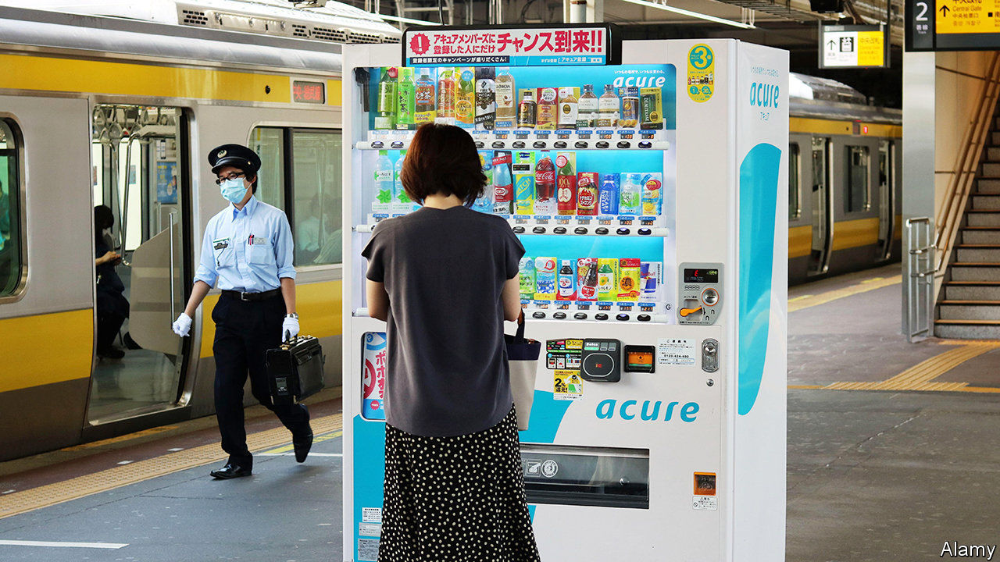

###### Caffeine clash

# Who will win the brewing battle between Japan and America? 

##### Japanese-born canned coffee is conquering America. Its Japanese purveyors are not 

 

> Sep 12th 2020 

IN THE 1970S Japan gave the world pocket calculators and the Walkman. A less well-known Japanese invention of the era was canned coffee. Fifty years on, the country remains the biggest consumer of ready-to-drink brews, guzzling 3.1bn litres per year, half the global total and enough to fill Tokyo’s new Olympic Stadium almost to the brim. As domestic sales slow—they fell by 12.5% in the five years to 2019, to $11.5bn—Japanese sellers of the stuff are looking abroad, and especially thirstily across the Pacific.

America consumes only around a fifth as much canned and bottled coffee as Japan does. But Americans are developing a taste for it. The market has expanded by 78% since 2014. Margins are more energising than in Japan. This should be a gift to ready-to-drink coffee’s Japanese pioneers. It hasn’t been.


Suntory, a Japanese beverage giant, which dominates its home market for prepackaged coffee, is notable by its absence in America. Matthew Barry of Euromonitor, a research firm, points to differences in consumer preferences between the two countries as one explanation. In America canned coffee is favoured predominantly by young people, and especially young women. They want a large, cold, café-quality beverage in a resealable bottle. In Japan the typical drinker is a middle-aged blue-collar man who buys cans from a vending machine. Another explanation is America’s concentrated market for quality brews. As well as cornering coffee shops, Starbucks accounts for 63% of canned-coffee sales by volume.

 The Seattle-based giant is now covetously eyeing Japan, where tastes and consumer habits are growing more similar to Western ones, with a lot more young female tipplers than before, for instance. Starbucks already has nearly 1,600 cafés in the country. Other foreigners, too, are making their presence felt. Japan’s favourite canned coffee, Georgia, is owned by Coca-Cola, which dreamed up the brand in Japan (and named it after its home state). The drinks giant is now launching packaged products by Costa Coffee, a British coffee-shop chain it owns. And last month Blue Bottle, a posh Californian coffee chain owned by Nestlé, a Swiss group, launched its first canned-coffee vending machine—in Tokyo.

