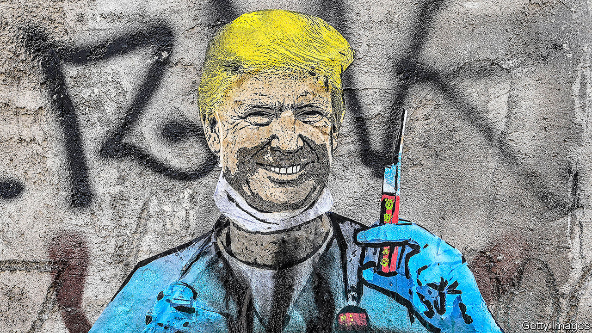

###### Strong medicine

# Why drugmakers are telling Donald Trump to cool his heels 

##### Nine pharmaceutical giants pledge to uphold scientific and ethical standards rather than rush a coronavirus vaccine 

 

> Sep 12th 2020 

THE WORLD’S 7.5bn people want a vaccine for covid-19 as soon as possible. One person needs it by November 3rd. As President Donald Trump limps towards election day, he wants to report real medical progress against the disease. Earlier this year it seemed possible that one or two pharmaceutical firms might be able to obtain some sort of limited approval by the time Americans cast their ballots. That may still be possible. It is certainly desirable, given the pandemic’s toll on lives and livelihoods. But on September 8th, in an unprecedented move, nine global drugmakers, including AstraZeneca, GSK, Pfizer and Sanofi, announced a pledge to uphold scientific and ethical standards in the search for a coronavirus vaccine.

The message is intended to reassure the public that the companies will not bow to mounting political pressure from the White House to rush through a vaccine without the proper safety and efficacy tests. But it is also a rebuke to the president, who has been politicising the drug-approval process—and eroding public confidence in the Food and Drug Administration (FDA). This could undermine trust in any vaccine that arrives, as sooner or later one almost certainly will.


Mr Trump has already successfully harried the FDA to authorise drugs, such as hydroxychloroquine, with no scientific evidence for their efficacy. He has accused the regulator (unfairly) of being part of a “deep state” effort to try to slow down vaccine development until after the election. It looked like part of a strategy to get the regulator to hurry up.

Big pharma is clearly worried. Drug firms stand to lose a great deal if their products are seen as being waved through prematurely. The industry relies on the FDA to make business possible. In the same way that people fly because they trust the aviation regulator, they take medicines because these are believed to be safe and effective. Take away the trust and the medicines’ makers would suffer.

So would investment in research. Pharmaceutical firms have little incentive to develop better drugs if they can simply claim a new product is superior without having to prove it. When Mr Trump came into office, some in his entourage lobbied him to install as head of the FDA someone with a more relaxed approach to efficacy standards. Doctors and patients immediately raised the alarm. But so did drugmakers, who pushed for a more serious candidate to assume the position.

The industry statement makes it clear that vaccine development will move at the pace of science, not politics. More evidence of this came the same day, when AstraZeneca halted clinical trials around the world after one participant showed an adverse reaction. This may slow down vaccine development. But it is also par for the course. Indeed, AstraZeneca’s decision shows that the system is working. Not so much deep state as deep science.■

Editor’s note: Some of our covid-19 coverage is free for readers of The Economist Today, our daily . For more stories and our pandemic tracker, see our 

