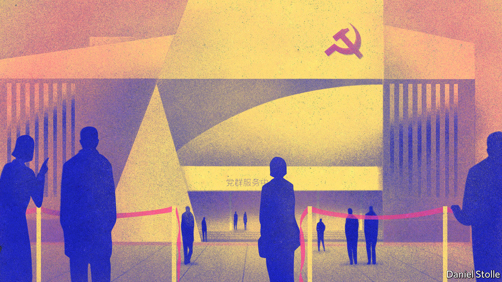

###### The red front-line

# China’s Communist Party is splurging on new local drop-in centres 

##### Filling them can be a challenge 

 

> Sep 12th 2020 

IN SHENZHEN’S GLISTENING tech district, opposite the headquarters of Tencent, a giant digital conglomerate, the Communist Party vies for attention. “Follow the party, start your business” is etched into a futuristic-looking cube at the entrance to a two-storey building, its walls sprayed with paintings of giant robots. In the lobby stands a life-size statue of Mao Zedong, flanked by other Communist leaders. But most visitors bypass the exhibit on the party’s history and head directly upstairs.

Xi Jinping Thought is not as appealing as the free classes on offer: calligraphy, kick-boxing, Pilates and Zumba. There are lectures on career-building and buying property in Shenzhen, a city bordering on Hong Kong that is one of the world’s most expensive property markets. At lunchtime, workers can enjoy free massages. “Most people find study sessions about the history of the Communist Party too dry,” says one of the centre’s staff. “They prefer attending yoga or lectures about blockchain. We even held a speed-dating event recently where we matched 15 couples.”


The building is known as a “party-masses service centre”. In recent years they have proliferated in cities, towns and villages across the country. It has been the biggest effort by the party to develop its physical infrastructure at the grassroots in decades. They are partly intended to be “one-stop shops” at which locals can get access to a wide variety of bureaucratic services that hitherto may have required visits to distant government offices. In Shenzhen, where they are called “community service centres” in English (perhaps to obscure their Communist links to politically sensitive foreigners), there are more than 1,000 of them. One is at the city’s airport. It offers karaoke, a flight simulator and a library of more than 3,500 books.

Providing entertainment and helping with government paperwork, however, are secondary functions of these centres. Their main purpose is to give ordinary party members space to meet and discuss such matters as Xi Jinping Thought and the party’s latest directives. The dismantling of many state-owned firms in the 1980s and 1990s stripped the party of much of its grassroots presence. In recent years it has been scrambling to rebuild this by setting up party organisations within private businesses and NGOs. But these often consist of just a few people who lack regular contact with higher-level party committees. The service centres help to bring disparate party bodies under one roof and make it easier to mobilise them when needed, such as to help the public during covid-related lockdowns. The one in the airport describes itself as a “red home” for nearly 10,000 party members working in more than 30 airport-related businesses. It has a dance hall that doubles as a meeting room.

Building and decking out these facilities has not been cheap. In the past two years a district of Dongguan, a city near Shenzhen, has spent more than 190m yuan (about $28m) on them. Jiayuguan, a far less affluent city about 3,000km to the north-east on the edge of the Gobi desert, has forked out a similar amount in the past five years. Nor has it been optional. Progress made in building them is used to evaluate officials’ performance. Cities have specified minimum areas for their floor space. In Shenzhen it is 650 square metres for neighbourhood ones, or more than half the size of an Olympic swimming pool. But some officials like to go larger. Shenzhen boasts the biggest neighbourhood-level party-masses centre in Guangdong province, at 8,000 square metres.

Officials have good reason to show enthusiasm. Rebuilding the party at the grassroots has been a priority for Mr Xi since he took over as China’s leader in 2012. On trips outside the capital he has paid several visits to party-masses centres. During one such in July, in the north-eastern city of Changchun, he paraphrased Mao, saying that effective work at the grassroots was essential for ensuring that the party can “sit tight on the fishing terrace despite the rising wind and waves”—in other words, maintain its grip on power.

In cosmopolitan cities such as Shenzhen, it involves appealing to a young tech-savvy elite that has little time for earnest study of party ideology. Hence the effort to entice people with services such as free advice on starting up a business. Ryan Manuel of Official China, a research firm, compares the new centres to churches in Western cities that provide busy professionals with a sense of community by arranging sports activities and night classes. In both cases the main aim remains to inspire a belief—in God at the churches, or in the party at the centres.

Even by the party’s admission, the new centres—despite being hailed as the “red front-line”—do not always perform as hoped. An article published in 2018 by the website of the People’s Daily, the party’s main mouthpiece, said many centres were “empty shells”. In some places, “the hardware is classy but the service doesn’t match and footfall is low,” lamented a county official near Kunming in another online article. In places where the buildings were empty, she wrote, citizens were also devoid of “satisfaction and happiness”.

But the party does not have to worry about attracting recruits, whose swearing-in ceremonies are often held in the new centres. In 2018 only about 10% of applicants were accepted to join the party, which has over 90m members. “Despite the party trying to be more inclusive and reach out to more people, the party itself remains highly selective in recruitment of members,” says Feng Chucheng of Plenum, a research firm. The party wants the bright tech workers of Shenzhen, but only those who will comply with its orders without question. Karaoke skills confer no advantage. ■

